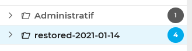
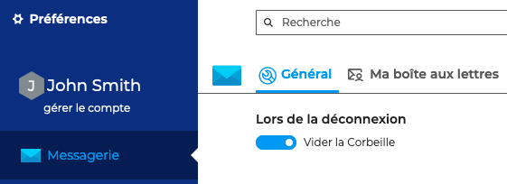
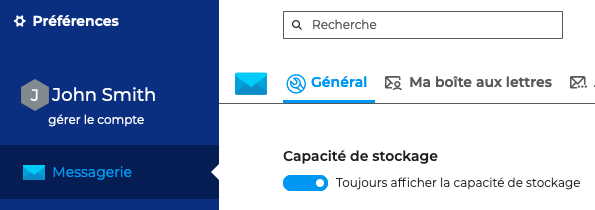

# Organiser les dossiers

La colonne de gauche présente la liste hiérarchique des dossiers accessibles par l'utilisateur, en lecture ou en lecture-écriture, triés en 2 arborescences repliables :

1. **Le compte de l'utilisateur** regroupe ses dossiers propres : dossiers par défaut (boîte de réception, messages envoyés, corbeille, etc.) suivis des dossiers créés par l'utilisateur triés par ordre alphabétique
2. **Dossiers partagés** : regroupe les boîtes partagées sur lesquelles l'utilisateur a un droit de lecture ou d'écriture.

Lorsqu'un dossier est sélectionné :

- les messages qu'il contient s'affichent dans la colonne du milieu
- le nom du dossier apparait sur fond bleu
- la puce indiquant le nombre de messages non lus dans le dossier apparait en bleu vif :

*Ici le dossier "restored-2021-01-14" est sélectionné*

## Créer un dossier

- En bas de l'arborescence de l'utilisateur, se trouve une entrée "**Nouveau dossier**" :
- Cliquer dessus pour faire apparaître le champs de saisie : 
    - Pour valider la création : appuyer sur "Entrée"
    - Pour annuler la création : appuyer sur "Echap" ou cliquer sur la croix en fin de ligne

## Gérer les dossiers

En passant la souris sur un dossier, un menu apparait, proposant les **actions possibles** sur ce dossier et les messages qu'il contient :

Les actions actuellement disponibles sont :

- **Créer un sous-dossier**
- **Renommer le dossier**
- **Supprimer le dossier**
- **Marquer tout comme lu** : tous les messages du dossier sont marqués comme lus
- **Vider le dossier** : les messages contenus dans le dossier seront supprimés définitivement. Ils ne seront pas placés dans la corbeille.

:::info
La suppression d'un dossier et de son contenu est une suppression définitive : les messages contenus dans le dossier ne sont pas placés à la corbeille.
:::

## Rechercher un dossier

La fonction "**Filter mes dossiers**" en haut de la colonne permet de retrouver rapidement un dossier. 
**Taper les premières lettres** du dossier dans le champ de recherche, seuls les dossiers correspondant apparaissent dans la liste

## Déplacer un dossier

Cette fonctionnalité n'est pas encore disponible dans la version test du webmail.

Pour contourner cela, il faut procéder à un déplacement des messages qu'il contient :

- Créer le dossier de destination à l'endroit souhaité
- Se rendre dans le dossier source
- Sélectionner l'ensemble des messages (bouton "Tous" en haut de liste)
- Déplacer les messages en les faisant glisser dans le nouveau dossier (voir ci-après)

## Vider la corbeille

Afin d'éviter de surcharger l'espace de stockage, il est possible de vider automatiquement la corbeille à chaque déconnexion en allant dans les paramètres de la messagerie : **Préférences - Messagerie - Général - Lors de la déconnexion** et activer l'option "**Vider la corbeille**"

## Afficher la capacité de stockage

Afin de gérer au mieux son espace de stockage, il est possible d'afficher la proportion d'espace utilisé et d'espace libre.

Pour cela, aller dans les paramètres de la messagerie : **Préférences - Messagerie - Général - Capacité de stockage** et sélection l'option "**Toujours afficher la capacité de stockage**"

:::info

**À propos des quotas**

Lorsque le quota est activé, le taux d’occupation (quota) du stockage des messages est indiqué en bas de la liste des dossiers. 

Lorsqu'un quota est atteint, il bloque la réception de mails. Ces mails sont conservés par le serveur pendant quelques jours.
Les opérations d'envoi et même de suppression peuvent aussi être perturbées, le système ayant besoin d'effectuer des copies dans un répertoire temporaire et/ou dans la corbeille.

Pour baisser le quota, supprimer des messages avec la fonction de suppression complète (Shift-Suppr).

Un quota atteint peut être manuellement augmenté par l'administrateur, puis redescendu à tout moment vers le quota initial.

:::

