# La messagerie

# Présentation

La messagerie BlueMind propose via son client léger (*webmail*) une interface riche dotée de nombreuses fonctionnalités :

- Vue 2 ou 3 volets personnalisable
- Affichage et gestion des boîtes partagées
- Glisser-Déplacer (*Drag & Drop*) de pièces jointes depuis le bureau
- Auto-complétion des adresses
- 2 modes d’édition : texte ou HTML (texte enrichi, insertion d’images, etc.)
- moteur de recherche *full-text* et multi-dossiers

# Affichage

La vue principale par défaut de BlueMind se présente en 3 panneaux :

-  : la barre latérale présente l'arborescence des dossiers de la messagerie de l'utilisateur, celle-ci comprend ses dossiers propres ainsi que les boîtes partagées auquel il a accès
-  : cette zone présente la liste des messages correspondant au dossier sélectionné ainsi que les boutons d'actions qui y sont associés
-  : l'affichage du message sélectionné dans la liste. L'utilisateur peut choisir via sa gestion des préférences de ne pas afficher cette zone et afficher sa messagerie en vue à 2 panneaux seulement.
-  : le moteur de recherche avancé *full-text* (recherche dans le contenu des messages et pièces jointes) et multi-dossier.

# Barre latérale

La barre latérale affiche la liste hiérarchique des dossiers accessibles par l'utilisateur, en lecture ou en lecture-écriture. Ceux-ci sont triés par ordre alphabétique.
:::important

Rafraichir la liste des dossiers

L'application possède un cache sur la liste des dossiers, ainsi il se peut qu'un dossier nouvellement créé ou partagé n'apparaisse pas immédiatement dans l'arborescence.

Pour forcer le rafraichissement de l'arborescence, un astuce consiste à :

- se rendre dans la gestion des dossiers :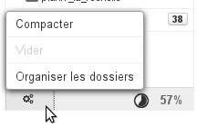
- simplement revenir sur le webmail, sans effectuer d'action

:::

Lorsqu'un dossier est sélectionné, son contenu est affiché dans la partie droite de la fenêtre 

Le dossier "Dossiers partagés" regroupe l'ensemble des dossiers, utilisateurs ou boites partagés, pour lesquels ont été attribués des droits de partages.

Les messages peuvent être déplacés d'un dossier à l'autre par glisser-déplacer depuis la liste de messages vers le dossiers correspondant.

Le clic droit sur un dossier propose un menu d'actions spécifiques pour le dossier :

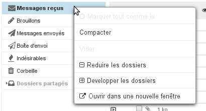
:::important

** **À propos des quotas** **

Lorsque le quota est activé, son pourcentage d'utilisation est affiché en permanence en bas du panneau de gauche de la messagerie webmail, le survol avec la souris permet d'afficher les informations détaillées :
 

Des codes couleurs permettent de visualiser le niveau du quota : le taux d'occupation est affiché en orange s'il atteint 75% du quota, en rouge foncé s'il atteint 85% et en rouge s'il atteint 100% :

Lorsqu'un quota est atteint, il bloque la réception de mails. Ces mails sont conservés par le serveur pendant quelques jours.
Les opérations d'envoi et même de suppression peuvent aussi être perturbées, le système ayant besoin d'effectuer des copies dans un répertoire temporaire et/ou dans la corbeille.
:::important

Quota et suppression

Pour supprimer des messages lorsque le quota est atteint, utilisez la fonction de suppression définitive (sans passer par la corbeille) en cliquant sur &lt;SHIFT+Suppr>.

:::

Un quota atteint peut être manuellement augmenté par l'administrateur, puis redescendu à tout moment vers le quota initial.

:::

# Liste des messages

## Colonnes et tri

Le bouton en forme d'engrenages  en haut de la liste des messages permet d'ouvrir la popup de sélection des colonnes et de l'ordre de tri de l'affichage :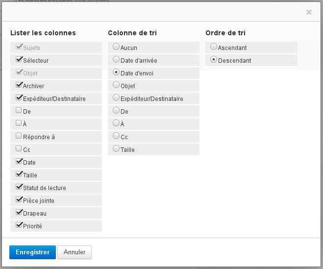Pour trier les messages suivant une colonne, cliquer sur l'en-tête de celle-ci : s'il s'agit déjà de la colonne de tri alors celui-ci est inversé (croissant  décroissant), sinon les messages sont triés par ordre croissant. L'ordre actuellement effectif est matérialisé par une flèche dans l'en-tête de colonne concerné :

Pour personnaliser l'ordre des colonnes, cliquer sur l'en-tête de la colonne à déplacer dans la liste des messages, celle-ci devient grisée et l'emplacement de la colonne est matérialisé en pointillé, déplacer alors la colonne vers l'emplacement souhaité :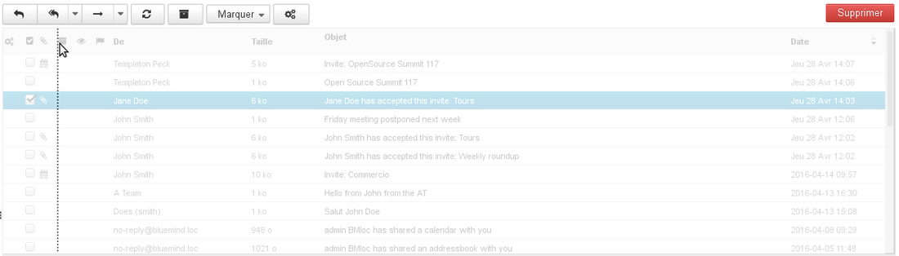
:::important

L'ordre des colonnes ainsi que le tri choisi sont enregistrés et conservés lors de la prochaine connexion.

:::

## Sélection des messages

La sélection multiple de messages peut se faire de plusieurs façons différentes :

- cliquer sur la ligne d'un premier message dans la liste puis sur la ligne du dernier message en maintenant la touche "Shift" enfoncée, cela sélectionne alors toute la plage de messages correspondante.
- cliquer sur la ligne d'un premier message dans la liste puis sélectionner les suivants en maintenant la touche "Ctrl" enfoncée
- dans la colonne «Sélecteur» :
  - cliquer sur la case correspondante à chaque message, sans maintenir de touche enfoncée au clavier
  - cliquer sur l'en-tête de colonne afin de faire apparaître le menu d'aide à la sélection :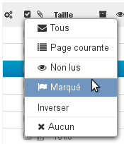

Les messages sélectionnés sont matérialisés dans la liste par un fond bleu et leur case "Sélecteur" cochée :

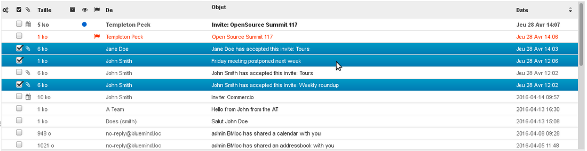
:::important

Lorsque plusieurs messages sont sélectionnés, le panneau d'aperçu n'affiche aucun contenu.

:::

## Lecture et modification du statut

Les colonnes de statut de lecture et de drapeau permettent, en plus de l'information rapidement visible présentée, d'agir sur le statut des messages : en cliquant dans la colonne correspondante le statut du message ("lu"/"non lu") est automatiquement inversé et un drapeau peut être placé et enlevé sur le message :

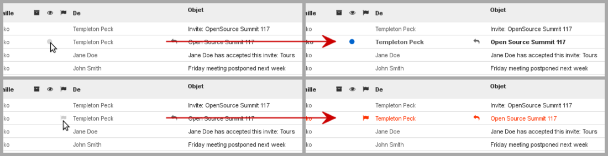

## Actions sur les messages

La barre d'outils au dessus de la liste des messages, en , permet d'accéder aux actions possibles suivant le ou les messages sélectionnés :

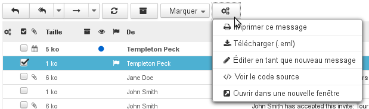

Ces boutons de raccourcis permettent d'accéder rapidement aux fonctions principales : répondre, répondre à tous, transférer, changer le statut de lecture et d'importance...

Le bouton représentant un engrenage  propose des actions supplémentaires :

- **Imprimer ce message**
- 
**Télécharger (.eml)** : permet de télécharger le message sous forme de fichier au format EML

- **Éditer en tant que nouveau message** : ouvre le composeur avec le message tel quel, les champs destinataires, CC, titre, contenu, etc. sont déjà remplis
- **Voir le code source** : affiche la source du message au format brut
- **Ouvrir dans une nouvelle fenêtre** : ouvre une nouvelle fenêtre de webmail avec le message en vue "2 panneaux"

Les boutons suivis d'une flèche proposent eux aussi des actions supplémentaires, en plus de leur fonction propre :

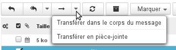

Actions supplémentaires pour le transfert

### Répondre à un message

- 
Sélectionner le message dans la liste des messages puis cliquer sur le bouton  «** Répondre** » dans la barre des boutons d'actions

- 
Un nouveau message est initié à destination de l'expéditeur du message reçu.
Le champ « Destinataire » est déjà renseigné.
Compléter le message puis l'envoyer.

:::important

Pour répondre à l'ensemble des destinataires du message, cliquer sur  « **Répondre à tous** »  puis compléter comme précédemment.

:::

### Transférer un message

- 
Sélectionner le message puis cliquer sur  « **Transmettre le message** ».

- La fenêtre de composition s'ouvre avec le message cité
- 
Choisir les destinataires et rédiger le message puis cliquer sur 

### Supprimer un message

- 
Sélectionner le message puis :

  - 
cliquer sur le bouton  au dessus à droite de la liste des messages

  - 
ou faire un clic droit et cliquer sur « **Déplacer le message dans la corbeille** »

  - 
ou appuyer sur la touche « Suppr » du clavier

Le message déplacé reste récupérable dans la corbeille pendant une durée dépendant de la configuration de la messagerie. Par défaut, il est accessible sans limitation de durée, sauf suppression manuelle.
- 
Pour **supprimer définitivement des messages** :

  - 
sélectionner le dossier « Corbeille » puis sélectionner les messages à supprimer.

  - 
Faire un clic droit et cliquer sur « Supprimer le message définitivement ».

- 
Pour **vider la corbeille** :

  - 
sélectionner le dossier « Corbeille »

  - 
faire un clic droit sur ce dossier puis sélectionner « **Vider** ».

### Éditer en tant que nouveau message

Pour éditer un message plutôt que le faire suivre ou répondre, faire apparaître le menu "Plus d'actions..."  et choisir "**Éditer en tant que nouveau message**".

## Actions sur la liste de messages

Les boutons de raccourcis au bas de la liste des messages permettent d'agir sur la liste des messages :

- 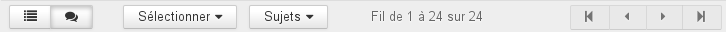Les deux premiers boutons permettent de basculer l'affichage en liste simple ou en liste groupée par sujets.
- Le menu "Sélectionner" permet de sélectionner des messages suivant des filtres pré-définis.
- Le menu "Sujets" permet de regrouper les messages en arborescence par conversation/discussion
- L'information centrale indique les messages actuellement affichés dans la liste.
- Les boutons munis de flèches permettent de naviguer d'une page à l'autre.

# Affichage d'un message

Le panneau  affiche le contenu d'un message sélectionné :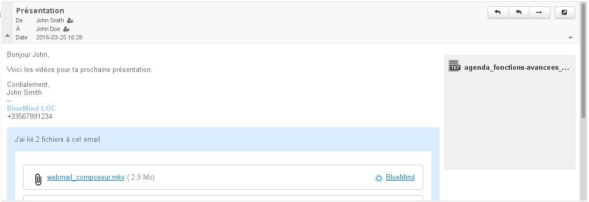
:::important

Pour afficher un message dans toute la partie droite de la fenêtre, double-cliquer sur celui-ci dans la liste des messages.

Pour revenir ensuite à l'affichage par défaut, cliquer sur l'icône de retour en haut à gauche de la zone d'affichage :

:::

## Affichage de l'en-tête

L'en-tête d'un message est par défaut affichée en mode simple. Pour afficher plus d'informations, cliquer sur la flèche située à gauche de la zone :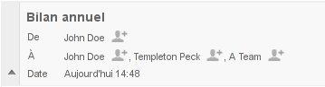Pour afficher l'en-tête complet du message, cliquer sur la flèche située à droite de la zone d'en-tête :

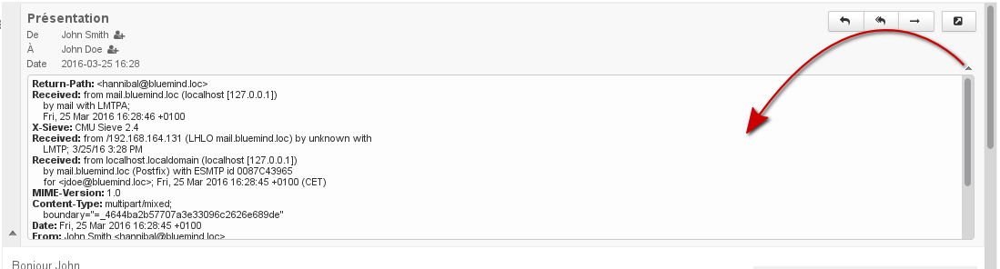

## Pièces jointes

Les pièces jointes se trouvent à deux endroits du message, selon le type d'attachement :

- les pièces jointes intégrées au message se trouvent sur la droite du message, dans un colonne sur fond gris, un bouton permettant de les télécharger sous forme d'archive ZIP
- [les pièces jointes détachées](/Guide_de_l_utilisateur/La_messagerie/Fichiers_volumineux_et_détachement_des_pièces_jointes/) se trouvent dans un encart bleu en fin de message

:::important

Les images jointes sont affichées dans l'aperçu du message à la suite de celui-ci.

:::

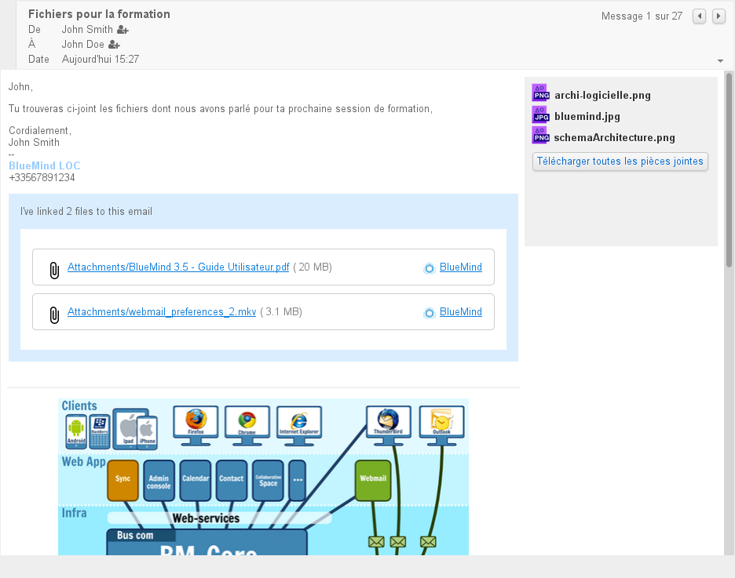Selon la nature de la pièce jointe, cliquer dessus ouvrira la fenêtre d'aperçu ou proposera de télécharger ou ouvrir le fichier.

