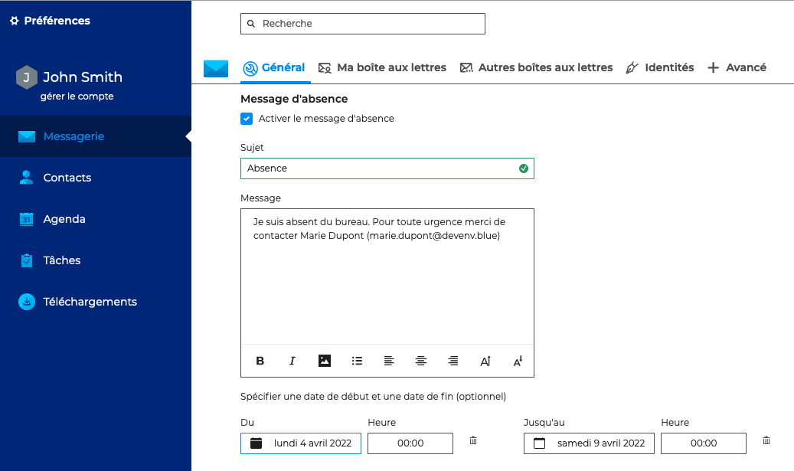
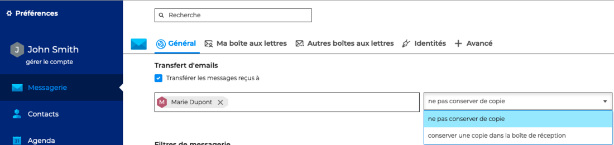

# Absence du bureau

En cas d'absence ou d'impossibilité de gérer la messagerie, il est possible de paramétrer un répondeur automatique ou de transférer l'ensemble des messages reçus.

## Activer le répondeur automatique

Pour paramétrer les réponses automatiques, aller dans les paramètres de la messagerie : **Préférences - Messagerie - Général - Message d'absence** et cocher l'option "**Activer le message d'absence**"

Remplir les champs :

- **Sujet** (obligatoire) : sujet de l'e-mail envoyé
- **Message** (optionnel) : corps du message envoyé
- **Dates de début et de fin** (optionnel)
    - si aucune date de début n'est spécifiée, le répondeur s'active dès l'enregistrement des nouveaux paramètres
    - si aucune date de fin n'est spécifiée, le répondeur reste actif jusqu'à ce que l'utilisateur modifie ses paramètres et désactive le message d'absence

Une fois les paramètres enregistrés, quand l'utilisateur recevra un message, un e-mail sera automatiquement envoyé à l'expéditeur.

:::tip

Lorsque le répondeur est désactivé, **les derniers paramètres sont enregistrés** et ainsi retrouvés lorsque l'utilisateur souhaite le réactiver.

:::

:::info

Un seul message d'absence est envoyé en réponse à une même personne (adresse mail) pour une période de 3 jours.

Si l'utilisateur désactive puis réactive son répondeur pendant cette période **sans modifier l'objet ou le contenu de son message**, les personnes ayant déjà reçu une réponse automatique n'en recevront pas une nouvelle, le décompte pour la période reprenant là où il s'était arrêté.

Exemple :

- l'utilisateur A active son répondeur
- il reçoit un mail de l'utilisateur B le jour J, un message d'absence est émis, le décompte de 3 jours commence
- l'utilisateur désactive son répondeur à J+1
- il reçoit un nouveau mail de B, aucun message d'absence n'est émis
- l'utilisateur réactive son répondeur à l'identique à J+2
- il reçoit alors un mail de B : le répondeur considère être toujours à J+2, aucun message d'absence n'est émis.

:::

## Transférer les messages reçus

Ce formulaire permet de **transférer l'ensemble des messages entrant** vers une ou plusieurs adresses, internes ou externes, en conservant ou non une copie dans la boîte de réception de l'utilisateur.

Pour activer le transfert, aller dans les paramètres de la messagerie : **Préférences - Messagerie - Général - Transfert d'emails** et cocher l'option "**Transférer les messages reçus à**"

Saisir le(s) e-mail(s) du ou des destinataire(s) du transfert, l'autocomplétion propose les adresses dans tous les carnets de l'utilisateur (annuaire, carnets personnels, etc.) et choisir de conserver ou non une copie de l'e-mail reçu.

