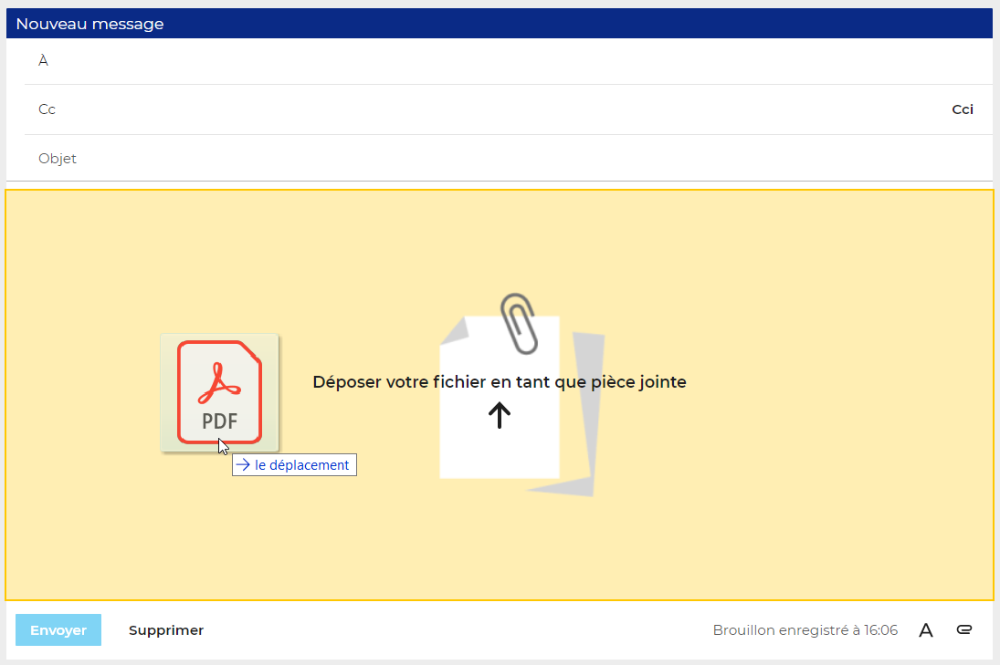
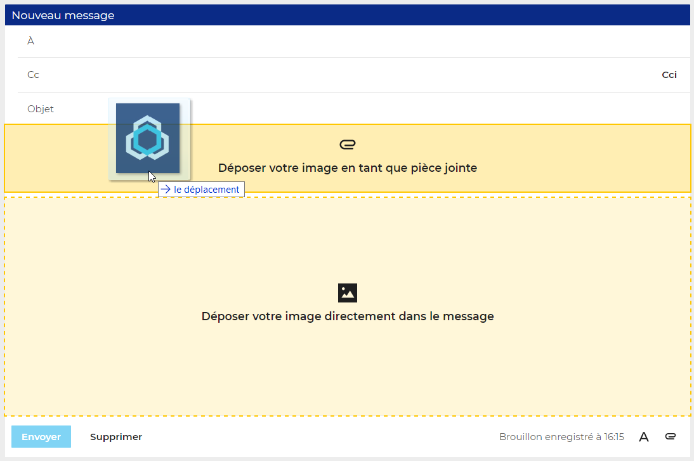
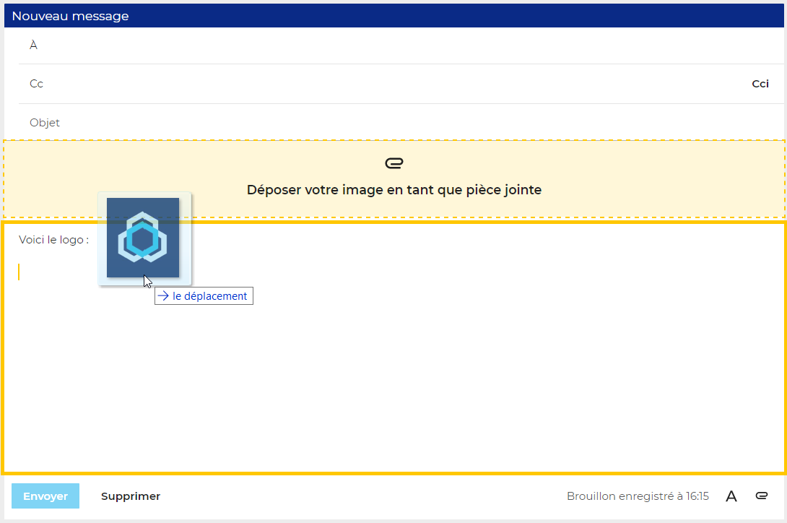
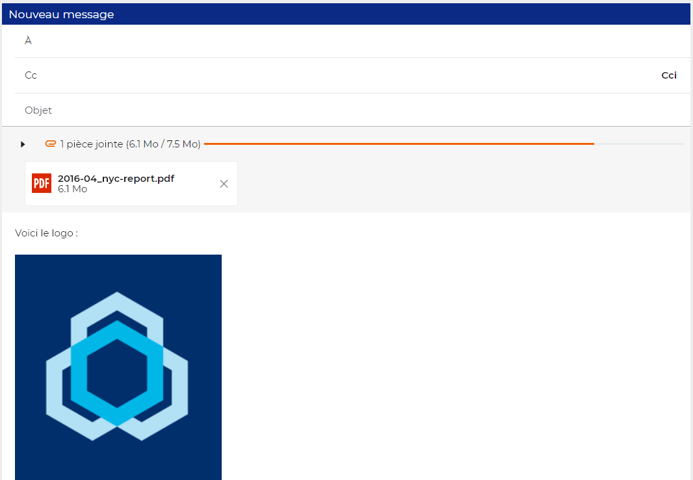
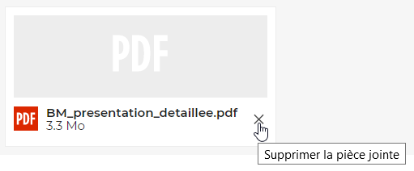

# Ajouter des pièces jointes

## Attacher une pièce jointe

- cliquer sur le bouton  de la barre d'outils ou l'icône trombone  en bas de la zone de saisie pour ouvrir le sélecteur de fichier de votre ordinateur
- glisser directement un fichier depuis votre navigateur de fichier :

Si le composeur **détecte une image**, il propose alors d'intégrer l'image au message :

La faire glisser à l'endroit souhaité dans le message :

En relâchant la souris, l'**image est ajoutée** :

:::info

Édition de l'image

Les fonctionnalités d'édition de l'image (redimensionnement par exemple) sont en cours de développement, elles ne sont pas encore disponibles dans la version beta actuelle.

:::

**Pour supprimer** une pièce jointe, cliquer sur la croix correspondant dans le cartouche du fichier concerné :

## Envoyer une pièce jointe volumineuse

:::info

Pièce jointe détachée

La gestion des pièces jointes détachées et des fichiers volumineux sera disponible dans une prochaine version

:::

