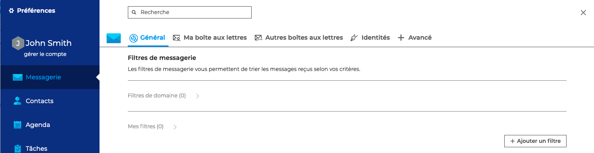
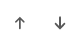
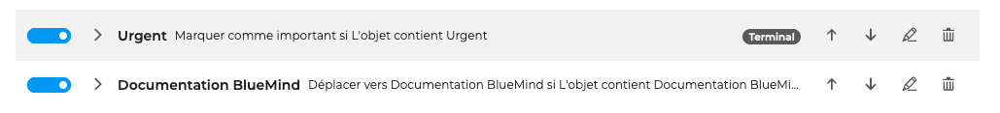

# Appliquer des règles de tri et d'actions

Les filtres permettent d'appliquer des **règles de tri et actions à effectuer automatiquement **aux nouveaux messages entrants.

Ils permettent, par exemple, de classer tous les messages d'un même expéditeur dans un sous-dossier ou de supprimer des messages en fonction de leur objet, sans que l'utilisateur ait à effectuer lui-même cette action.

**Pour créer et gérer les filtres** automatiques, aller dans les paramètres de la messagerie : **Préférences - Messagerie - Général - Filtres de messagerie**

## Créer un filtre automatique

Afin de créer un nouveau filtre, cliquez sur "**+Ajouter un filtre**" pour ouvrir la fenêtre popup de création

- Donner un **nom** au filtre afin de pouvoir le reconnaître facilement

- Choisir une **condition** parmi la liste (par exemple "L'objet contient" : documentation BlueMind)

- Choisir une **action **parmi la liste (par exemple "Déplacer vers" puis choisir un dossier existant - pour créer un dossier voir [Gérer les dossiers](/Guide_de_l_utilisateur/La_messagerie_4.7/Organiser_les_dossiers/))

- Indiquer une **exception** si besoin (par exemple "L'expéditeur est" John Smith)

- Cocher l'option "**Filtre terminal**" pour que ce filtre soit le dernier de la liste des filtres créés à s'appliquer

 Dans cet exemple, tous les e-mails contenant "documentation BlueMind" dans leur objet, iront directement dans le dossier sélectionné, sauf s'ils sont envoyés par John Smith

## Ordonner les filtres automatiques

Il est possible de créer autant de filtres que nécessaire et de **les ordonner**.

Le classement des filtres est important. Les filtres seront en effet appliqués selon l'ordre défini. Pour modifier l'ordre des filtres, il suffit d'utiliser les flèches .

Lorsqu'un filtre est un "**Filtre terminal**", tous les filtres situés en-dessous ne seront pas appliqués.

 Dans cet exemple, le filtre "Urgent" est un "filtre terminal". Lors de la réception d'un e-mail ayant pour "Urgent - Documentation BlueMind", celui-ci sera "marqué comme important" mais ne sera classé dans le dossier "Documentation BlueMind"

## Modifier et supprimer les filtres

Une fois les filtres créés, cliquer  pour les **modifier **et sur pour les **supprimer**.

