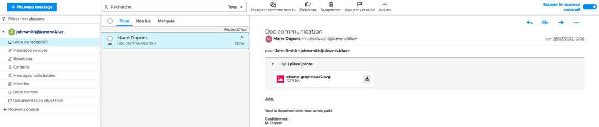
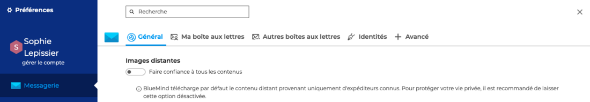
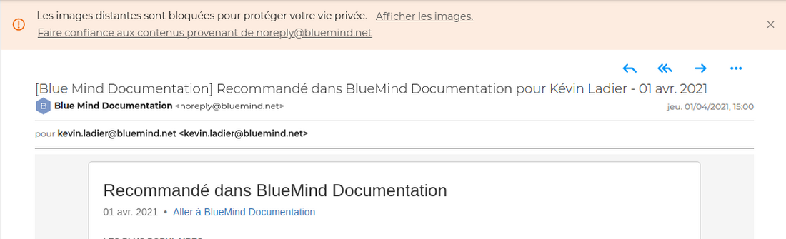

# Consulter les messages

## Lire les messages

Les messages arrivent dans [le dossier](/Guide_de_l_utilisateur/La_messagerie_4.7/Organiser_les_dossiers/) **Boîte de réception**. Tous les messages de la boîte de réception s'affichent dans [la liste des messages](/Guide_de_l_utilisateur/La_messagerie_4.7/Gérer_la_liste_des_messages/). Le contenu du message sélectionné apparait dans la zone d'affichage principale.

## Ouvrir les pièces jointes

Un encart repliable sous l'en-tête présente les pièces jointes intégrées au message, avec un aperçu lorsqu'il est possible. Chaque fichier peut être téléchargés au moyen de l'icône 

Selon la nature de la pièce jointe, cliquer dessus ouvrira la fenêtre d'aperçu ou proposera de télécharger ou ouvrir le fichier.

:::info

Le téléchargement de l'ensemble des fichiers en un seul clic sera disponible dans une prochaine version, ainsi que la gestion des [pièces jointes détachées](/Guide_de_l_utilisateur/La_messagerie_4.7/Ajouter_des_pièces_jointes/).

:::

## Imprimer les messages

:::info
L'impression des messages et des pièces jointes sera disponible dans une prochaine version.
:::

## Gérer les images distantes

Les contenus distants sont des images ou des pixels invisibles qui ne sont pas inclus directement dans le corps du message mais insérés via des liens vers des serveurs distants. Les images sont téléchargées quand le message s'affiche. Cette technique, appelée Pixel tracking, permet à l'émetteur de savoir, non seulement si le message a été lu, mais également combien de fois, à quelle heure et de quel endroit (situation géographique approximative liée à l'adresse IP).

Afin de préserver votre vie privée, **BlueMind ne télécharge par défaut que les contenus provenant d'émetteurs connus**. Bien de que fortement déconseillé, il est possible d'activer le téléchargement de tous les contenus.

Pour activer le téléchargement de tous les contenus, aller dans les paramètres de la messagerie:** Préférences - Messagerie - Général - Images distantes**

**

**

Lorsque l'option "Faire confiance à tous les contenus" est désactivée, **une alerte apparaît **proposant 2 options :

- afficher le contenu distant tant que le message est ouvert

- toujours faire confiance à cet expéditeur - dans ce cas, l’émetteur s'ajoutera dans les "[contacts collectés](/Guide_de_l_utilisateur/Les_contacts_4.7/Créer_et_éditer_un_carnet_d_adresses_personnel/)" et sera alors considéré comme "connu"

