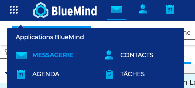
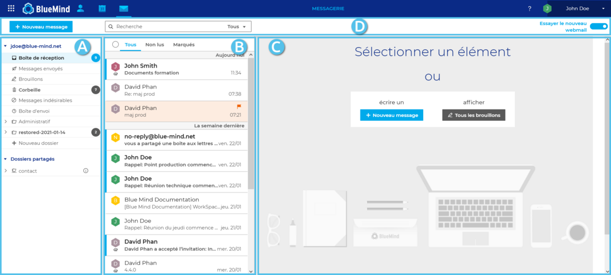

# Découvrir la messagerie

## Accéder à la messagerie

**L'accès** à la messagerie s'effectue dans la barre de navigation principale BlueMind.

:::tip

Application par défaut

Par défaut, l'interface s'ouvre sur la messagerie mais peut également s'ouvrir sur l'agenda. Pour cela, aller dans les [paramètres du compte](/Guide_de_l_utilisateur/Paramétrer_le_compte_utilisateur/) : **Préférences - Général - Application par défaut**

:::

## Naviguer dans la messagerie

**La vue principale** de la messagerie est une vue en 3 colonnes :

1.  : l'arborescence de dossiers. Elle propose les dossiers dans des arborescences séparées et repliables, permettant ainsi le regroupement des dossiers de l'utilisateur d'une part et des boîtes partagées d'autre part.
2.  : la liste des messages contenus dans le dossier sélectionné en colonne A. Des filtres en haut de liste permettent de n'afficher que certains types de messages et le passage de la souris sur un message fait apparaître des informations et actions possibles.
3.   : la zone d'affichage principale. Elle présente les actions possibles en guise d'accueil ou le message sélectionné s'il y a lieu.
4.   : elle comprend le bouton de création de nouveau message, le moteur de recherche et les boutons des actions possibles selon l'affichage en cours (actions sur un message lorsqu'il est affiché ou actions groupées possibles lorsque plusieurs messages sont sélectionnés)

