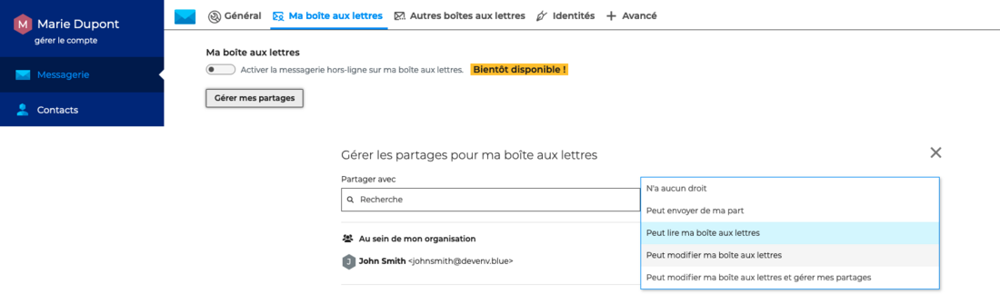

# Partager une messagerie

Les utilisateurs ont la possibilité de partager leur messagerie avec les membres de l'organisation et d'attribuer différents niveaux de droits d'accès.

Pour **partager sa messagerie**, aller dans les paramètres de la messagerie : **Préférences - Messagerie - Ma boîte aux lettres**

**

**

Cliquer sur "**Gérer mes partages**" pour ouvrir la fenêtre pop-up de gestion des partages

Dans la fenêtre pop-up, **rechercher l'utilisateur** ou le groupe d'utilisateur en tapant les premières lettres - l'autocomplétion proposera tous les utilisateurs disponibles puis **sélectionner le niveau de partage** souhaité.

Les droits possibles sont : 

- **N'a aucun droit** => **aucun partage**L'utilisateur ne pourra pas voir la messagerie. Cette option peut permettre de supprimer des droits de lecture et d'écriture
- **Peut envoyer de ma part** => **partage avec droits de lecture avancés**Après s'être abonné, l'utilisateur désigné peut se créer une identité afin d'envoyer des messages au nom de l'utilisateur donnant le droit
- **Peut lire ma boite aux lettres** => **partage avec droits de lecture**Après s'être abonné, l'utilisateur désigné peut consulter les messages de l'utilisateur

- **Peut modifier ma boîte aux lettres** => **partage avec droits d'écriture**En plus des droits précédents, l'utilisateur désigné peut consulter les messages et les modifier (suppression, déplacement d'un dossier à l'autre, organisation et noms des dossiers, etc.).
- **Peut modifier ma liste de tâches et gérer mes partages** => **partage avec droits de gestion**En plus des droits précédents, l'utilisateur désigné peut modifier les partages de la messagerie de l'utilisateur

