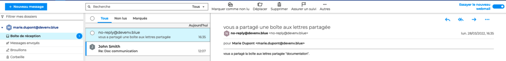
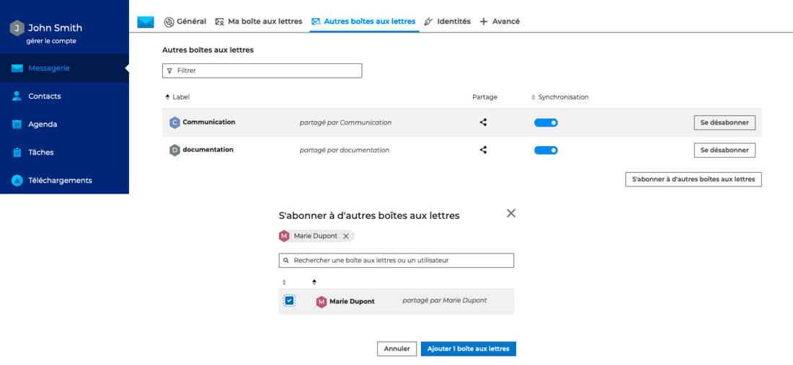
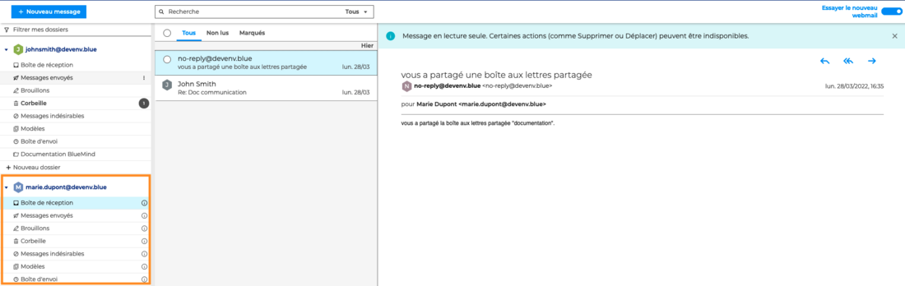
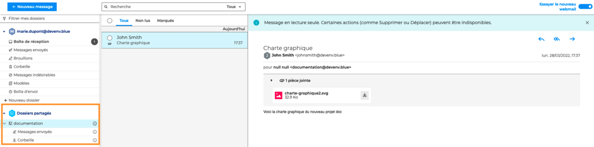
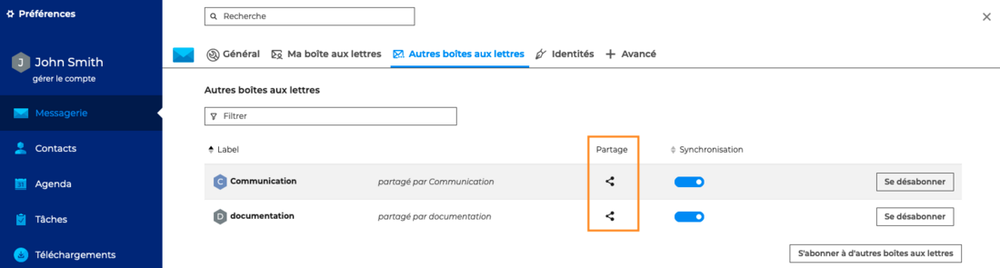

# Utiliser une messagerie partagée

En plus de leur messagerie nominative, les utilisateurs peuvent accéder aux **messageries individuelles** [partagées](/Guide_de_l_utilisateur/La_messagerie_4.7/Partager_une_messagerie/) par d'autres utilisateurs ainsi qu'aux messageries collaboratives, créées par l'administrateur du domaine : les **messageries de groupe** et les **boîtes aux lettres partagées**.

## S'abonner à une messagerie partagée

Lorsque des droits d'accès sur une messagerie sont attribués à un utilisateur, celui-ci reçoit une notification par e-mail

Une fois la notification reçue, l'utilisateur doit **activer l'abonnement** à la boîte aux lettres dans ses paramètres de messagerie : **Préférences - Messagerie - Autres boîtes aux lettres**

Cliquer sur "**S'abonner à d'autres boîtes aux lettres"** pour afficher la fenêtre pop-up, **cocher** la ou les boîtes aux lettres parmi celles proposées puis cliquer sur **Ajouter 1 boîte aux lettres**.

:::info

Afin de valider l'abonnement, relancer l'application en cliquant sur le lien

:::

## Utiliser une messagerie partagée par un utilisateur

**Une fois l'abonnement validé**, la messagerie de l'utilisateur apparait dans la [liste des dossiers](/Guide_de_l_utilisateur/La_messagerie_4.7/Organiser_les_dossiers/).

En fonction du **[niveau de droits accordés](/Guide_de_l_utilisateur/La_messagerie_4.7/Partager_une_messagerie/)** à l'utilisateur, celui-ci pourra :

- **Droit de lecture** : consulter les messages
- **Droit de lecture avancé** : consulter les messages, y répondre et les transférer
- **Droit d'écriture** : en plus des droits précédents, l'utilisateur peut déplacer et/ou supprimer les messages
- **Droit de gestion** : en plus des droits précédents, l'utilisateur peur gérer les droits de partage

:::info

Ici, l'utilisateur John Smith a des droits d'accès "Peut lire ma boîte aux lettres". Il peut donc consulter l'ensemble des dossiers et des messages de la messagerie de Marie Dupont mais ne peut ni les déplacer ni les supprimer.

:::

## Utiliser une boîte aux lettres partagée

Les boites aux lettres partagées sont des boites aux lettres qui, à la différence de celles des utilisateurs, ne sont pas nominatives : **un ou plusieurs utilisateurs peuvent y être rattachés**.

**Toute action** de suivi, réponse ou transfert réalisée par l'un des utilisateurs **sera visible par l'ensemble des collaborateurs**. Par exemple, si un des utilisateurs marque un message comme "Important", tous les utilisateurs verront le drapeau de suivi.

Ce fonctionnement, parfaitement adapté à un **travail d'équipe**, peut être utilisé par un service d'entreprise, dans le cadre d'un projet ou bien encore pour mettre à disposition des [modèles](Envoyer_un_message.md/#utiliser-un-modèle) d'e-mail.

Les boîtes aux lettres partagées sont créées et gérées par l'administrateur du domaine, qui peut déléguer la gestion des droits de partage à un ou des administrateur(s) de la messagerie.

**Une fois l'abonnement activé**, la boite aux lettres partagée apparait dans les **Dossiers partagés** de la [liste des dossiers](/Guide_de_l_utilisateur/La_messagerie_4.7/Organiser_les_dossiers/).

En fonction du **[niveau de droits accordés](/Guide_de_l_utilisateur/La_messagerie_4.7/Partager_une_messagerie/)** à l'utilisateur, celui-ci pourra :

- **Droit de lecture** : consulter les messages
- **Droit de lecture avancé** : consulter les messages, y répondre et les transférer
- **Droit d'écriture** : en plus des droits précédents, l'utilisateur peut déplacer et/ou supprimer les messages
- **Droit de gestion** : en plus des droits précédents, l'utilisateur peur gérer les droits de partage et **envoyer des messages au nom de la boite aux lettres partagée** en se créant [**une identité**](/Guide_de_l_utilisateur/La_messagerie_4.7/Gérer_les_identités_du_compte/) avec la messagerie de la boîte aux lettres partagée

## Utiliser une messagerie de groupe

**Les groupes d'utilisateurs**, créés par l'administrateur, rassemblent les membres de l'organisation ayant des besoins ou des objectifs communs (par exemple un groupe "responsables de services" pour rassembler tous les responsables de services d'une entreprise). Cela permet notamment de gérer plus facilement les droits d'accès communs à tous les membres d'un groupe.

Un groupe peut également avoir une **messagerie spécifique**, fonctionnant comme une liste de distribution d'entreprise : **les messages** envoyés à la messagerie de groupe **sont réceptionnés dans les messageries nominatives de chaque membre du groupe**.

Ainsi, **tous les utilisateurs ont le même niveau de droits** : chaque membre peut consulter, modifier, déplacer ou répondre à un message.

**Les actions** réalisées sur les messages **sont individuelles**. Par exemple, si un des utilisateurs marque un message comme "Important", le suivi ne sera effectif que dans sa messagerie. Les autres utilisateurs ne le verront pas.

:::info

Contrairement aux boîtes aux lettres partagées, il n'est pas possible avec une messagerie de groupe d'envoyer un e-mail au nom du groupe, ni de créer une identité avec l'e-mail du groupe.

La possibilité de consulter les messages et dossiers de la messagerie sera disponible dans une prochaine version.

:::

## Gérer les partages d'une messagerie partagée

Cliquer sur l'icône de partage  pour ouvrir la fenêtre pop-up et suivre la **procédure de [partage d'une messagerie](/Guide_de_l_utilisateur/La_messagerie_4.7/Partager_une_messagerie/)**

:::info

Afin de pouvoir modifier les droits d'accès d'une messagerie qui lui a été partagée, l'utilisateur doit avoir les [droits de gestion](/Guide_de_l_utilisateur/La_messagerie_4.7/Partager_une_messagerie/) sur la messagerie et y être **abonné**.

:::

