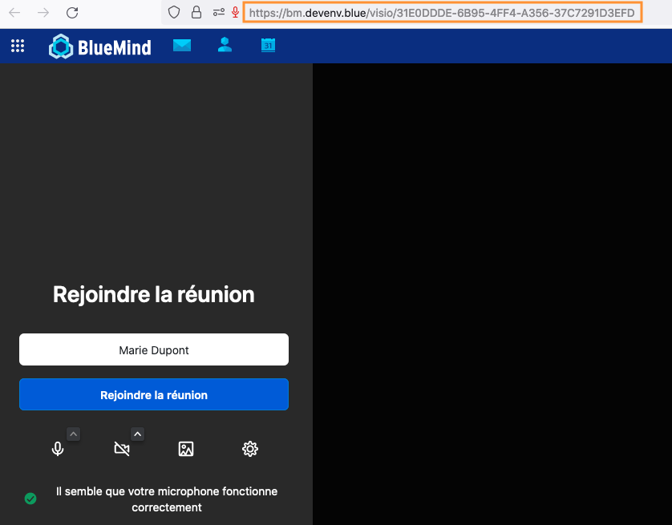

# Créer une visioconférence

BlueMind propose 3 solutions de visiocoférence :

- via une connexion à la solution [Starleaf](https://starleaf.com/fr/)
- via une connexion à la solution [Jitsi Meet](https://jitsimeet.fr/)
- via la solution intégrée **BlueMind Vidéo **(basée sur Jitsi Meet)

Quelque soit la solution installée par l'administrateur, il est possible d'intégrer une visioconférence aux [réunions créées **dans l'agenda**](/Guide_de_l_utilisateur/L_agenda/Organiser_une_réunion/)**.** Dans ce cas, les participants **recevront l'invitation à la visioconférence avec la notification **d'invitation à la réunion.

Avec **BlueMind Vidéo** il est également possible de créer un visioconférence **en dehors de l'agenda**. Pour cela, **cliquer sur**  dans le bandeau de navigation

Une fois, la page de visioconférence ouverte, **copier le lien** affiché dans le navigateur et **l'envoyer aux participants**.

:::tip

Il est également possible de créer un lien de visioconférence directement (dans un e-mail par exemple), sans ouvrir l'application.

Écrire : https://nomdedomaine/visio/titredelaconférence - par exemple : https//bm.devenv.blue/visio/welcome

:::

