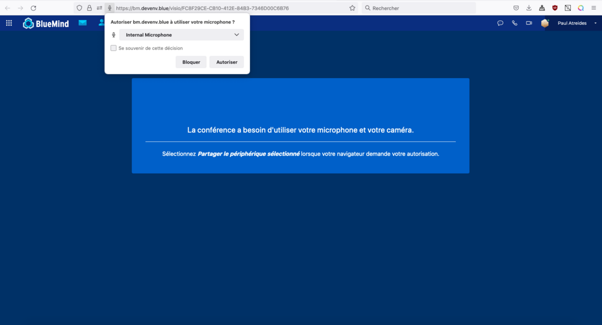
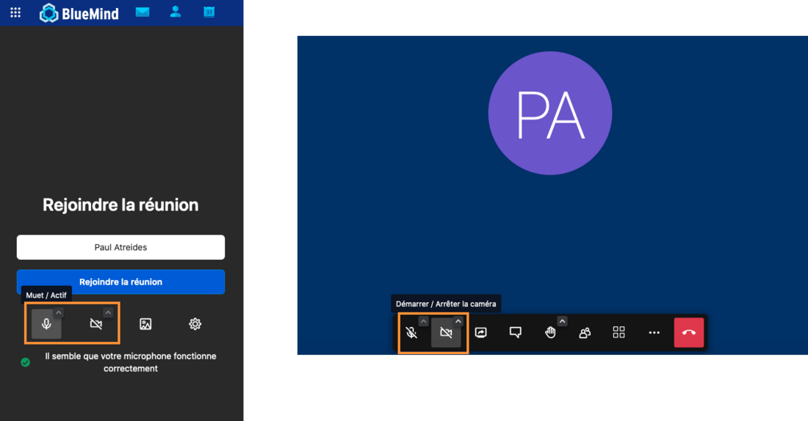
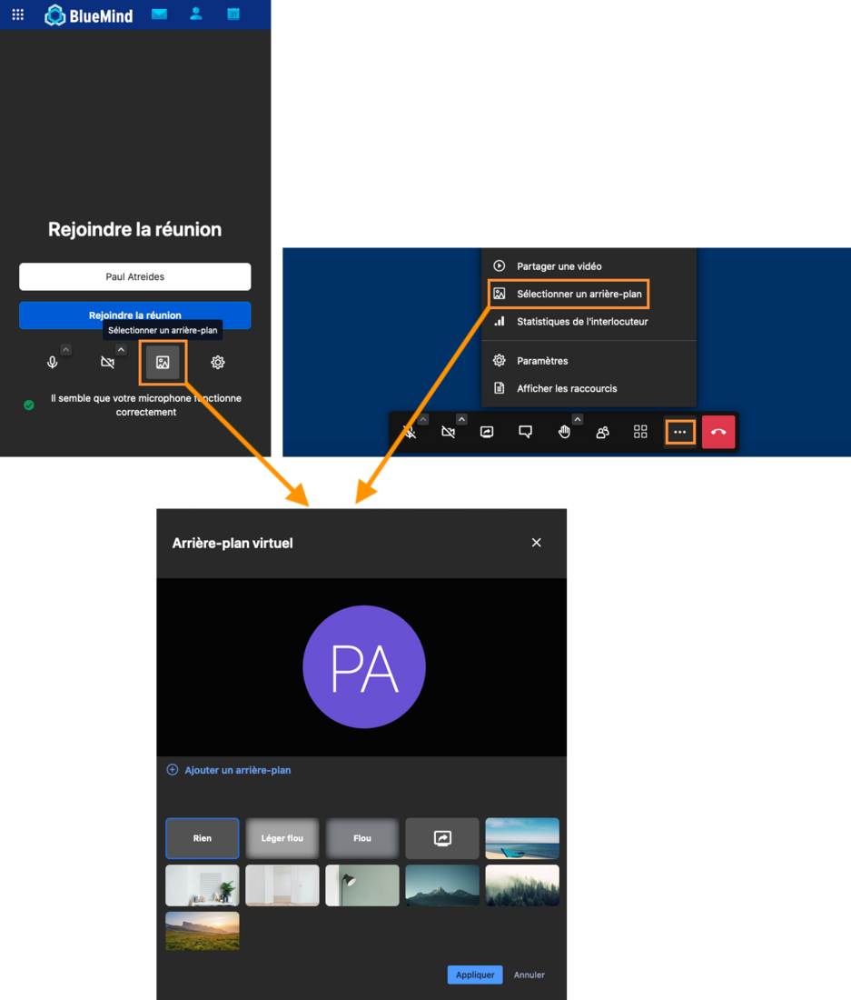
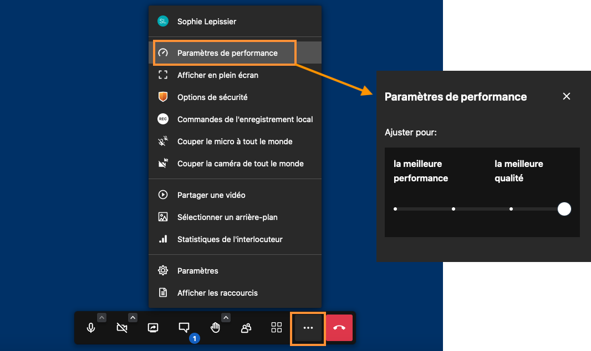
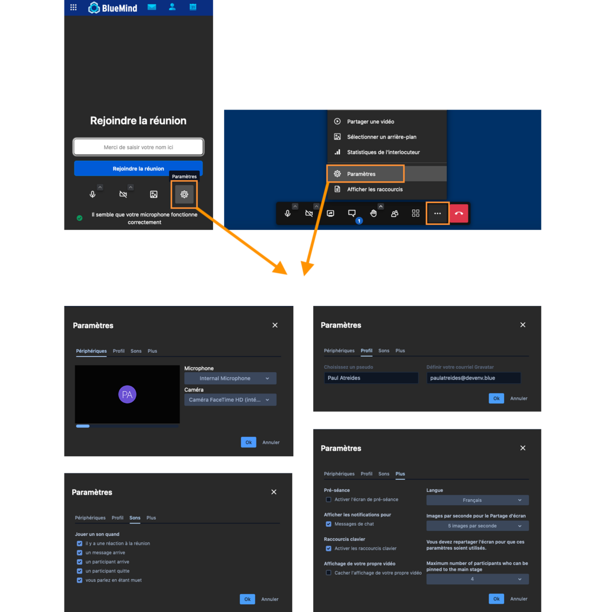
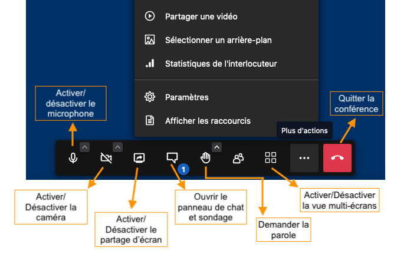
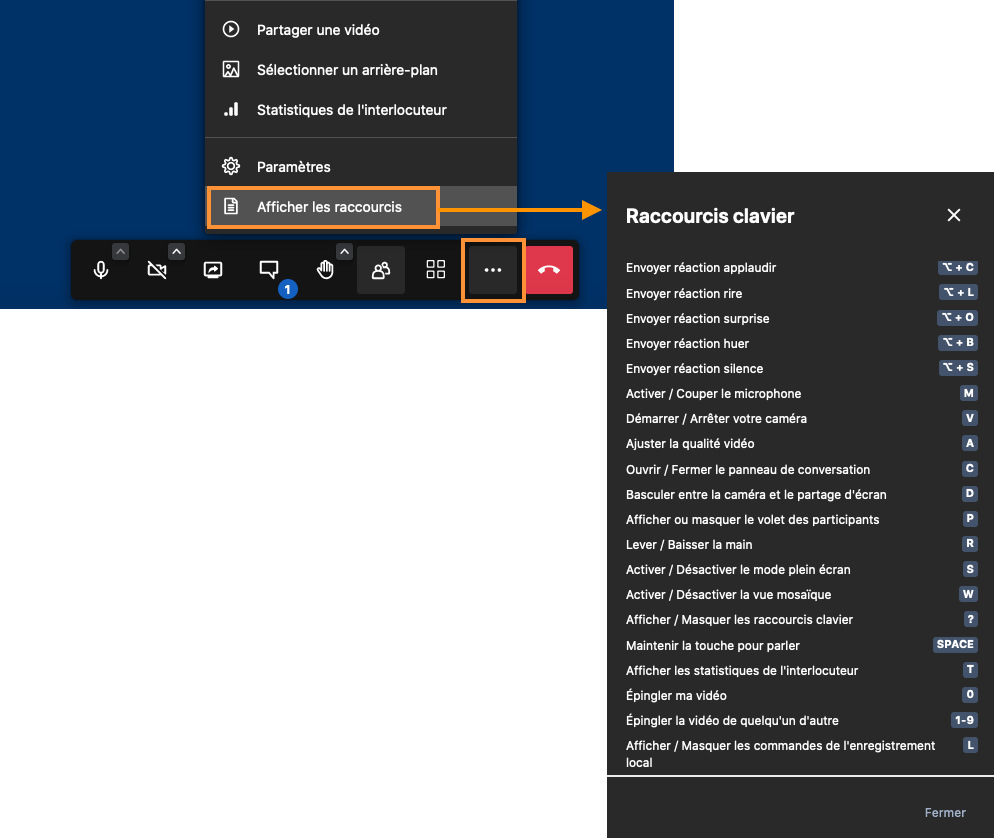

# Participer à une visioconférence

Pour accéder à la visioconférence, cliquer sur le [lien reçu dans l'invitation](/Guide_de_l_utilisateur/L_agenda/Participer_à_un_évènement/).*

*

**BlueMind Vidéo**, la solution intégrée de BlueMind basée sur Jitsi, permet une prise en main rapide.

Il faut simplement **autoriser le domaine à utiliser le microphone et la caméra **de l'appareil.

## Gérer le son et l'image

- L'utilisateur peut, avant ou pendant la visioconférence, **couper et redémarrer le son et l'image de son appareil**.Pour cela, **cliquer sur les icônes** de microphone et de caméra avant de rejoindre la conférence ou dans la barre d'actions en bas de l'écran pendant la conférence.

:::tip

L'icône barré indique que le son ou l'image est arrêté(e)

:::

- Il est également possible de **modifier l'arrière plan** de son écran.Pour cela, **cliquer sur l'icône** "Arrière plan" avant de rejoindre la conférence ou sur le menu dans la barre d'actions en bas de l'écran pendant la conférence.

:::tip

"Ajouter un arrière plan" permet de télécharger une image personnelle afin de l'utiliser en arrière plan.

:::

- En cas de connexion internet non fibrée ou faible, il est possible de **configurer la qualité de la vidéo** pour fluidifier le servicePour cela, aller dans le menu de la barre d'actions en bas de la page et cliquer sur "**Paramètres de performances**"

## Modifier les autres paramètres

À tout moment l'utilisateur peut vérifier les périphériques utilisés, **modifier son pseudo, la langue, les notifications, l'accès au chat**, etc.

Pour cela, **cliquer sur l'icône "Paramètres"** avant de rejoindre la conférence ou dans le menu de la barre d'actions en bas de l'écran pendant la conférence

## Intervenir pendant une conférence

En fonction des paramétrages décidés par le modérateur de la visioconférence, l'utilisateur pourra d**emander la parole, discuter via le chat, partager son écran ou une vidéo**.

Pour interagir, **utiliser les icônes de la barre d'actions** située en bas de l'écran

:::tip

Pour fluidifier plus encore les interactions, utiliser les raccourcis proposés par BlueMind Vidéo. Pour les afficher aller dans le menu de la barre d'actions en bas de l'écran et cliquer sur "**Afficher les raccourcis**"

:::

