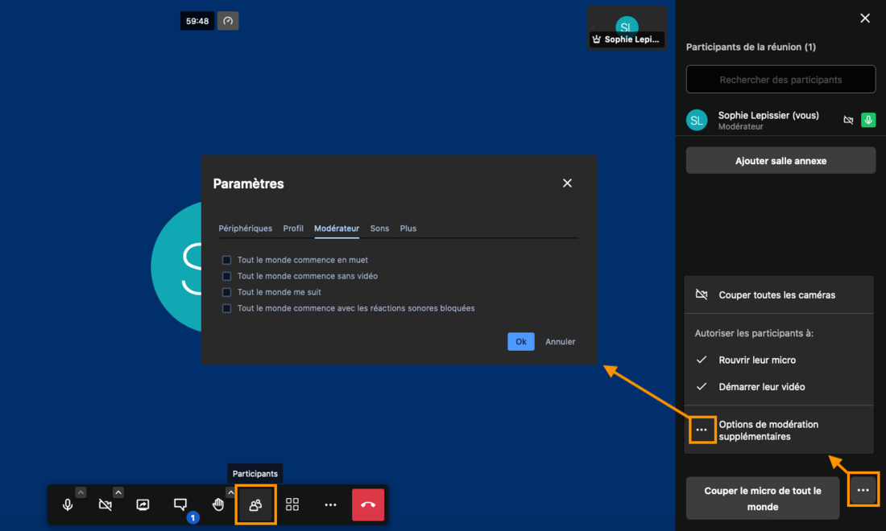
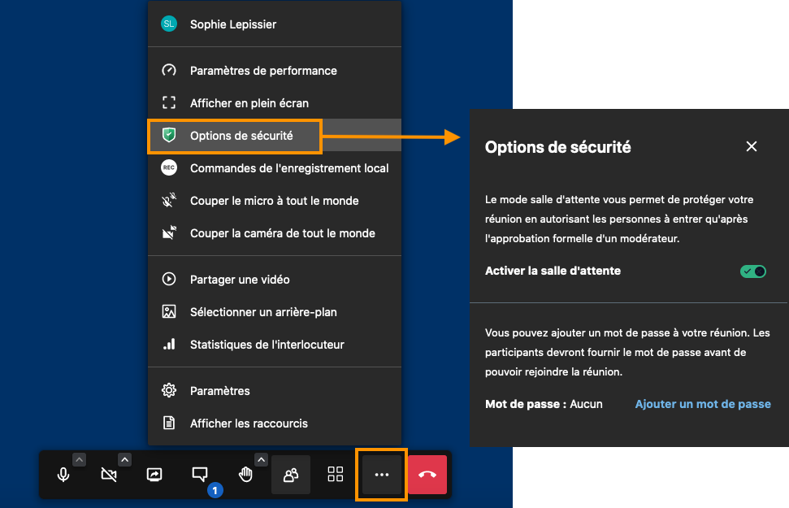
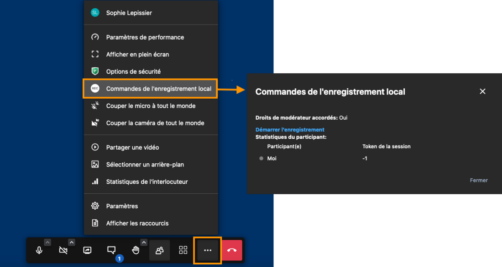

# Animer une visioconférence

L'organisateur de la visioconférence a un **rôle de modérateur.**

En plus du paramétrage et des actions possibles pour tous les participants, le modérateur a des droits supplémentaires afin de gérer les interactions et les droits d'accès. Il peut également enregistrer la visioconférence.

## Gérer les participants

Le modérateur peut décider de **couper ou redémarrer les microphones et caméras des participants**.
Pour cela, cliquer sur l'icône "**Participants**" dans la barre d'actions en bas de l'écran pour ouvrir le panneau de gestion des participants.

## Sécuriser l'accès à la visioconférence

Toute personne ayant le lien de visioconférence peut y accéder. Cependant, le modérateur peut sécuriser l'accès en **ajoutant un mot de passe** et/ou **en créant une salle d'attente**.
Pour cela, aller dans le menu de la barre d'actions en bas de l'écran et cliquer sur "**Options de sécurité**"

## Enregistrer la visioconférence

Le modérateur peut également **enregistrer la visioconférence**.
Pour cela, aller dans le menu de la barre d'actions en bas de l'écran et cliquer sur "**Commandes de l'enregistrement local**"

