# Les catégories (tags)

# Présentation

Les catégories permettent d'affecter un ou plusieurs mots clefs (ou *tags*) aux contacts et événements d'agenda, ces catégories étant communes aux 2 applications.

 

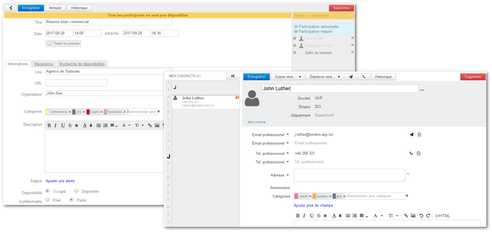

# Affecter des catégories

Pour les événements de l'agenda le champs se trouve dans l'**onglet Informations** du formulaire de création :

:::important

NB : les copies d'écran ci-dessous correspondent aux contacts, le fonctionnement est le même dans l'agenda

:::

Plusieurs façon de saisir sont possibles :

- Si des catégories existent déjà, **un menu déroulant** permet de les voir et les sélectionner, cliquer sur la flèche en fin de champ de saisie pour le faire apparaître :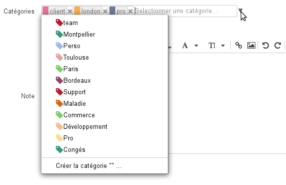
- **Saisir au clavier** le mot souhaité :
  - Si la catégorie n'existe pas, valider avec entrée ou cliquer sur «Créer la catégorie» pour la créer :
  - Si des catégories existent déjà, l'autocomplétion propose les mots correspondant au cours de la frappe :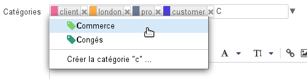

Une fois sélectionnée la catégorie s'affiche avec une couleur associée et une croix permettant de la supprimer. Si la catégorie existe déjà elle conserve sa couleur qui est la même partout où elle est utilisée, sinon une couleur différente des autres lui est automatiquement affectée :

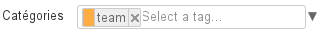

Saisir autant de catégories que désiré :

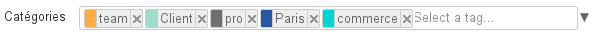
:::important

Pour supprimer une catégorie, cliquer sur la croix correspondante ou utiliser la touche de suppression &lt;Retour arrière> (*backspace*) du clavier.

:::

Les catégories sont alors visibles dans la liste des contacts par des icônes de couleurs (2 au maximum). Au survol de la souris, la liste complète des catégories affectées au contact est affichée :

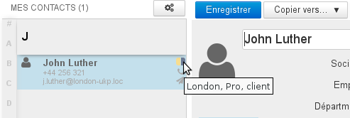

De la même façon, des icônes de couleurs sont affichées sur les événements pourvus de catégories dans l'agenda :

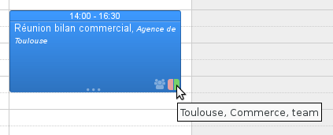

# Gérer les catégories
:::important

Les catégories de domaines sont gérées de la même façon par l'administrateur dans la console d'administration > Gestion du système > Domaines Supervisés > domaine > Onglet «Catégories» - voir le Guide de l'Administrateur - [Domaines - chapître 7 : Les catégories](/Guide_de_l_administrateur/Présentation_du_produit/Messagerie_multi_domaines/)

:::

La gestion des catégories se fait dans l'interface de gestion des préférences utilisateur > rubrique "Mon compte" > onglet "Catégories"

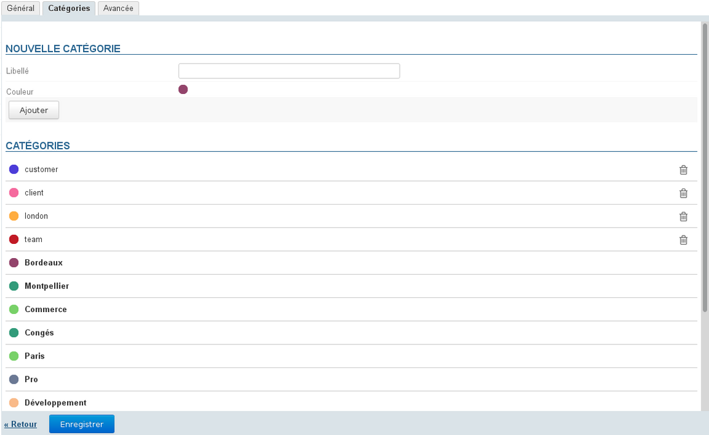
:::important

Les catégories partagées, créées par l'administrateur du domaine, ne sont pas modifiables, elles apparaissent en gras et sans bouton d'action disponible.

:::

## Créer une nouvelle catégorie :

- saisir le libellé
- choisir une couleur (par défaut, une couleur disponible est proposée)
- cliquer sur Ajouter

## Modifier une catégorie :

- au survol de la souris, un champs de saisie apparaît à la place du libellé : 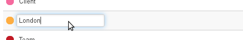 
  - pour modifier le libellé cliquer dans le champs de saisie pour le rendre actif et saisir le nouveau libellé
  - pour modifier la couleur, cliquer sur la pastille correspondante et choisir la nouvelle couleur parmi celles proposées : 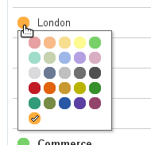
- 
 **Une fois les modifications apportées, quitter le ** **champs pour valider : au clavier par la touche &lt;tabulation>, à la souris en cliquant ailleurs dans la page** 
NB : La modification est immédiatement effective, il n'est pas nécessaire de cliquer sur le bouton «Enregistrer» en bas de page.

## Supprimer une catégorie

Pour supprimer une catégorie, cliquer sur l'icône poubelle  en fin de ligne correspondante puis cliquer sur OK pour valider.
:::important

Une fois validée, la suppression est immédiate et irréversible

:::

# Recherche

## Recherche de contacts

La recherche dans l'application Contacts s'effectue sur tous les champs, y compris les catégories. Pour effectuer une recherche parmi les contacts, taper dans le champs de recherche en haut de page la catégorie recherchée puis valider avec la touche &lt;Entrée> ou en cliquant sur le bouton de recherche :

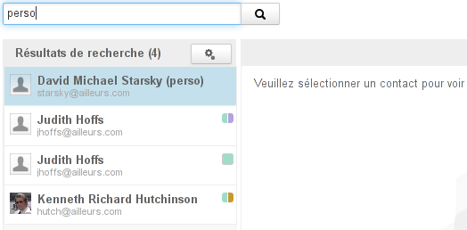

## Recherche d'événements d'agenda

De même, pour effectuer une recherche dans l'agenda, taper dans le champs de recherche en haut de page la catégorie recherchée puis valider avec la touche &lt;Entrée> ou en cliquant sur le bouton de recherche :

Dans la vue principale de l'agenda, la liste des catégories permet d'afficher ou masquer les événements et tâches correspondant à celles-ci :

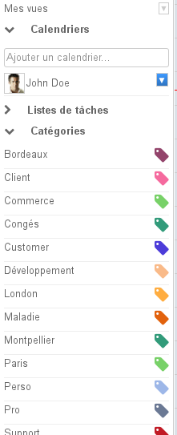

Par défaut toutes les catégories de l'utilisateur et de domaines sont affichées :

- cliquer sur une catégorie pour afficher les événements concernés, les autres apparaissent alors grisées dans la liste et les événements ne comportant pas cette catégorie sont masqués.
- plusieurs catégories peuvent être sélectionnées en même temps : les événements comportant l'une **ou** l'autre apparaissent dans la vue
- cliquer de nouveau sur une catégorie pour la désactiver
- lorsque toutes les catégories sont désélectionnées, la vue est réinitialisée : tous les événements sont affichés et toutes les catégories réapparaissent en noir

Enregistrer

