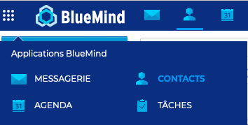
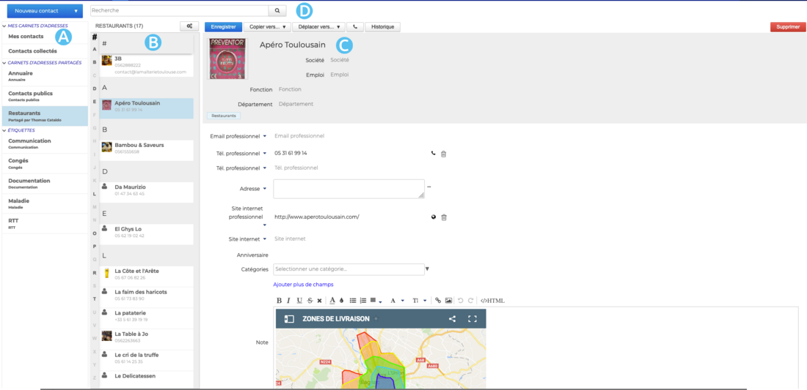
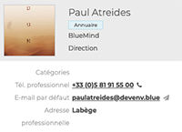
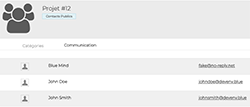
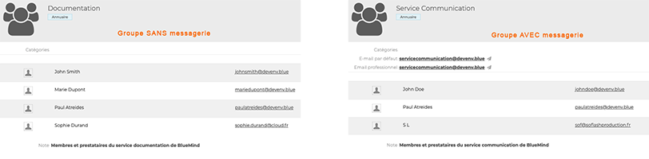
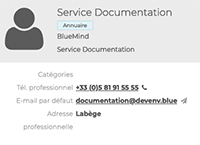
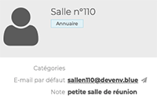

# Découvrir les contacts

BlueMind propose une gestion des contacts par **carnets d'adresses**.

Ces carnets d'adresses, [synchronisables](/Guide_de_l_utilisateur/Les_contacts/Synchroniser_les_carnets_d_adresses/) avec les logiciels de messagerie (Outlook, Thunderbird) et les smartphones (IPhone, Android, ... selon les possibilités des appareils) sont organisés en 2 catégories :

- [les carnets d'adresses personnels](/Guide_de_l_utilisateur/Les_contacts/Créer_et_éditer_un_carnet_d_adresses_personnel/)
- [les carnets d'adresses partagés](/Guide_de_l_utilisateur/Les_contacts/Utiliser_un_carnet_d_adresses_partagé/#utiliser-lannuaire)

Il est également possible d'envoyer un message ou d'appeler un contact directement depuis sa fiche, d'indexer les contacts avec les [catégories](/Guide_de_l_utilisateur/Paramétrer_le_compte_utilisateur/#créer-des-catégories), de créer des [listes de distribution](/Guide_de_l_utilisateur/Les_contacts/Éditer_une_liste_de_distribution/), de partager les contacts entre groupes ou utilisateurs ainsi que d'accéder à un [carnet d'adresses d'entreprise](/Guide_de_l_utilisateur/Les_contacts/Utiliser_un_carnet_d_adresses_partagé/#utiliser-lannuaire).

## Accéder aux contacts

**L'accès** à l'application Contacts s'effectue dans la barre de navigation principale BlueMind.

## Naviguer dans l'interface

-  : dans la 1ère colonne se trouve, sous le bouton «Nouveau contact», la liste des carnets accessibles par l'utilisateur : ses carnets d'adresses personnels et ceux auxquels il est abonné ; ainsi que la liste des catégories, permettant de retrouver rapidement les contacts indexés
-  : dans la 2ème colonne se trouve la liste des contacts présents dans le carnet sélectionné en 1ère colonne

:::tip

l'alphabet vertical sur la gauche de la zone permet de naviguer plus rapidement dans les contacts, les lettres auxquelles se trouvent des contacts sont mises en évidence en noir et gras pour une meilleure visibilité.

:::

-  : la 3ème colonne, zone d'affichage principale, présente la fiche de l'utilisateur sélectionné en 2ème colonne.
-  : champs de recherche

## Identifier les types de contacts

BlueMind permet l'utilisation de **différents types de contacts** : individuel ou de groupe, personnel ou collectif. Leurs fonctionnalités et appartenances aux carnets d'adresses varient selon leur nature.

### Les utilisateurs internes 
*Ce sont les membres de l'organisation.*

 
- **Carnet d'adresses** : [Annuaire](Utiliser_un_carnet_d_adresses_partagé.md/#utiliser-lannuaire)
- **On peut** : 
    - [envoyer un e-mail](/Guide_de_l_utilisateur/La_messagerie/Envoyer_un_message/) au contact
    - [envoyer une invitation](/Guide_de_l_utilisateur/L_agenda/Organiser_une_réunion/) à une réunion avec ou sans visioconférence au contact
    - intégrer le contact à une [liste de distribution](/Guide_de_l_utilisateur/Les_contacts/Éditer_une_liste_de_distribution/)
- **On ne peut pas** :
    - éditer la fiche du contact. La fiche est créée et gérée par l'administrateur

### Les utilisateurs externes 
*Il s'agit des utilisateurs non membres de l'organisation, par exemple un prestataire.*

 

- **Carnets d'adresses**:
    - Les utilisateurs externes créés par l'administrateur font partis de l'[Annuaire](Utiliser_un_carnet_d_adresses_partagé.md/#utiliser-lannuaire)
    - Les utilisateurs externes créés par l'utilisateur font partis des [carnets personnels](/Guide_de_l_utilisateur/Les_contacts/Créer_et_éditer_un_carnet_d_adresses_personnel/)
- **On peut** : 
    - [envoyer un e-mail](/Guide_de_l_utilisateur/La_messagerie/Envoyer_un_message/) au contact
    - [envoyer une invitation ](/Guide_de_l_utilisateur/L_agenda/Organiser_une_réunion/) à une réunion avec ou sans visioconférence au contact
    - éditer la [fiche du contact](/Guide_de_l_utilisateur/Les_contacts/Éditer_un_contact/) des carnets personnels
    - intégrer le contact à une [liste de distribution](/Guide_de_l_utilisateur/Les_contacts/Éditer_une_liste_de_distribution/)
- **On ne peut pas** :
    - éditer la fiche du contact de l'annuaire. La fiche est créée et gérée par l'administrateur

### Les listes de ditribution
*Une liste rassemble plusieurs utilisateurs avec des besoins ou des objectifs communs.*

 

- **Carnet d'adresses** : [carnets personnels](/Guide_de_l_utilisateur/Les_contacts/Créer_et_éditer_un_carnet_d_adresses_personnel/)
- **On peut **:
    - [envoyer une invitation](/Guide_de_l_utilisateur/L_agenda/Organiser_une_réunion/) à une réunion avec ou sans visioconférence à l'ensemble des membres de la liste
    - éditer [la liste de distribution](/Guide_de_l_utilisateur/Les_contacts/Éditer_une_liste_de_distribution/)
- **On ne peut pas** :
    - envoyer d'e-mail à l'ensemble des membres de la liste (cette fonctionnalité sera disponible dans une prochaine version)
    - afficher l'agenda des membres de la liste

### Les groupes d'utilisateurs
*Un groupe rassemble plusieurs utilisateurs avec des besoins ou des objectifs communs. Ils peuvent être paramétrés AVEC ou SANS MESSAGERIE.*

 

- **Carnet d'adresses** : Les groupes sont créés par l'administrateur et font parties de l'[Annuaire](Utiliser_un_carnet_d_adresses_partagé.md/#utiliser-lannuaire)
- **On peut** : 
    - [envoyer une invitation](/Guide_de_l_utilisateur/L_agenda/Organiser_une_réunion/) à une réunion avec ou sans visioconférence à l'ensemble des membres du groupe
    - [afficher l'agenda](/Guide_de_l_utilisateur/L_agenda/Afficher_plusieurs_calendriers/) de l'ensemble des membres du groupe
    - [envoyer un e-mail ](/Guide_de_l_utilisateur/La_messagerie/Envoyer_un_message/)à l'ensemble des membres d'un groupe avec messagerie
    - les membres d'un groupe avec messagerie peuvent [recevoir les messages envoyés au groupe](/Guide_de_l_utilisateur/La_messagerie/Utiliser_une_messagerie_partagée/) sur leur messagerie nominative
- **On ne peut pas** :
    - envoyer d'e-mail aux membres du groupe sans messagerie
    - envoyer d'e-mail de la part d'un groupe avec messagerie (ni créer d'identité avec la messagerie du groupe)
    - les membres d'un groupe avec messagerie ne peuvent pas consulter ni gérer les messages et dossiers de la messagerie (cette fonctionnalité sera disponible dans une prochaine version)

### Les boîtes partagées
*Ce sont des messageries communes à plusieurs utilisateurs ou groupes d'utilisateurs.*

 

- **Carnet d'adresses** : Les boîtes aux lettres partagées sont créées par l'administrateur et font parties de l'[Annuaire](Utiliser_un_carnet_d_adresses_partagé.md/#utiliser-lannuaire)
- **On peut** : 
    - [envoyer un e-mail ](/Guide_de_l_utilisateur/La_messagerie/Envoyer_un_message/)à l'ensemble des membres de la boîte aux lettres partagée
    - les membres peuvent [recevoir, consulter (voire gérer) les messages](/Guide_de_l_utilisateur/La_messagerie/Utiliser_une_messagerie_partagée/) et dossiers de la boîte aux lettres partagée
    - les membres (avec des droits étendus) peuvent [écrire au nom de la boîte aux lettres partagée](/Guide_de_l_utilisateur/La_messagerie/Gérer_les_identités_du_compte/)
- **On ne peut pas** :
    - envoyer d'invitation à la boîte aux lettres partagée
    - afficher l'agenda de la boite aux lettres partagées

### Les ressources
*Il s'agit des moyens de l'entreprise mis à disposition des utilisateurs, par exemple une salle de réunion.*

 

- **Carnet d'adresses** : Les ressources sont créées par l'administrateur et font parties de l'[Annuaire](Utiliser_un_carnet_d_adresses_partagé.md/#utiliser-lannuaire)
- **On peut** :
    - [réserver la ressource](/Guide_de_l_utilisateur/L_agenda/Organiser_une_réunion/)
    - l'administrateur et/ou gestionnaire de la ressource peut [gérer les réservations](/Guide_de_l_utilisateur/L_agenda/Gérer_les_réservations_de_ressources/)
- **On ne peut pas** :
    - éditer la fiche contact de la ressource. La fiche est créée et gérée par l'administrateur

