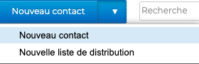
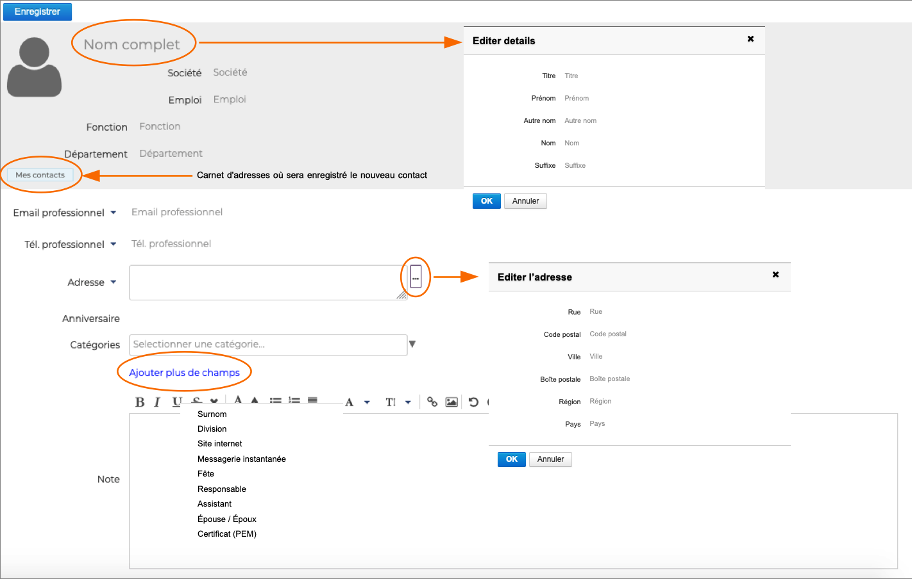
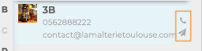
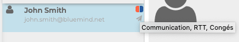
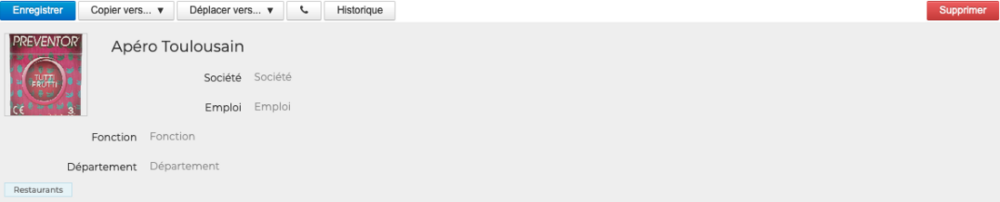

# Éditer un contact

Les fiches contacts peuvent être ajoutées ou modifiées dans les **[carnets personnels](/Guide_de_l_utilisateur/Les_contacts/Créer_et_éditer_un_carnet_d_adresses_personnel/) de l'utilisateur **ainsi que dans ses **[carnets partagés](/Guide_de_l_utilisateur/Les_contacts/Utiliser_un_carnet_d_adresses_partagé/) avec des droits d'écriture**.

Les fiches contacts de l'[annuaire](Utiliser_un_carnet_d_adresses_partage.md/#utiliser-lannuaire) ne sont pas modifiables.

## Créer un nouveau contact

Pour créer un nouveau contact, **se positionner sur le carnet d'adresses** dans lequel le nouveau contact doit être ajouté et cliquer sur "**Nouveau contact**" en haut de la colonne de gauche. 

 

Puis **remplir les champs** de la nouvelle fiche de contact.

- **Nom complet** : ouvre une fenêtre pop-up permettant de préciser le titre, nom, prénom, aun autre nom (ou prénom ou pseudonyme par exemple) ainsi qu'un suffixe
- **E-mail professionnel** : indique l'e-mail professionnel. Il est également possible de rajouter un e-mail personnel.
- **Tel professionnel** : coordonnées téléphoniques du contact. Il est possible de rajouter un téléphone personnel, mobile, un fax professionnel ainsi qu'un fax personnel
- **Ajouter plus de champs** : permet d'ajouter des informations complémentaires telles qu'un site internet, un surnom, etc.
- **Notes** : champ en texte libre avec la possibilité d'ajouter des liens hypertextes et des images

:::tip

Les e-mail et téléphone permettent également d'envoyer un message ou d'appeler (si la téléphonie est activée) le contact directement depuis la [liste des contacts](Decouvrir_les_contacts.md)

:::

:::tip

L'icône Utilisateur  peut être remplacé par une image.

:::

## Ajouter des catégories à un contact

Afin de faciliter leur recherche, il est possible d'ajouter une ou plusieurs [catégories](/Guide_de_l_utilisateur/Paramétrer_le_compte_utilisateur/) (étiquettes) aux contacts.

Pour cela, **sélectionner la ou les catégories** dans la liste en saisissant les premières lettres de la catégorie souhaitée - l'autocomplétion proposera les termes correspondant au cours de la frappe.

:::tip

Si la catégorie n'existe pas, il suffit de saisir le texte de la nouvelle catégorie puis cliquer sur **Créer**. Une fois les modifications de la fiche contact enregistrées, la nouvelle catégorie sera ajoutée à la liste des catégories personnelles.

Pour la supprimer, cliquer sur la croix 

:::

Il est possible d'affecter **autant de catégories que désiré**. Les catégories sont alors visibles dans la liste des contacts par des icônes de couleurs (2 au maximum). Au survol de la souris, la liste complète des catégories affectées au contact est affichée.

## Modifier les informations d'un contact

Pour éditer un contact, **se rendre sur sa fiche** en sélectionnant d'abord le carnet d'adresses dans lequel il apparait ou en utilisant le champs de recherche en haut de page.

Si l'utilisateur n'a pas les droits d'écriture, alors les informations sont simplement affichées et les boutons d'actions sont absents. Si l'utilisateur a le droit d'édition sur la fiche alors les champs sont modifiables et les boutons d'actions sont présents.

En plus de la modification des champs, une fiche existante peut-être **copiée ou déplacée vers un autre carnet d'adresses** (personnel ou partagé) et peut-être **supprimée**. Il est également possible de voir l'**historique des modifications**.

:::info

La suppression d'une fiche n'est effective que sur la fiche en cours d'édition. Si la fiche a été copiée vers d'autres carnets d'adresses, le contact y sera toujours présent

:::

