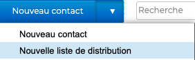
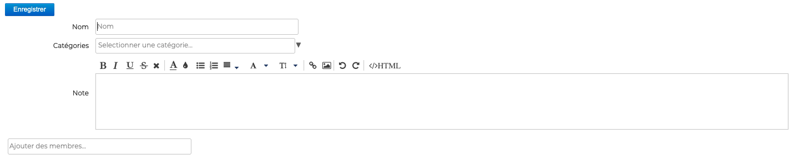
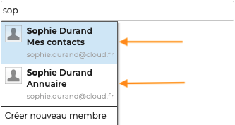
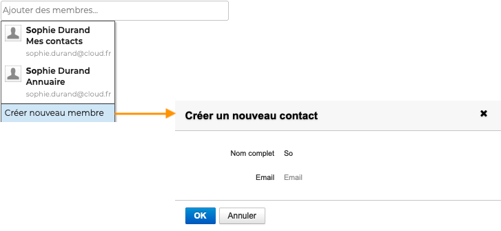
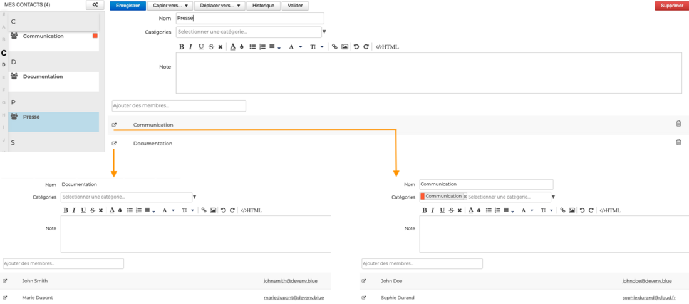
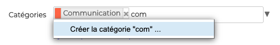
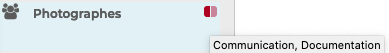
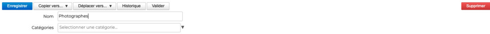
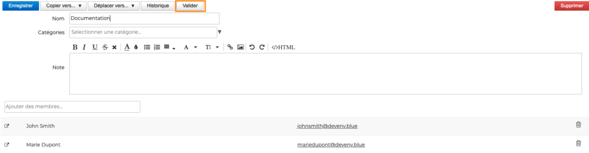

# Éditer une liste de distribution

Les listes de distribution permettent d'inviter un ensemble de personnes, par exemple tous les membres d'un projet, à un évènement ou une réunion en sélectionnant un seul destinataire. 

:::info

La possibilité de sélectionner une liste de distribution comme destinataire d'un message sera disponible dans la prochaine version

:::

Des listes de distribution personnelles peuvent être ajoutées ou modifiées dans les **[carnets personnels](/Guide_de_l_utilisateur/Les_contacts/Créer_et_éditer_un_carnet_d_adresses_personnel/) de l'utilisateur **ainsi que dans ses **[carnets partagés](/Guide_de_l_utilisateur/Les_contacts/Partager_un_carnet_d_adresses/) avec des droits d'écriture**.

Il n'est pas possible de créer de liste de distribution personnelle dans les carnets partagés en lecture seule, ni dans l'[annuaire](/Guide_de_l_utilisateur/Les_contacts/Utiliser_un_carnet_d_adresses_partagé/).

## Créer une liste de distribution

Pour créer une liste de distribution, **se positionner sur le carnet d'adresses** dans lequel la liste doit être créée, cliquer sur la flèche du bouton «**Nouveau Contact**» puis choisir «**Liste de distribution**» dans le menu 

Sur la page d'édition, **renseigner un titre** puis **ajouter les membres** souhaités grâce au champs "Ajout d'un membre".

L'**autocomplétion** recherche les fiches correspondantes dans tous les carnets d'adresses. La liste indique le nom et le carnet d'adresses des contacts trouvés :

:::tip

Le menu déroulant propose l'option «**Créer nouveau membre**» donnant accès à un formulaire de création rapide d'un contact avec un nom et une adresse de messagerie :

Le contact est alors créé dans le carnet en cours de consultation et ajouté à la liste de distribution.

:::

## Créer une liste de distribution contenant une liste de distribution

Une liste de distribution peut inclure non seulement des contacts mais également **une autre liste de distribution**.

Lorsque l'utilisateur souhaitera écrire à la liste "mère", toutes les adresses seront ajoutées dans le message, celles directement comprises dans la liste ainsi que celles de la liste incluse :

:::info

Il est possible d'inclure des listes provenant d'**un même carnet uniquement**, les listes d'un autre carnet (du même utilisateur ou d'un carnet partagé) ne peuvent pas être incluses.

Cela exclut donc aussi les groupes issus de l'annuaire.

:::

## Ajouter des catégories aux listes de distribution

Afin de faciliter leur recherche, il est possible d'ajouter une ou plusieurs [catégories](/Guide_de_l_utilisateur/Paramétrer_le_compte_utilisateur/) (étiquettes) aux listes de distribution.

Pour cela, **sélectionner la ou les catégories** dans la liste en saisissant les premières lettres de la catégorie souhaitée - l'autocomplétion proposera les termes correspondant au cours de la frappe.

Si la catégorie n'existe pas, il suffit de saisir le texte de la nouvelle catégorie puis cliquer sur **Créer**. Une fois les modifications de la fiche contact enregistrées, la nouvelle catégorie sera ajoutée à la liste des catégories personnelles.

Pour la supprimer, cliquer sur la croix 

Il est possible d'affecter **autant de catégories que désiré**. Les catégories sont alors visibles dans la liste des contacts par des icônes de couleurs (2 au maximum). Au survol de la souris, la liste complète des catégories affectées au contact est affichée.

:::tip

Une fois la liste de distribution enregistrée, la fiche contact de la liste sera disponible **dans le carnet d'adresses sélectionné au moment de la création**.

:::

## Modifier une liste de distribution

Pour éditer une liste de distribution, **se rendre sur sa fiche** en sélectionnant d'abord le carnet d'adresses dans lequel il apparait ou en utilisant le champs de recherche en haut de page.

Si l'utilisateur n'a pas les droits d'écriture, alors les informations sont simplement affichées et les boutons d'actions sont absents. Si l'utilisateur a le droit d'édition sur la fiche alors les champs sont modifiables et les boutons d'actions sont présents.

En plus de la modification des champs, une fiche existante peut-être **copiée ou déplacée vers un autre carnet d'adresses** (personnel ou partagé) et peut-être **supprimée**. Il est également possible de voir l'**historique des modifications**.

## Mettre à jour les contacts d'une liste de distribution

Il est possible d'inclure dans une liste de distribution des contacts issus de carnets partagés par d'autres utilisateurs (droit de lecture minimum).

Afin de s'assurer que ces **contacts sont bien à jour** dans une liste de distribution, un bouton « **Valider **» permet de mettre à jour l'ensemble des contacts de la liste. Ainsi en cas de modification dans le carnet d'origine, par son propriétaire ou un ayant droit, l'utilisateur s'assure d'avoir la dernière version :

:::tip

Si le propriétaire du carnet dont proviennent les contacts retire le droit de partage sur ce carnet, alors **les contacts restent dans la liste de distribution** mais ils ne seront pas mis à jour par le bouton "Valider". En revanche, si le propriétaire redonne le droit de partage, alors la mise à jour est automatiquement effectuée et le bouton "Valider" fonctionne de nouveau.

:::

