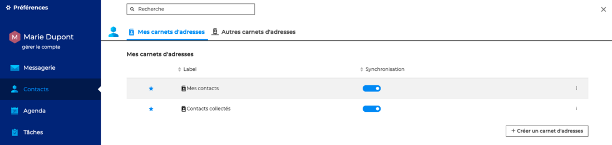
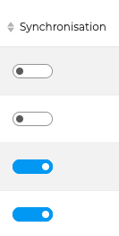

# Synchroniser les carnets d'adresses

BlueMind permet une synchronisation différenciée pour chaque carnet avec les logiciels clients (application web, clients lourds ou appareils mobiles).

La synchronisation des carnets d'adresses s'effectue dans les paramètres des contacts, en allant sur **Préférences - Contact - Mes carnets d'adresses **ou **Autres carnets d'adresses**.

Puis activer le bouton "**Synchronisation**" pour les carnets souhaités.

Lorsque la synchronisation est activée, les données sont téléchargées sur le logiciel client. De ce fait :
|     | Synchronisation activée | Synchronisation désactivée |
| --- | ----------------------- | -------------------------- |
| Application web | Les fiches sont consultables et disponibles hors connexion | Les fiches sont consultables en mode connecté mais indisponibles hors connexion |
| EAS iOS | Le carnet est visible et les fiches sont consultables et disponibles hors connexion.| Le carnet n'est pas visible et les fiches sont accessibles en recherche et autocomplétion |
| EAS (autres) | Le carnet n'est pas visible et les fiches sont accessibles en recherche et autocomplétion |
| DAV | *Mes contacts* : le carnet est visible et les fiches sont consultables et disponibles hors connexion. *Autres carnets* : pas de visibilité ni de recherche |
| Outlook (connecteur) | Le carnet est visible et les fiches sont consultables et disponibles hors connexion.  | Le calendrier n'est pas visible | 
| Thunderbird | Le carnet est visible et les fiches sont consultables et disponibles hors connexion.  | Le carnet est visible, avec une icône différente et les fiches sont accessibles en recherche (carnet d'adresses) et autocomplétion (composition de messages) | 

:::info

Avertissement de volumétrie

Lorsque le volume des données contenues dans un carnet est important (plus de 1 000 contacts), un message avertit de possibles problèmes de synchronisation

:::

:::tip

Les carnets d'adresses créés par l'utilisateur dans l'application Contacts de BlueMind, de même que ceux créés depuis les clients lourds (Outlook ou Thunderbird), sont automatiquement ajouté aux abonnements avec la synchronisation activée.

:::

