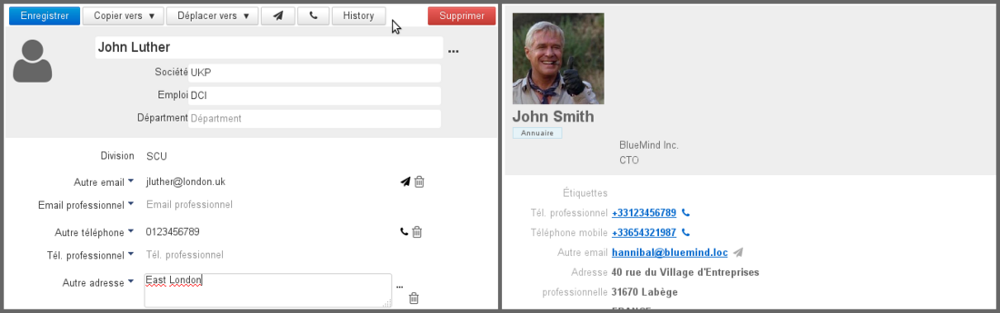
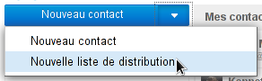
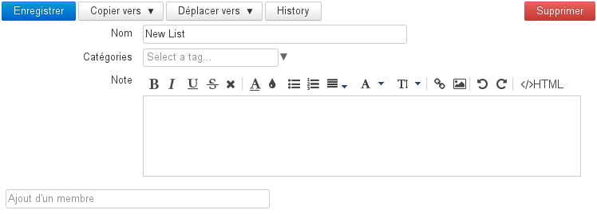
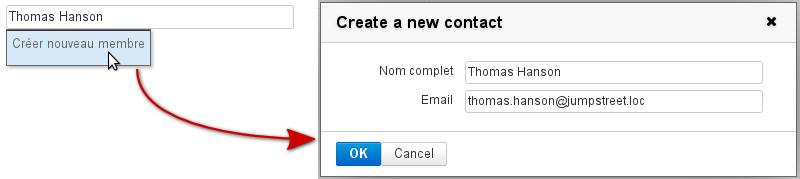
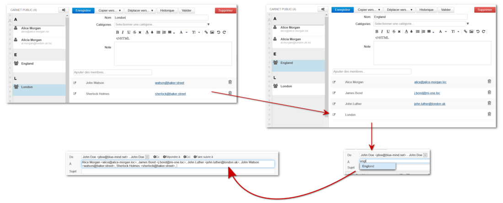
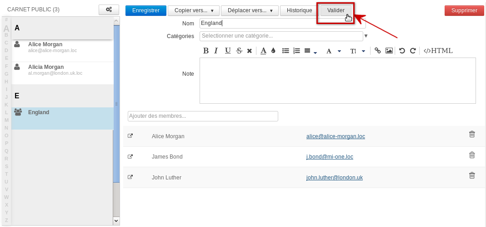
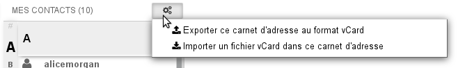

# Les contacts

# Présentation

BlueMind propose une gestion de contacts permettant la création de plusieurs carnets d'adresses, le partage de contacts entre groupes ou utilisateurs et l'accès à un carnet d'adresses d'entreprises.

Les carnets d'adresses sont synchronisables avec les clients lourds (Outlook, Thunderbird) et les smartphones (IPhone, Android, ... selon les possibilités des appareils).

Par défaut, BlueMind configure 3 carnets d'adresses :

- 
un carnet d'adresses personnel "Mes contacts" ;

- l'Annuaire, carnet d'adresses public rassemblant tous les utilisateurs publics du système;
- 
un autre carnet d'adresses personnel "Contacts collectés", qui réunit automatiquement les destinataires des messages de l'utilisateur non présents dans l'annuaire ;

D'autres carnets d'adresses peuvent être créés, de façon illimitée et peuvent être partagés de façon fine, par utilisateurs ou par groupes, en lecture comme en écriture.

# L'interface

-  : dans la 1ère colonne se trouve, sous le bouton «Nouveau contact», la liste des carnets accessibles par l'utilisateur : ses carnets d'adresses par défaut, ses carnets personnels ainsi que ceux qui lui ont été partagé et auxquels il est abonné ;
- 
 : dans la 2ème colonne se trouve la liste des contacts présents dans le carnet sélectionné en 1ère colonne
:::important

l'alphabet vertical sur la gauche de la zone permet de naviguer plus rapidement dans les contacts, les lettres auxquelles se trouvent des contacts sont mises en évidence en noir et gras pour une meilleure visibilité.

:::

-  : la 3ème colonne, zone d'affichage principale, présente la fiche de l'utilisateur sélectionné en 2ème colonne.
-  : champs de recherche

# Édition des contacts

Pour éditer un contact, se rendre sur sa fiche en sélectionnant d'abord le carnet d'adresses dans lequel il apparait ou en utilisant le champs de recherche en haut de page.

Si l'utilisateur n'a pas les droits d'écriture, alors les informations sont simplement affichées et les boutons d'actions sont absents. Si l'utilisateur a le droit d'édition sur la fiche alors les champs sont modifiables et les boutons d'actions sont présents :

Fiche éditable par l'utilisateur - Fiche non éditable par l'utilisateur

Le bouton «Ajouter» permet d'ajouter d'autres types d'informations que celles proposées par défaut : anniversaire, assistant, adresse de messagerie instantanée, etc.

# Ajouter des étiquettes à un contact

Voir [Les étiquettes (tags)](/Guide_de_l_utilisateur/Les_catégories_tags_/)

# Liste de distribution

## Création et édition

Pour créer une liste de distribution, cliquer sur la flèche du bouton «Nouveau Contact» puis choisir «Liste de distribution» dans le menu :

Sur la page d'édition, renseigner ensuite un titre puis ajouter les membres souhaités grâce au champs "Ajout d'un membre".

L'autocomplétion recherche dans tous les carnets d'adresses les fiches correspondantes en indiquant sous le nom trouvé le carnet duquel ce contact provient :

Que le nom soit trouvé ou non, le menu déroulant propose l'option «Créer nouveau membre» donnant accès à un formulaire de création rapide d'un contact avec un nom et une adresse de messagerie :

Ajout d'un membre pour une liste de distribution

Le contact est alors créé dans le carnet en cours de consultation et ajouté à la liste de distribution.

## Inclusions de listes

Une liste de distribution peut être incluse dans une liste de distribution : lorsque l'utilisateur souhaitera écrire à la liste "mère", toutes les adresses seront ajoutées dans le message, celles directement comprises dans la liste ainsi que celles de la liste incluse :

:::important

Il est possible d'inclure des listes provenant d'un même carnet uniquement, les listes d'un autre carnet (du même utilisateur ou d'un carnet partagé, voir ci-dessous) ne peuvent pas être incluses.

Cela exclut donc aussi les groupes issus de l'annuaire qui, bien qu'ayant une adresse email, sont considérés comme des listes.

:::

## Listes et carnets partagés

Il est possible d'inclure dans une liste de distribution des contacts issus de carnets partagés par d'autres utilisateurs (droit de lecture minimum).

Afin de s'assurer que ces contacts sont bien à jour dans une liste de distribution, un bouton « Valider » permet de mettre à jour l'ensemble des contacts de la liste. Ainsi en cas de modification dans le carnet d'origine, par son propriétaire ou un ayant droit, l'utilisateur s'assure d'avoir la dernière version :

:::important

Si le propriétaire du carnet dont proviennent les contacts inclus retire le droit de partage sur ce carnet, alors ****les contacts restent inclus et utilisables**** mais ils ne seront pas mis à jour par le bouton "Valider". En revanche, si par la suite le propriétaire redonne le droit de partage, alors la mise à jour est automatiquement effectuée lors de la réactivation du droit et le bouton "Valider" fonctionne de nouveau.

:::

# Importer et exporter

Pour importer ou exporter un carnet d'adresses au format vCard, cliquer sur le bouton d'action situé en haut de la liste des contacts du carnet concerné :

Dans le cas d'un export, l'intégralité des contacts du carnet sont exportés dans un seul et même fichier, proposé instantanément au téléchargement.

Dans le cas d'un import, l'intégralité des contacts présents dans le fichier est ajoutée au carnet. BlueMind ne détecte pas les doublons, les contacts seront ajoutés même si déjà présents dans le carnet.

