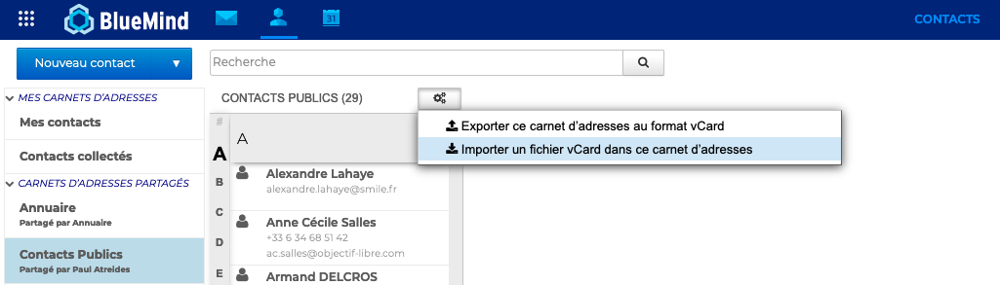
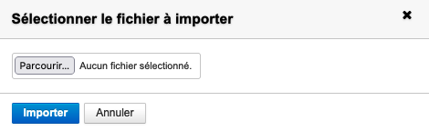
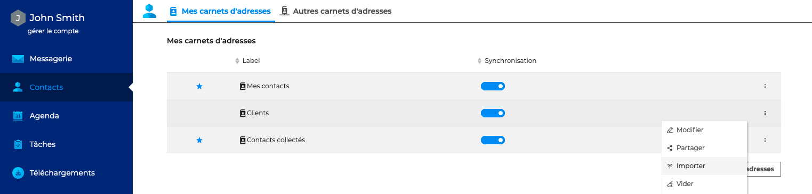
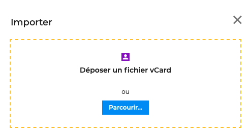
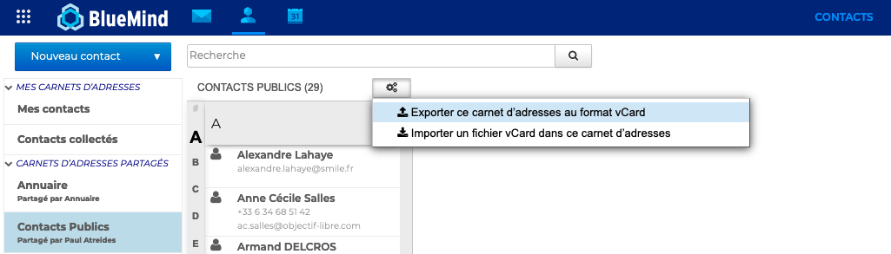

# Importer et exporter des contacts

Il est possible d'ajouter les contacts issus d'un carnet d'adresses externe dans un carnet BlueMind en **important un fichier vCard.**

Les carnets d'adresses BlueMind peuvent également être **exportés dans un fichier vCard**.

## Importer des contacts dans un carnet d'adresses partagé

Pour importer un ou plusieurs contacts dans un carnet d'adresses [partagé avec les droits d'écriture](/Guide_de_l_utilisateur/Les_contacts_4.7/Partager_un_carnet_d_adresses/), se positionner sur le carnet d'adresses où les contacts doivent être importés, cliquer sur le bouton d'action situé en haut de la liste puis "**Importer un fichier vCard dans ce carnet d'adresses**"

**Sélectionner le fichier** vCard à importer

:::info

L'intégralité des contacts présents dans le fichier est ajoutée au carnet. BlueMind ne détecte pas les doublons, les contacts seront ajoutés même si déjà présents dans le carnet.

:::

## Importer des contacts dans un carnet d'adresses personnel

L'import de contacts externes dans un carnet personnel peut se faire depuis l'interface, comme pour les carnets d'adresses partagés, ou dans les paramètres des contacts, en allant sous **Contacts - Mes carnets d'adresses**

Se positionner sur le carnet d'adresses dans lequel les contacts doivent être importés, cliquer sur "**Importer**" pour ouvrir la fenêtre pop-up d'importation et choisir le fichier **vCard** à importer

:::tip

L'import de contacts est également possible au moment de la [création d'un carnet d'adresses](/Guide_de_l_utilisateur/Les_contacts_4.7/Créer_et_éditer_un_carnet_d_adresses_personnel/).

:::

## Exporter un carnet d'adresses

Les carnets d'adresses BlueMind, personnels et [partagés avec les droits de lecture](/Guide_de_l_utilisateur/Les_contacts_4.7/Partager_un_carnet_d_adresses/), peuvent également être **exportés dans un fichier vCard**.

Pour cela, dans l'application Contact, se positionner sur le carnet d'adresses à exporter, cliquer sur le bouton d'action situé en haut de la liste puis "**Exporter ce carnet d'adresses au format vCard**"

