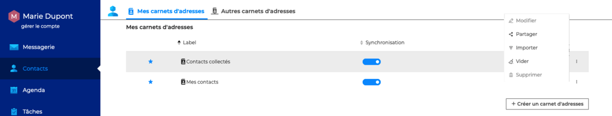
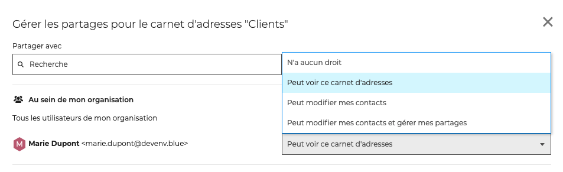
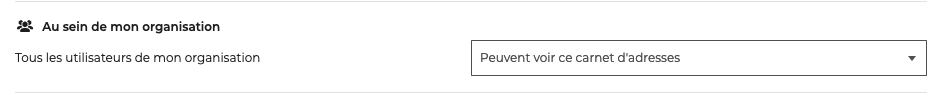

# Partager un carnet d'adresses

Un utilisateur peut décider de partager avec d'autres utilisateurs l'ensemble de ses carnets d'adresses et d'attribuer différents niveaux de droits d'accès.

La gestion des droits d'accès aux calendriers s'effectue dans les paramètres des contacts, en allant sous **Préférences - Contacts - Mes carnets d'adresses**

Cliquer sur "**Partager**" pour ouvrir la fenêtre pop-up de gestion des partages

Dans la fenêtre pop-up, **rechercher l'utilisateur** ou le groupe d'utilisateur en tapant les premières lettres - l'autocomplétion proposera tous les utilisateurs disponibles puis **sélectionner le niveau de partage** souhaité.

Les droits possibles sont : 

- **N'a aucun droit** => **aucun partage**L'utilisateur ne pourra pas voir le carnet d'adresses. Cette option peut permettre de supprimer des droits de lecture et d'écriture
- **Peut voir ce carnet d'adresses** => **partage avec droits de lecture**Après s'être abonné, le carnet d'adresses s'ajoutera aux carnets d'adresses partagés de l'utilisateur. Il pourra utiliser les contacts et les ajouter dans des listes de distribution personnelles.
- **Peut modifier mes contacts** => **partage avec droits d'écriture**En plus des droits de lecture, l'utilisateur pourra modifier, copier, déplacer ou supprimer les fiches des contacts du carnet d'adresses

- **Peut modifier mes contacts et gérer mes partages** => **partage avec droits de gestion**En plus des droits de lecture et d'écriture, l'utilisateur pourra ajouter ou supprimer les droits d'accès au carnet d'adresses

:::info

"**Tous les utilisateurs de mon organisation**" correspond au partage public du carnet d'adresses, le niveau de droits choisi sera appliqué à l'ensemble des utilisateurs du domaine

:::

