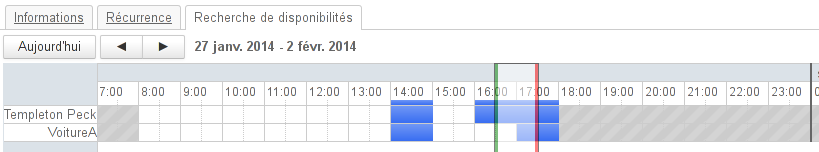
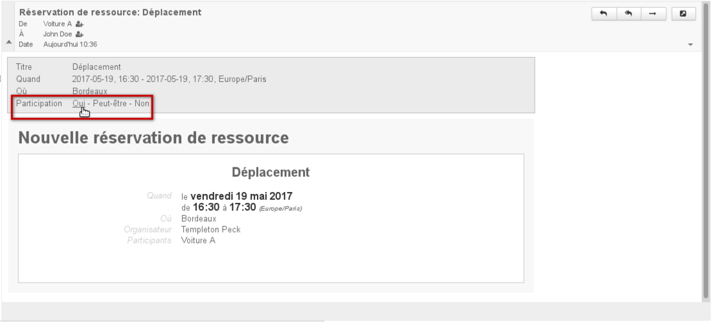
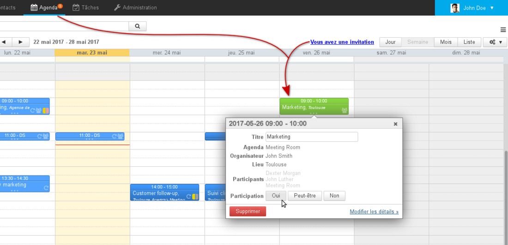
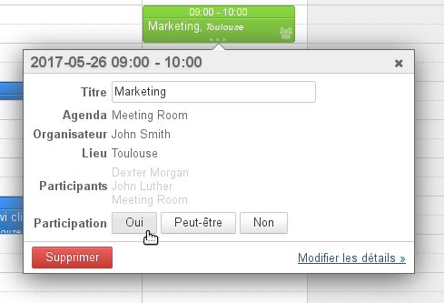

# Les ressources

# Présentation

Blue Mind permet de gérer, de même que les agendas individuels ou de groupes, les agendas de ressources (véhicules, salles, vidéo-projecteurs...).

L'administrateur peut définir de nouveaux types de ressources et déléguer la gestion des ressources à des utilisateurs.

Comme pour les agendas de personnes, la fonctionnalité disponible/occupé permet la recherche de disponibilités de ressources.

# Les droits de partage

Les droits que les utilisateurs peuvent se voir attribuer sur une ressource sont les suivants :

1 **Peut réserver la ressource** : l'utilisateur peut associer la ressource à un rendez-vous afin de demander à la réserver
1 **Peut réserver la ressource et visualiser ses réservations** : en plus du droit précédent, l'utilisateur peut consulter l'agenda de la ressource et voir ainsi ses réservations et demandes en cours
1 **Peut modifier ses réservations** : en plus des droits précédents, l'utilisateur peut modifier les réservations de la ressource (accepter, refuser, modifier, déplacer, supprimer, etc.). L'utilisateur est alors appelé **gestionnaire de la ressource**.
1 **Peut modifier ses réservations et gérer ses partages** : en plus des droits précédents, le gestionnaire de la ressource peut modifier les droits de partage de celles-ci et les attribuer aux autres utilisateurs.

# Réservation d'une ressource

La réservation d'une ressource se fait en plusieurs étapes :

1 L'utilisateur souhaitant réserver la ressource ajoute celle-ci aux participants de son événement lors de la création ou de l'édition de celui-ci.Pour cela il peut utiliser la recherche de disponibilités comme pour les autres participants : 
1 Lorsque l'utilisateur enregistre son événement, il a le choix d'envoyer ou non une invitation, il s'agit d'un email de demande de réservation.
1 
Le ou les gestionnaire désignés de la ressource reçoivent alors une demande par alerte d'agenda si le calendrier de la ressource est actuellement affiché dans leur application ** **et** ** par mail si une invitation a été envoyée.

Le gestionaire peut accepter la demande depuis le mail de réservation

La ressource est vue en attente de validation par le gestionnaire

1 2 cas sont possible selon la [politique de réservation](/Guide_de_l_administrateur/Gestion_des_entités/Ressources/#Administrationdesressources-surbooking) choisie pour la ressource :
  2 Si l'acceptation et le refus automatiques sont activés, alors :
    - le gestionnaire reçoit un message de réservation de la ressource
    - si la ressource est disponible, sa participation est validée
    - si la ressource n'est pas disponible, sa participation est refusée
    - l'utilisateur reçoit un message d'acceptation ou de refus de la part de la ressource
  2 Si l'acceptation et le refus automatiques ne sont pas activés, le gestionnaire doit valider la demande de réservation d'une des différentes manières possible :
    - depuis sa messagerie, par les liens "Participation" de l'email reçu
    - depuis son agenda, par la liste des événements en attente (clic sur l'icône chiffrée du bandeau de navigation)
    - depuis son agenda en cliquant sur l'événement : 
:::important

si seule l'acceptation automatique est activée et que la ressource n'est pas disponible, alors c'est le cas b qui est appliqué : le gestionnaire de ressource reçoit un message de demande de réservation et le statut de la ressource reste en attente.

:::
1 L'utilisateur est alors informé par mail que la ressource a accepté ou refusé l'invitation.

:::important

Le processus de réservation est le même pour le gestionnaire de ressource qui souhaite la réserver lui-même : l'acceptation n'est pas automatique, il doit valider la participation de la ressource une fois le rendez-vous créé.
En revanche, il ne reçoit pas de message de demande de réservation, seuls les autres administrateurs de la ressource, s'il y en a, le reçoivent.

:::

# Foire aux Questions

## Général

### Une ressource peut-elle avoir plusieurs réservations simultanées ?

En effet, si le(s) gestionnaire(s) valident plusieurs demandes de réservations pour un même créneau horaire, la ressource aura plusieurs réservations simultanées.

Au moment de la réservation, l'utilisateur est averti de la non disponibilité de la ressource mais il peut malgré tout effectuer une demande.

**La double réservation (le surbooking) est empêchée par défaut pour les ressources nouvellement créées :** si une ressource est disponible alors sa participation est automatiquement validée, si elle ne l'est pas alors l'événement est automatiquement refusé. Le gestionnaire de ressource garde cependant la main et peut toujours modifier les attributions ainsi que créer et modifier les événements du calendrier de la ressource directement.

Pour en savoir plus sur la configuration, veuillez consulter le chapitre dédié : [Guide de l'administrateur > Administration des ressources > Politique de réservation](/Guide_de_l_administrateur/Gestion_des_entités/Ressources/#Administrationdesressources-surbooking)

## Je suis utilisateur

### La ressource n'est pas proposée par l'autocomplétion lorsque je la recherche

Vérifiez auprès de votre administrateur ou auprès du gestionnaire de ressource que des droits de réservation vous ont bien été affectés

## Je suis gestionnaire

### L'alerte de demande de réservation n'apparaît pas

Vérifiez dans la partie gauche de votre agenda que le calendrier de la ressource est présent dans la liste des calendriers actuellement affichés.

### J'ai une alerte de réservation mais je ne vois pas l'événement ni aucun autre dans ma vue

Vérifiez dans la partie gauche de votre agenda que le calendrier de la ressource n'est pas grisé : s'il est grisé, cela signifie qu'il est présent (donc l'alerte apparaît) mais non affiché (les rendez-vous sont masqués)

### Je souhaite quitter la gestion d'une ressource

Si vous avez le droit de gestion des partages de la ressource, vous pouvez le supprimer vous-mêmes en vous rendant dans votre interface de gestion des paramètres utilisateur > Agenda > onglet "Gestion des Partages" :

- sélectionnez la ressource dans la liste déroulante
- modifiez ou supprimez le droit qui vous est affecté dans la liste des personnes et groupes autorisés

:::important
Si vous diminuez votre droit de partage, l'écran de modification des partages de la ressource est toujours accessible tant que vous ne quittez pas la gestion des paramètres. Néanmoins, la modification est immédiate et si vous essayez de modifier (pour remettre par exemple) le droit, cela sera sans effet et un message d'erreur «Opération interdite» vous informera que vous ne pouvez pas faire cela.
:::

Si vous n'avez pas ce droit de gestion, il faut alors vous adresser à un administrateur de BlueMind ou à un autre gestionnaire de la ressource.

