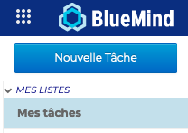
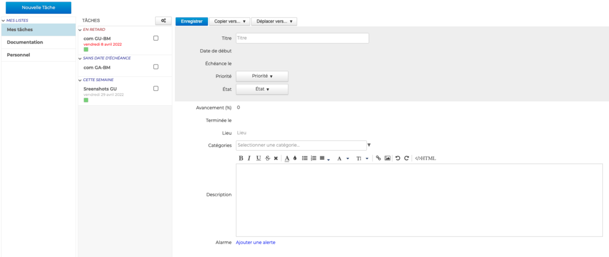
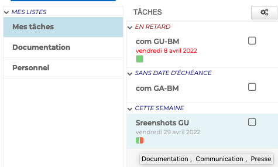
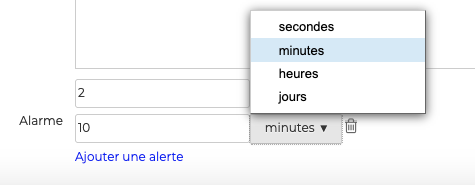

# Ajouter une tâche

Pour ajouter une tâche, se positionner sur la liste souhaitée puis cliquer sur "**Nouvelle tâche**" pour ouvrir **la fiche de création**

## Saisir les informations

La fiche de création de tâches permet d'indiquer **toutes les informations nécessaires** :

- **Titre** : nom ou résumé de la tâche - champ en texte libre **obligatoire**
- **Date de début** : date à laquelle la tâche doit commencer
- **Échéance** : date de fin attendue
- **Priorité** : liste indiquant si l'importance de la tâche est Haute - Moyenne ou Basse
- **État** : liste indiquant si la tâche est Non démarrée - Terminée - En cours ou Annulée
- **Avancement** : permet de renseigner au fur et à mesure de l'exécution de la tâche, son niveau d'avancement en pourcentage
- **Terminée le** : date de fin effective
- **Lieu** : adresse ou indication concernant la localisation de la tâche - champ en texte libre
- **Description** : indique toute information complémentaire - champ en texte libre, avec possibilité de mise en page, d'ajouter des images, des liens, etc

## Ajouter des catégories

Afin de faciliter leur recherche, il est possible d'ajouter une ou plusieurs [catégories](../Parametrer_le_compte_utilisateur.md/#créer-des-catégories) (étiquettes) aux tâches.

Pour cela, **sélectionner la ou les catégories** dans la liste en saisissant les premières lettres de la catégorie souhaitée - l'autocomplétion proposera les termes correspondant au cours de la frappe.

Si la catégorie n'existe pas, il suffit de saisir le texte de la nouvelle catégorie puis cliquer sur **Créer**. Une fois les modifications de la fiche de la tâche enregistrées, la nouvelle catégorie sera ajoutée à la liste des catégories personnelles.

Pour la supprimer, cliquer sur la croix 

Il est possible d'affecter **autant de catégories que désiré**. Les catégories sont alors visibles sur la tâche par des icônes de couleurs (2 au maximum). Au survol de la souris, la liste complète des catégories affectées à l'évènement est affichée.

## Ajouter une alerte

La dernière partie de la fiche permet d'ajouter **des alertes de rappel**, en secondes, minutes, heures ou jours.

:::tip

Une fois le formulaire rempli et enregistré, la tâche apparaît dans la liste et le bouton  est alors disponible en haut du formulaire.

:::

