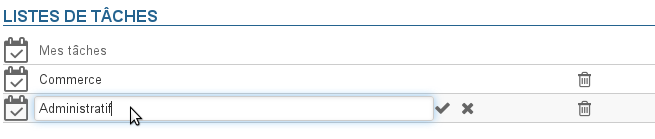
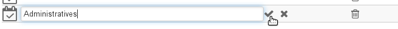
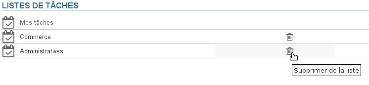
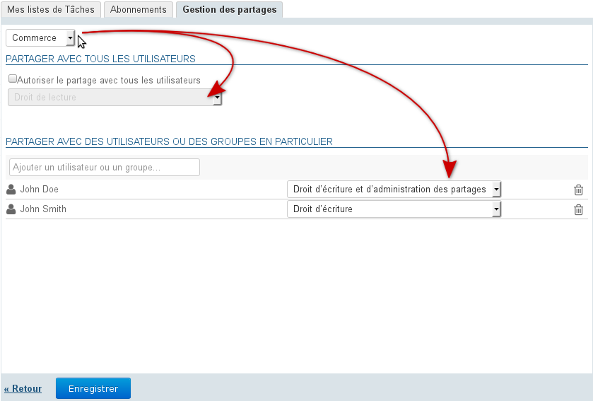

# Préférences des tâches

# Présentation

Pour accéder aux préférences des tâches, se rendre dans "Mon compte" en cliquant sur le nom d'utilisateur à droite du bandeau de navigation :

# Les listes de tâches

Le 1er onglet vous permet de gérer vos listes de tâches, en complément de la gestion au sein de l'application elle-même :

Par défaut, chaque utilisateur a une liste personnelle "Mes tâches", celle-ci ne peut être ni modifiée ni supprimée.

## Création

Pour créer une liste de tâches :

- Renseigner un libellé
- Cliquer sur le bouton "Ajouter"

La liste apparaît dans la liste au dessous et est dès lors accessible dans l'application.

## Modification

Pour renommer une liste, cliquer sur son libellé afin de faire apparaître le champs de saisie :

Renseigner le nouveau et valider en cliquant sur la coche en fin de ligne ou grâce à la touche Entrée ou simplement en quittant le champs :

:::important

tant que vous n'avez pas validé vos modifications, vous pouvez cliquer sur la croix en fin de ligne pour les annuler : 

:::

## Suppression

Pour supprimer une liste de tâches, cliquer sur l'icône poubelle  de la ligne correspondante :

:::important

Les tâches contenues dans une liste sont supprimées avec la liste.

:::

# Abonnements

Cet onglet permet à l'utilisateur de s'abonner à des listes de tâches partagées ou à ses propres listes et d'activer leur synchronisation pour une utilisation hors ligne ou sur des clients tiers (logiciel client lourd ou périphérique mobile) :

Lorsque la synchronisation est activée pour une liste, les données sont téléchargées sur le logiciel client. De ce fait :

    |  | Synchronisation activée | Synchronisation désactivée |
| --- | --- | --- |
| Application web et Thunderbird | les tâches sont consultables et disponibles hors connexion | les tâches sont consultables en mode connecté mais indisponibles hors connexion |
| EAS iOS | les tâches sont visibles et disponibles hors connexion via l'application *Rappels* | les tâches ne sont pas visibles |
| EAS (autres) | si l'appareil le permet (voir la page [Compatibilité](Compatibilite_57770212.html) pour plus de détails) :- les tâches sont visibles- les tâches sont disponibles hors connexion | les tâches ne sont pas visibles |
| DAV | les tâches sont visible et disponibles hors connexion |
| Outlook | - les tâches sont visibles et disponibles hors connexion- Si un abonnement à une liste est ajoutée dans Outlook, il est automatique ajouté dans BlueMind avec la synchronisation activée | les tâches ne sont pas visibles |

:::important

Lorsque le volume des données contenues dans une liste est important (plus de 9000 tâches), un message avertit de possibles problèmes de synchronisation.

:::

Pour ajouter une liste :

- Saisir le nom de la liste recherchée
- Valider avec la touche &lt;Entrée> ou choisir dans la liste proposée par l'autocomplétion
- Désactiver la synchronisation si désiré
- **Cliquer sur le bouton «Enregistrer» pour prendre en compte les changements.**

Pour supprimer une liste :

- Cliquer sur l'icône corbeille en fin de ligne 
- **Cliquer sur le bouton «Enregistrer» pour prendre en compte les changements.**

:::important

Il est nécessaire de cliquer sur « Enregistrer » pour prendre en compte un changement d'état de synchronisation puis **relancer la synchronisation (ou attendre la synchronisation automatique) sur le logiciel client** pour que les modifications soient prises en compte (téléchargement et visualisation des données en cas d'activation, suppression des données en cas de désactivation).

:::

# Gestion des partages

BlueMind permet de partager ses listes de tâches avec les autres utilisateurs afin de les rendre simplement consultable ou de créer des listes partagées grâce au droit d'écriture.

Les droits possibles sont :

- **Droit de lecture** : l'utilisateur ne peut que consulter les tâches, en affichant la liste dans sa vue de calendrier ou dans son application Tâches
- **Droit d'écriture** : en plus du droit de lecture, l'utilisateur peut modifier ou même créer ou supprimer des tâches dans la liste
- **Droit d'écriture et d'administration des partages** : en plus des droits précédents, l'utilisateur peut gérer les partages de la liste depuis son espace de gestion des préférences

Pour partager une liste :

1 Choisir la liste concernée dans la liste déroulante en haut de l'onglet.Un utilisateur peut partager :
  - ses listes personnelles : « Mes tâches », ou d'autres listes créées
  - les listes de tâches pour lesquelles il a délégation : on lui a attribué le droit "Droit d'écriture et d'administration des partages"
1 Si l'on souhaite créer un partage public, cocher la case "Autoriser le partage avec tous les utilisateurs" et choisir le type de droit à attribuer aux utilisateurs
1 ** **Choix recommandé :** ** Si l'on préfère attribuer des droits individuellement à certains utilisateurs ou groupe, rechercher la personne grâce au champs de saisie puis sélectionner le droit à lui attribuer
1 Une fois tous les droits attribués comme souhaité, valider en cliquant sur **« Enregistrer »**

