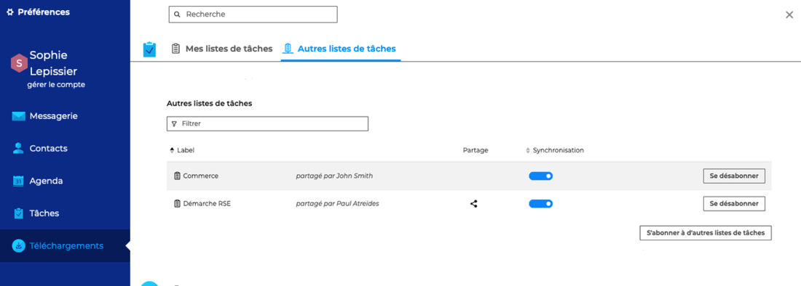
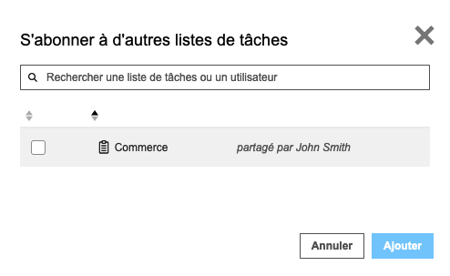
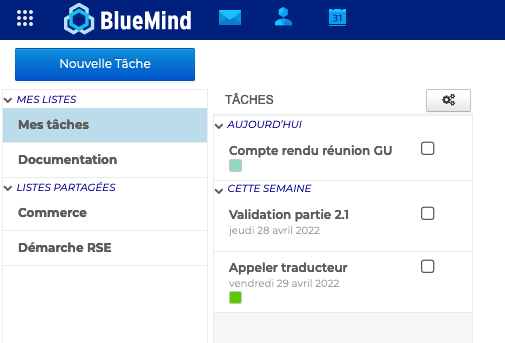
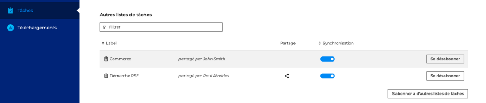

# Utiliser une liste de tâches partagée

En plus de ses listes de tâches personnelles, les utilisateurs peuvent accéder à des listes supplémentaires partagées par d'autres utilisateurs.

La gestion des listes de tâches partagées s'effectue dans les paramètres des tâches, dans **Préférences - Tâches - Autres listes de tâches

**

****

## S'abonner à une liste de tâches

Pour s'abonner à une liste de tâches partagée par un autre utilisateur, cliquer sur "**S'abonner à d'autres calendriers**"

**Sélectionner le(s) liste(s) de tâches** parmi celles partagées par les autres utilisateurs puis cliquer sur "**Ajouter**". Les listes sélectionnées apparaissent alors dans la liste des "**Autres listes de tâches**".

## Consulter les listes de tâches partagées

Une fois l'abonnement validé, la liste de tâches apparait dans les **listes des tâches partagées** (colonne de gauche).

En fonction du **[niveau de droits accordés](/Guide_de_l_utilisateur/Les_tâches/Partager_une_liste_de_tâches/) **à l'utilisateur, celui-ci pourra :

- consulter les tâches de la liste
- modifier la liste en ajoutant ou modifier les tâches
- gérer les partages de la liste de tâches

## Gérer les partages des listes de tâches partagées

Cliquer sur l'icône de partage  pour ouvrir la fenêtre pop-up et suivre la **procédure de [partage d'un carnet d'adresses](/Guide_de_l_utilisateur/Les_tâches/Partager_une_liste_de_tâches/)**

:::info

Afin de pouvoir modifier les droits d'accès d'un carnet d'adresses qui lui a été partagé, l'utilisateur doit avoir les [droits de gestion](/Guide_de_l_utilisateur/Les_tâches/Partager_une_liste_de_tâches/) sur le carnet et y être **abonné**.

:::

