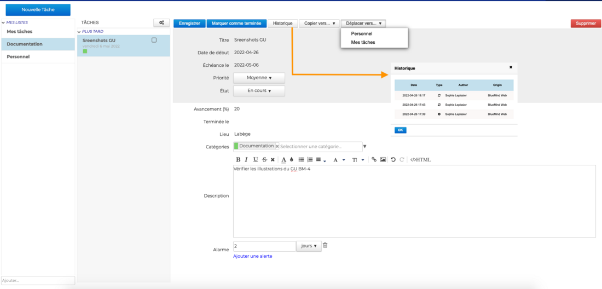
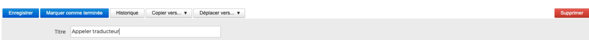
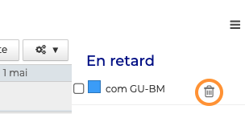
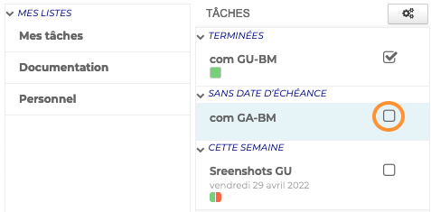
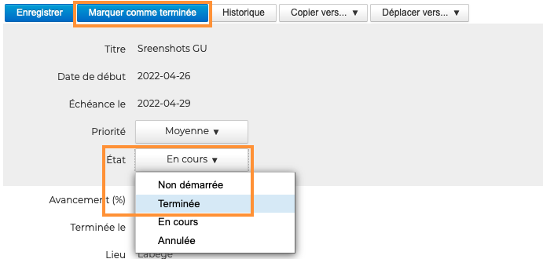
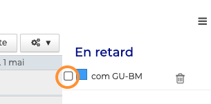
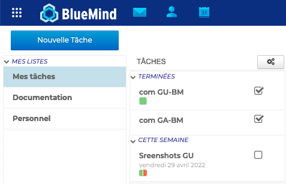

# Éditer et terminer une tâche

## Éditer une tâche

**Pour modifier, déplacer ou copier** une tâche, ouvrir son formulaire d'édition. 

Apporter les modifications souhaitées, de la même façon que lors de la [création de la tâche](Ajouter_une_tâche.md) et cliquer sur "**Enregistrer**.
Utiliser la barre d'actions pour **voir l'historique de la tâche, la copier ou la déplacer**.

## Supprimer une tâche

- **Depuis le formulaire d'édition** en cliquant sur "**Supprimer**"

- **Depuis l'agenda**, **cliquer sur**  dans le [panneau des tâches de l'Agenda](/Guide_de_l_utilisateur/Les_tâches/Visualiser_une_tâche/)

:::info

Supprimer

**Aucune confirmation de suppression n'est demandée**, la tâche sera directement et définitivement supprimée.

:::

## Terminer une tâche

- **Depuis l'application Tâches**, **cliquer sur**  dans la colonne des tâches

- **Depuis le formulaire d'édition** en cliquant sur "**Marquer comme terminée**" ou en sélectionnant "**Terminée**" dans la liste déroulante du champ **État**

- **Depuis l'agenda**, **cliquer sur**  dans le [panneau des tâches de l'Agenda](/Guide_de_l_utilisateur/Les_tâches/Visualiser_une_tâche/).

:::tip

Une fois cochée, la tâche disparait du panneau. 
**Toutes les tâches terminées sont visibles dans l'application**, classées par liste de tâches et sous le statut "Terminées". **Décocher**  pour enlever le statut "**terminée**"

:::

