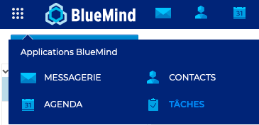
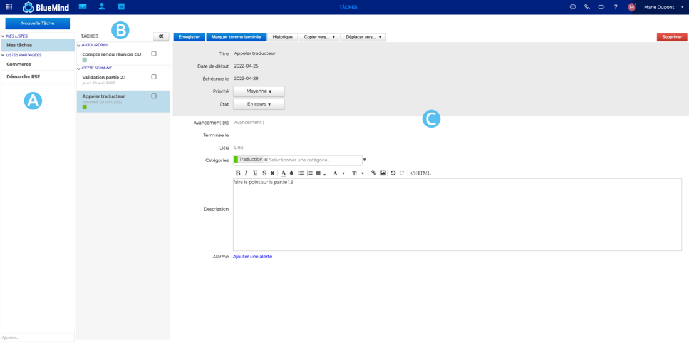

# Découvrir les tâches

BlueMind propose la gestion des tâches dans une application dédiée et synchronisée avec l'[agenda](/Guide_de_l_utilisateur/L_agenda_4.7/).

Il est possible d'organiser ses tâches par listes et d'utiliser les tags partagés avec les applications Contacts et Agenda de BlueMind.

Les tâches peuvent être partagées avec les autres membres de l'organisation en leur déléguant une visualisation simple ou la gestion complète.

## Accéder à l'application

**L'accès** aux tâches s'effectue dans la barre de navigation principale BlueMind.

## Naviguer dans l'interface

La gestion des tâches se présente sous la forme d'une application en 3 colonnes :

-  : dans la 1ère colonne se trouve, sous le bouton «Nouvelle tâche», les listes de tâches auxquelles l'utilisateur est abonné : sa liste par défaut "Mes tâches", et d'autres listes qu'il a créées ou auxquelles il s'est abonné (via sa gestion des paramètres)
-  : dans la 2ème colonne se trouve les tâches contenues dans la liste sélectionnée, le bouton d'action en haut de colonne permet l'export des tâches de la liste ou l'import de tâches dans celle-ci
-  : la 3ème colonne, zone d'affichage principale, présente la fiche de la tâche sélectionnée ou en cours de création

