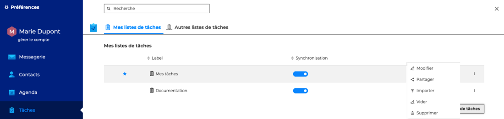
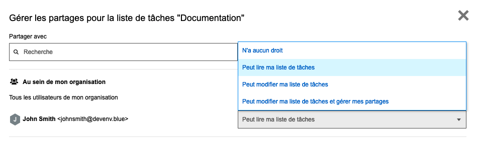
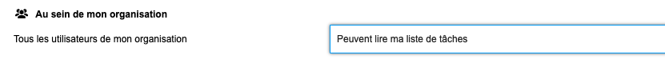

# Partager une liste de tâches

Un utilisateur peut décider de partager avec d'autres utilisateurs l'ensemble de ses listes de tâches et attribuer différents niveaux de droits d'accès.

La gestion des droits d'accès aux listes des tâches s'effectue dans les paramètres des tâches, en allant sous **Préférences - Tâches - Mes listes de tâches**

Cliquer sur "**Partager**" pour ouvrir la fenêtre pop-up de gestion des partages

Dans la fenêtre pop-up, **rechercher l'utilisateur** ou le groupe d'utilisateur en tapant les premières lettres - l'autocomplétion proposera tous les utilisateurs disponibles puis **sélectionner le niveau de partage** souhaité.

Les droits possibles sont : 

- **N'a aucun droit** => **aucun partage**L'utilisateur ne pourra pas voir la liste de tâches. Cette option peut permettre de supprimer des droits de lecture et d'écriture
- **Peut lire ma liste de tâches** => **partage avec droits de lecture**Après s'être abonné, la liste de tâches s'ajoutera aux listes de tâches partagées de l'utilisateur. Il pourra consulter les tâches de la liste dans sa vue de calendrier ou dans son application Tâches.
- **Peut modifier ma liste de tâches** => **partage avec droits d'écriture**En plus des droits de lecture, l'utilisateur pourra modifier, copier, déplacer ou supprimer les tâches de la liste

- **Peut modifier ma liste de tâches et gérer mes partages** => **partage avec droits de gestion**En plus des droits de lecture et d'écriture, l'utilisateur pourra ajouter ou supprimer les droits d'accès à la liste de tâches

:::tip

"**Tous les utilisateurs de mon organisation**" correspond au partage public de la liste de tâches, le niveau de droits choisi sera appliqué à l'ensemble des utilisateurs du domaine

:::

