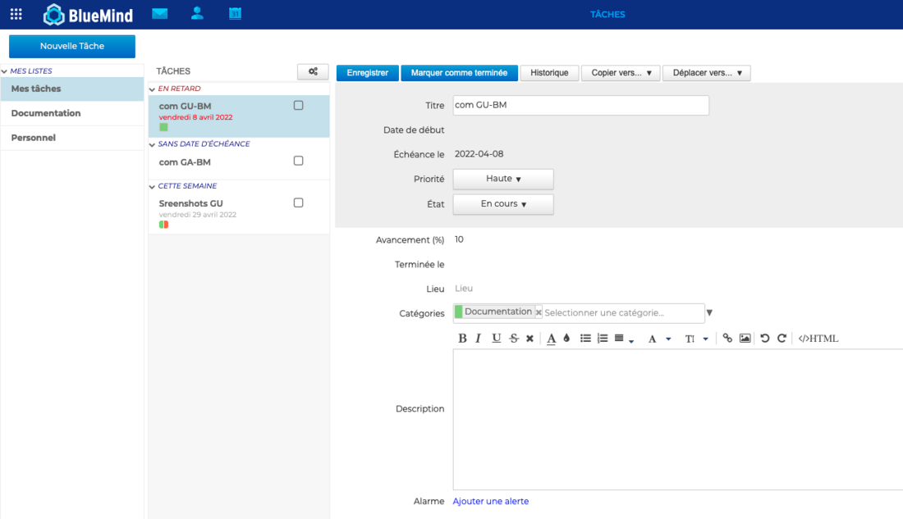
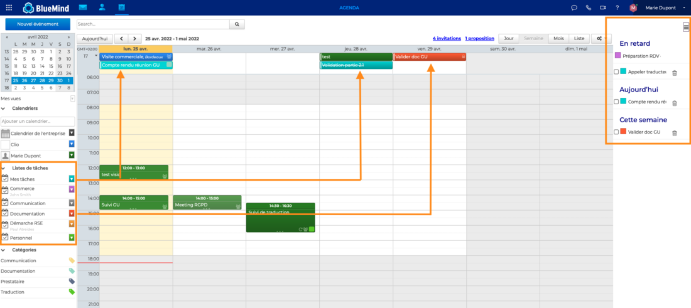
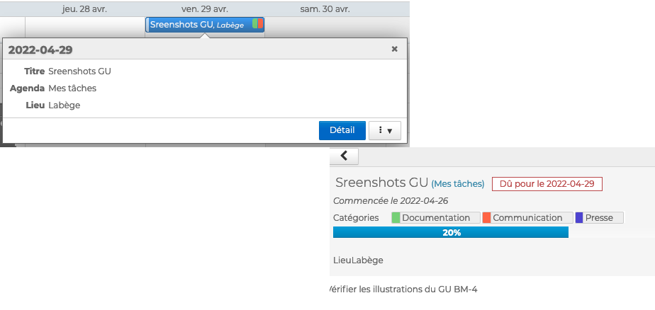

# Visualiser une tâche

## Visualiser les tâches dans l'application

Dans l'interface de gestion des tâches, celles-ci sont **classées par liste **et apparaissent **triées suivant leur état** dans des sous-listes dépliables. Le détail de chaque tâche est visible dans la zone d'édition.

**Classement des tâches** :

- **En retard** : tâches dont la date d'échéance est passée
- **Aujourd'hui** : tâches dont la date d'échéance est ce jour
- **Cette semaine** : tâches dont la date d'échéance se situe dans la semaine en cours
- **Ce mois** : tâches dont la date d'échéance se situe dans le mois à venir à partir de la semaine suivante

## Visualiser les tâches dans l'agenda

Dans l'agenda, les tâches sont présentées **comme des calendriers**.

Les listes sont regroupées dans le sous-menu "**Listes de tâches**"

Les tâches sont présentées dans la partie haute de la vue, comme les **événements sur journée complète**, à leur date d'échéance.

De plus, l'utilisateur peut afficher un **panneau en partie droite de la page** afin d'afficher les **tâches non terminées** sous forme de liste, présentées suivant le même tri que dans l'application de gestion des tâches.

Chaque tâche est présentée avec le code couleur de la liste à laquelle elle appartient et son titre. La coche  permet de marquer la tâche comme terminée et l'icône poubelle  de la supprimer.

:::tip

En haut à droite de l'agenda, le bouton  permet de faire apparaître ou masquer le panneau des tâches.

:::

**Pour voir le détail d'une tâche** depuis l'agenda, **cliquer sur l'évènement** puis sur "**Détails**"

