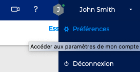
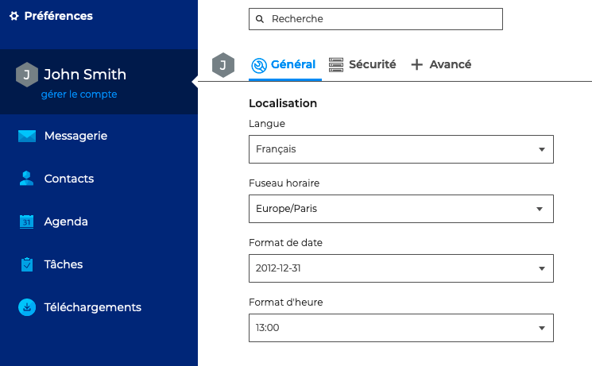
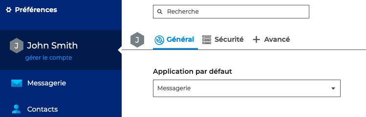
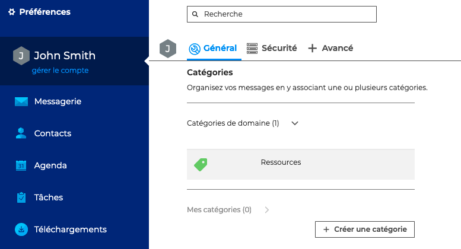
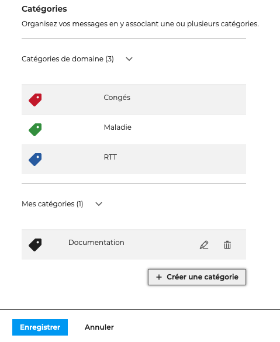
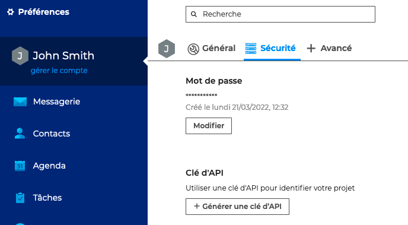
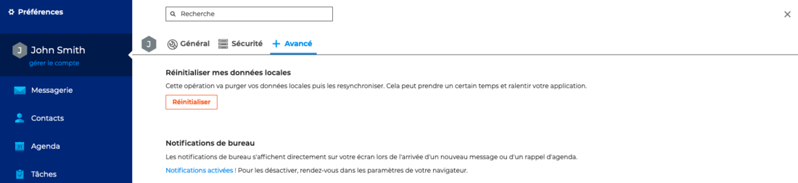
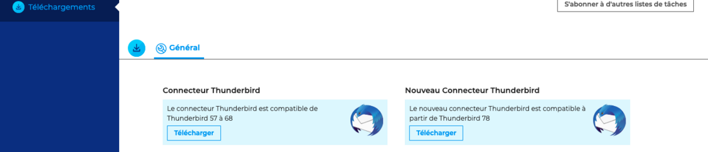

# Paramétrer le compte utilisateur

L'interface de gestion des paramètres permet à l'utilisateur de **personnaliser son environnement BlueMind**.

Cette interface est accessible **depuis le bandeau de navigation** présent en haut de toutes les pages de BlueMind :

## Paramétrer la localisation

**Localisation** permet de régler les paramètres généraux de localisation et d'affichage de l'application :

- La langue d'affichage
- Le fuseau horaire sur lequel il se trouve, cela permet à l'application de régler automatiquement son horloge
- Le format d'affichage des dates : jour/mois/année ou mois/jour/année ou année-mois-jour
- Le format d'affichage des heures : sur 24 heures ("13:00") ou au format anglo-saxon ("1:00 pm")

:::info

À propos des langues

BlueMind est actuellement traduit et en cours de traduction dans plusieurs langues. Vous pouvez consulter les langues disponibles ainsi que leur évolution sur le site dédié à la traduction de l'application : [https://forge.blue-mind.net/translate/](https://forge.blue-mind.net/translate/)

:::

## Définir l'application d'ouverture

Toujours dans les paramètres généraux,**Application par défaut** permet de choisir l'application qui s'ouvrira par défaut lors de la connexion à BlueMind

## Créer des catégories

**Les catégories** permettent d'ajouter un ou plusieurs mots clefs (ou *tags*) aux contacts et événements d'agenda afin de **pouvoir les classer et les retrouver** rapidement.

:::info

Les catégories de domaines, créées par l'administrateur, ne sont pas modifiables.

:::

Pour **ajouter une catégorie** personnelle, aller sur "**+Créer une catégorie**" puis

- saisir le libellé
- choisir une couleur (par défaut, une couleur disponible est proposée)
- cliquer sur **Créer**
- cliquer sur **Enregistrer**

Aller sur  pour **modifier** et sur  pour **supprimer** une catégorie.

:::info

Enregistrer

Ne pas oublier d'enregistrer les modifications en bas de page avant de quitter les préférences.

:::

## Gérer les mot de passe et clé d'API

Pour changer son **mot de passe** et générer une **clé d'API,** aller dans les paramètres de sécurité.

## Gérer les données locales et notifications

L'onglet "**+Avancé**" des préférences du compte utilisateur donne accès à la **réinitialisation des données locales** de l'application ainsi qu'à l'**activation des notifications**.

Les **notifications** permettent de recevoir une alerte à l'écran lors de l'arrivée d'un nouveau message ainsi que pour les rappels d'événements.

Les navigateurs supportant cette fonctionnalité sont :

- Chrome
- Firefox
- Safari

Les navigateurs non supportés sont :

- Internet Explorer
- Opera

## Téléchargements

La section téléchargements des paramètres permet aux utilisateurs de télécharger le connecteur Thunderbird mis à disposition par leur administrateur afin de synchroniser leur logiciel.

