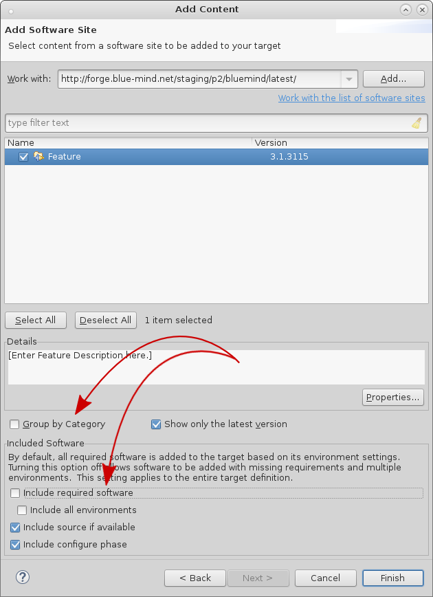
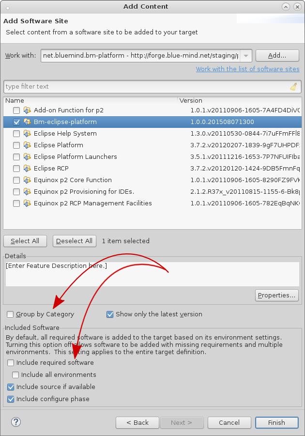
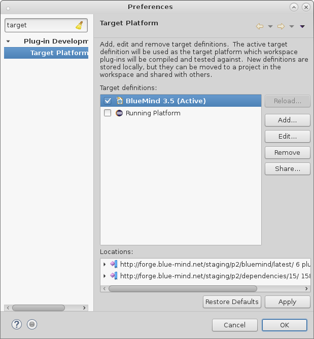

# Eclipse


## Prérequis

- [Installer Maven](https://maven.apache.org/)
- récupérer les sources de BlueMind tel que décrit dans la page [Contribuer à BlueMind](/Guide_du_developpeur/Contribuer_à_BlueMind/)


## Installation

Télécharger et installer la version [d'Eclipse](https://www.eclipse.org/downloads/packages/) pour développeurs RCP et RAP.

## Configuration

### Ajout d'une plateforme d'exécution

La plateforme d'exécution Eclipse doit-être complétée avec les dépendances de BlueMind :

1. démarrer et initialiser un workspace en utilisant la version d'Eclipse que vous souhaitez utiliser pour développer (par exemple Eclipse Mars installé précédemment)
2. aller dans *Window*->*Preferences*, chercher *Target*
3. cliquer sur *Target Platform*
4. cliquer sur *Add*, choisir *Nothing* option, cliquer sur *Next*
5. indiquer un nom (ex: BlueMind 3.5)
6. cliquer sur le bouton *Add*, choisir *Software Site*, puis cliquer sur *Next*
7. dans le champs *«Work with»*, indiquer [http://forge.blue-mind.net/staging/p2/bluemind/latest](http://forge.blue-mind.net/staging/p2/bluemind/latest)
    1. Au bas de la fenêtre décocher *«Group by category*» et «*Include required software»*
    2. dans la liste mise à jour, cocher *Feature*
8. cliquer sur *Finish*
9. cliquer de nouveau sur le bouton* Add*, choisir *Software Site*, puis cliquer sur *Next*
10. dans le champs Work with, indiquer [http://forge.blue-mind.net/staging/p2/dependencies/current/](http://forge.blue-mind.net/staging/p2/dependencies/current/)
    1. Au bas de la fenêtre décocher *«Group by category»* et *«Include required software»*
    2. dans la liste mise à jour, cocher *bm-eclipse-platform*
 *  *11. cliquer sur *Finish*
12. cliquer de nouveau sur *Finish*
13. s'assurer que la nouvelle plateforme est bien sélectionnée et cliquer sur *Apply* puis OK pour quitter 


### Configuration


 

#### Formatage

Afin d'utiliser un formatage du code uniforme, dans Eclipse:

1. aller dans *Window*, puis *Preference*
2. chercher Save Actions, cliquer sur *Java*->*Editor*->*Save Actions*
3. cocher* Perform the selected actions on save*
4. cocherFormat source code, sélectionner *Format all lines*
5. cocher *Organize imports*
6. cliquer sur *Apply*, puis *OK*


#### En-têtes

Il est important que les fichiers sources aient les en-têtes conformes. Dans Eclipse:

1. aller dans *Window*, puis *Preference*
2. chercher *Template*, cliquer sur *Java*->*Code Style*->*Code Template*
3. déplier le menu *Code*, cliquer sur *New Java files*
4. cliquer sur *Edit*
5. dans la partie *Pattern*, mettre:
**Pattern New Java file**

```
/\* BEGIN LICENSE
  \* Copyright © Blue Mind SAS, 2012-${year}
  \*
  \* This file is part of BlueMind. BlueMind is a messaging and collaborative
  \* solution.
  \*
  \* This program is free software; you can redistribute it and/or modify
  \* it under the terms of either the GNU Affero General Public License as
  \* published by the Free Software Foundation (version 3 of the License).
  \*
  \* This program is distributed in the hope that it will be useful,
  \* but WITHOUT ANY WARRANTY; without even the implied warranty of
  \* MERCHANTABILITY or FITNESS FOR A PARTICULAR PURPOSE.
  \*
  \* See LICENSE.txt
  \* END LICENSE
  \*/
${filecomment}
${package\_declaration}

${typecomment}
${type\_declaration}
```


6. cliquer sur *OK*
7. cliquer sur *Apply*, puis *OK*


### Initialisation du workspace Eclipse

#### "Package explorer"

Avant d'importer les plugins, il est important que la vue que vous utiliserez pour parcourir les plugins soit "Package explorer" (pour des raisons de performance).

Pour l'ouvrir :

1. Allez dans Window / Show View
2. Si elle n'apparait pas dans cet écran, cliquez sur "Other" et vous la trouverez dans la catégorie "Java"
3. Fermer les autres vues permettant de lister les plugins type "Project Explorer" ou "Plugins ..."


#### Import des plugins

Dans Eclipse

1. aller dans *File*, menu *Import*
2. déplier *General*, sélectionner *Existing projects into Workspace*
3. cliquer sur *Next*
4. cocher *Select root directory*, cliquer sur *Browse*
5. sélectionner le dossier *open* du git de BlueMind, cliquer sur *OK*
6. si vous ne voyez qu'un projet dans la liste *Projects*, nettoyer le git. Se placer dans le répertoire racine du git de BlueMind exécuter: *git clean -f -d -n -x*, puis recommencer à l'étape 1
7. sinon, cliquer sur Finish
8. refaire l'opération pour le répertoire *closed* du git de BlueMind


#### Build maven

Il est nécessaire de faire un build maven:

1. dans un terminal, aller dans le répertoire *open* du git de BlueMind
2. lancer la commande: *mvn -Dmaven.test.skip=true clean install*
3. faire pareil dans le répertoire *open/ui/gwt-libs/*
4. dans Eclipse, sélectionner tous les packages et appuyer sur *F5* (*Refresh*)


