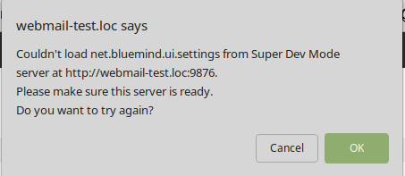

# Frontend / UI


## Présentation


## Les différents environnements front


:::info

Pré-requis

VM avec Bluemind en version 3.5 ou supérieure prête à l'utilisation.

:::

### Environnement VueJS


:::info

Pré-requis

NodeJS installé depuis [le site officiel](https://nodejs.org/en/download/package-manager/) (version 8 ou supérieure). NPM est installé avec NodeJS.

Yarn installlé depuis [le site officiel](https://yarnpkg.com/fr/docs/install) (version 1.12 ou supérieure).

:::

**Pour lancer le serveur de développement :**

- Se placer dans le plugin contenant l'application, dans le dossier où se trouve le fichier `package.json` (normalement il est à la racine du plugin Vue.js)
- Lancer ensuite "`yarn dev`" (ou "`npm run dev`" si vous n'êtes pas dans le repo bluemind-all) : un serveur de développement (*live-reload enabled*) est alors exécuté. Le serveur est lancé sur [http://*:9180/](http://127.0.0.1:8080/)


**Éditeur VSCode (conseillé)**
**Configuration VSCode (éditable via Fichier > Préférences > Paramètres)**

```
{
    "settings": {
        "prettier.eslintIntegration": true,
        "editor.tabSize": 4,
        "eslint.autoFixOnSave": true,
        "eslint.validate": [
            {
                "autoFix": true,
                "language": "javascript"
            },
            {
                "autoFix": true,
                "language": "vue"
            }
        ],
    },
    "extensions": {
        "recommendations": [
            "formulahendry.auto-close-tag",
            "formulahendry.auto-rename-tag",
            "msjsdiag.debugger-for-chrome",
            "dbaeumer.vscode-eslint",
            "eg2.vscode-npm-script",
            "christian-kohler.npm-intellisense",
            "esbenp.prettier-vscode",
            "dariofuzinato.vue-peek",
            "octref.vetur",
        ]
    },
}
```


:::info

- Si le serveur de dev Webpack ne recompile pas à chaud les fichiers sources lorsqu'ils sont modifiés, c'est probablement à cause d'un nombre de "inotify watchers" insuffisant : [https://github.com/guard/listen/wiki/Increasing-the-amount-of-inotify-watchers](https://github.com/guard/listen/wiki/Increasing-the-amount-of-inotify-watchers)


:::

### Environnement GWT


:::info

Pré-requis

Eclipse Oxygen ou Photon installé.

:::

** 


**

**Installation :**

- Installer le plugin Eclipse "GWT Eclipse Plugin" (via Eclipse Marketplace)
- Lors de l'installation du plugin, cocher seulement [GWT 2.8](http://www.gwtproject.org/download.html)


** 


**

**Pour lancer le serveur de développement :**

- Clic-droit sur le projet qui fournit le bundle JS (par exemple net.bluemind.ui.adminconsole.main pour l'AC), puis "*Run As*" et enfin, "*GWT Development Mode with Jetty*"


:::info

- Si un message de ce type *"could not find any host pages in project"* apparaît au lancement du server : clic-droit sur le projet / Propriétés / GWT / Web Application et sélectionner l'option "This directory has a WAR directory" (et configurer le dossier, web-resources par exemple).
- Si ce message d'erreur apparaît : Il y a plusieurs raisons possibles :
    - Avec le devmode il peut être nécessaire de préciser une adresse IP au serveur de dev GWT. Elle peut être défini dans Run Configuration / Arguments en précisant un paramètre "`-bindAddress 0.0.0.0`" (par exemple)
    - Vous avez un problème de Content Security Policy (regarder dans la console). Allez voir dans la section "En cas de problème de CSP" du devmode
    - Vous avez un problème de [Mixed Content Security](https://developer.mozilla.org/fr/docs/S%C3%A9curit%C3%A9/MixedContent) (regarder dans la console). Allez voir dans la section "En cas de problème avec HTTPS" du devmode


:::

### Environnement Closure


:::info

Pré-requis

- Créer les fichiers vide `/root/dev-unsecure-cookies et /root/dev-no-csp` sur sa VM et redémarrer le service bm-hps
- Compilation effectuée dans open/ui :


```
 mvn -Dmaven.test.skip=true clean install
```


:::

** 


**

**Pour lancer le serveur de développement :**

- Dans open/ui exécuter le script `plovr.sh`
- Sur [http://localhost:9810](http://localhost:9810) sont listé les différentes configurations (~applications) gérées par plovr


:::info

- Configurations Plovr pratiques (à ajouter dans l'URL, juste après index.html, par exemple : [https://virt.bluemind.loc/contact/index.html?mode=RAW](https://virt2.bluemind.loc/contact/index.html?mode=RAW)) 
    - ?level=QUIET pour ne afficher les warnings au-dessus de l'application,
    - ?mode=RAW qui permet d'être en mode non-compilé (tout le JS en clair)
- Plus d'informations sur la config et les options disponibles dans plovr : [http://plovr.com/options.html](http://plovr.com/options.html)


:::

## Configurer le reverse proxy


:::info

Configurer son environnement de développement pour que le bon fichier JS (celui en cours de développement) soit consommé par le webserver du Bluemind installé sur sa VM.

:::

### Via le plugin devmode (méthode conseillée)

*Avantage** : **ne nécessite pas de reverse proxy sur la machine de développement.*


:::info

Pré-requis

Paquet [bm-plugin-webserver-devfilter](https://jenkins2.bluemind.net/job/addons/job/devmode/) installé sur sa VM. Si vous n'avez pas accès au devmode il suffit de compiler le paquet en se rendant dans le dossier "devmode/".

:::


**Mise en œuvre :**

- Un fichier de conf est automatiquement créé (`/etc/bm/dev.json`) lors de l'installation du paquet (seulement si aucun fichier de conf existant n'est détecté)

- Ajouter "`IP_DE_VOTRE_HOST_SUR_RESEAU_VM dev.bluemind.test`" dans le `/etc/hosts` de votre host
- Toujours sur l'host, démarrer le serveur de développement


**Remarques* :* **

- Dans le fichier de conf, modifier le champ '`active`' des filtres pour les activer.
- À chaque modification du fichier de conf, redémarrer bm-webserver ou ajouter "?reload-devmode" à l'URL (par exemple : /cal/index.html?reload-devmode )
- Deux filtres particuliers qui peuvent être laisser toujours actifs pour développer en Closure : celui pour désactiver les appcache et l'autre sur /input/
- Vous pouvez consulter ou télécharger sur le lien suivant [la configuration par défaut du devmode](https://forge.bluemind.net/stash/projects/BM/repos/bluemind-all/browse/open/devmode/packaging/ROOT/usr/share/doc/bm-plugin-webserver-devfilter/dev.json)


****En cas de problème avec HTTPS / **[Mixed Content Security](https://developer.mozilla.org/fr/docs/S%C3%A9curit%C3%A9/MixedContent)****** : ****

Deux solutions sont possibles :

- Lancer le navigateur en "*mode unsecure*" :
    - Pour Firefox, depuis la page "*about:config*" passer le paramètre `security.mixed_content.block_active_content` à *false*
    - Pour Chrome, à priori, ils ne permettent plus d'autoriser le mixed content (voir [https://support.google.com/chrome/thread/25175839?hl=en](https://support.google.com/chrome/thread/25175839?hl=en) et [https://docs.adobe.com/content/help/en/target/using/experiences/vec/troubleshoot-composer/mixed-content.html](https://docs.adobe.com/content/help/en/target/using/experiences/vec/troubleshoot-composer/mixed-content.html))


- Passer en mode full HTTP :


Par défault Bluemind redirige le HTTP vers HTTPS. Il faut donc ajouter la configuration suivante à votre nginx (sur votre VM).

Dans cet exemple, *bluemind.virt *est l'URL utilisée pour accéder à votre VM et *bluemind-dev.virt *sera l'URL pour accéder en HTTP


```
server {
   listen 80;
   server\_name bluemind-dev.virt;

  location / {
    proxy\_pass https://bluemind.virt;
  }
}
```


**En cas de problème de CSP :**

La CSP de Bluemind bloque la requête ?

Il vous suffit de faire un touch **/root/dev-no-csp** et de redémarrer HPS


**Impossible de s'authentifier avec HTTP:// ?**

Vider le cache de l'application, en particulier les cookies, créér le fichier **/root/dev-unsecure-cookies** et redémarrer HPS.


**En cas de problème avec HSTS :**

- Sur la VM, il faut supprimer la ligne qui ajoute le header `add_header Strict-Transport-Security max-age=15768000;` dans la configuration nginx : `/etc/nginx/sites-enabled/bm-client-access`
- Puis redémarrer nginx : `nginx -s reload`
- Dans google-chrome/chromium, il est nécessaire de vider le cache HSTS (chrome://net-internals / Domain Security Policy / Delete domain security policies)


**


**

**Debug :**

Si le devmode ne fonctionne pas, c'est probablement à cause des 2 problèmes ci-dessus.

Sinon, tentez les étapes suivants pour qualifier votre problème :

- Est-ce que la VM est ok ?
- Serveur de développement bien lancé ?
- Ping l'host depuis la VM ?
- Curl le JS recherché depuis la VM (problème de pare-feu ?)
- règles définies dans /etc/bm/dev.json correctes ?


### Via un reverse proxy


:::info

Pré-requis

Au choix le  *reverse proxy*  Nginx ou Apache doit être installé sur sa machine de développement.

:::

** *Remarques :* **

- `bluemind.host` : URL pour accéder au server BM installé sur sa VM
- `bluemind.virt` : URL utilisée pour avoir le bon JS actif (celui qu'on modifie sur sa machine de dev, compilé et servi en *live-reload* par *webpack-dev-server*).
- Exemple de `/etc/hosts` (pour un Linux) :


#### Nginx

Remarque : la configuration modifiée est celle du Nginx sur la machine **de développement**, pas sur la VM.

Exemple :


```
upstream core2 {
  server bluemind.virt:443;
}

server {  
  	listen 80;
  	server\_name bluemind.host;
	
	# SIGNATURE
	location /signature/js/compile/net.bluemind.ui.signature.application.js {    
		proxy\_pass http://127.0.0.1:8080/signature/js/compile/net.bluemind.ui.signature.application.js;
	}
}
```


#### Apache


```
RewriteEngine On

# SIGNATURE
RewriteRule "^/signature/js/compile/net.bluemind.ui.signature.application.js$" "http://127.0.0.1:8080/signature/js/compile/net.bluemind.ui.signature.application.js" [R]
 
```


