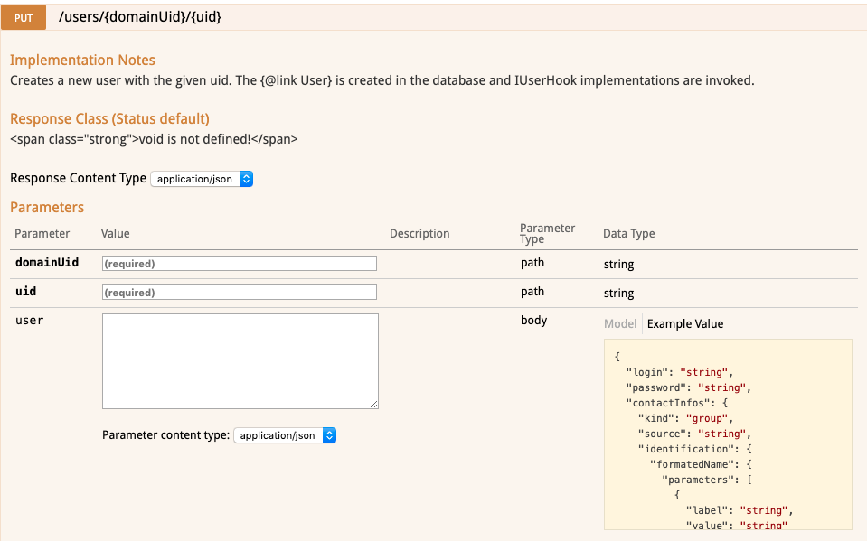

# API d'utilisateurs


## Présentation

Vous trouverez sur cette page des exemples d'utilisation et de mise en pratique de l'API utilisateur


## Création d'un utilisateur

La création d'un utilisateur couvre toutes les actions nécessaire pour créer un utilisateur opérationnel :

- Création au niveau de la base de données
- Association de l'utilisateur avec un domaine
- Création de la boîte au lettre 
- Création du calendrier par défaut
- Création d'une vue de calendrier par défaut
- Création des carnets d'adresses "Mes contacts" et "Contacts collectés"


[https://forge.bluemind.net/staging/doc/openui-models/web-resources/?bm_version=4.1.42252#!/net.bluemind.user.api.IUser/put_users_domainUid_uid](https://forge.bluemind.net/staging/doc/openui-models/web-resources/?bm_version=4.1.42252#!/net.bluemind.user.api.IUser/put_users_domainUid_uid)



#### Exemple en HTTP

| Méthode | URL |
| --- | --- |
| PUT | https://&lt;domain>/api/users/&lt;domain>/&lt;uid> |
| 
domain = le domaine
 | 
uid = identifiant unique de l'utilisateur
 |
| **Body** |
| 

```
{
	"emails": [{
		"address": "john@<domain>",
		"allAliases": false,
		"isDefault": true
	}],
	"login": "john",
	"password": "doe",
	"contactInfos": {
		"identification": {
			"name": {
				"familyNames": "Doe",
				"givenNames": "John"
			},
			"photo": false
		}
	},
	"routing": "internal",
	"accountType": "FULL"
}
```

 |

#### Exemple en Curl


```
curl -X GET --header 'Content-Type: application/json' 
--header 'X-BM-ApiKey: <auth\_key>' 
--header 'Accept: application/json' 
--header 'X-BM-ApiKey: <auth\_key>' 
-d '{
	"emails": [{
		"address": "john@<domain>",
		"allAliases": false,
		"isDefault": true
	}],
	"login": "john",
	"password": "doe",
	"contactInfos": {
		"identification": {
			"name": {
				"familyNames": "Doe",
				"givenNames": "John"
			},
			"photo": false
		}
	},
	"routing": "internal",
	"accountType": "FULL"
}' https://<domain>/api/users/<domain>/<uid>
```


#### Exemple en Java (en utilisant le client généré Bluemind)


```
IUser userService = serviceProvider.instance(IUser.class, domain); 
User user = new User();
user.login = "john";
user.password = "doe";
user.routing = Routing.internal;
user.emails = Arrays.asList(Email.create(login + "@" + domain, true));
user.contactInfos = new VCard();
user.contactInfos.identification.name = new Name();
user.contactInfos.identification.name.givenNames = login;
String userUid = UUID.randomUUID().toString();
userService.create(userUid, user);
```


