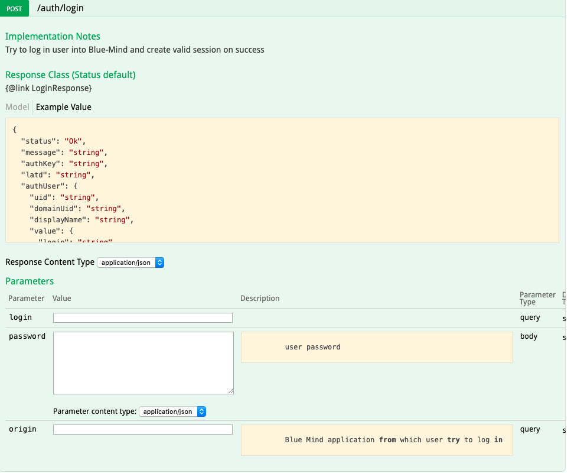

# Authentification


## Présentation

L'authentification est le point d'entrée de l'utilisation de l'API.

La méthode `login` permet de récupérer une clef d'authentification (*auth-key*) grâce à un login et un mot de passe. Cette clef est alors valide et utilisable pour toute la durée de la session d'utilisateur et sert à identifier l'utilisateur pendant les appels d'API suivants.

Il est également possible de créer des clés d'api permanentes dans les [paramètres d'utilisateur](/Guide_de_l_utilisateur/Paramètres_utilisateur/).


## Utilisation

Pour les appels en HTTP, la clef est passée via l'en-tête `X-BM-ApiKey`.

Pour les appels en Java, la clef sert à créer un *service-provider* pour créer des instances d'api.
Par exemple :


```
IServiceProvider serviceProvider = ClientSideServiceProvider.getProvider(server, resp.authKey);
```


[https://forge.bluemind.net/staging/doc/openui-models/web-resources/?bm_version=4.1.42252#!/net.bluemind.authentication.api.IAuthentication/post_auth_login](https://forge.bluemind.net/staging/doc/openui-models/web-resources/?bm_version=4.1.42252#!/net.bluemind.authentication.api.IAuthentication/post_auth_login)



#### Exemple en HTTP

| Méthode | URL |
| --- | --- |
| POST | https://&lt;domain>/api/auth/login?login=&lt;login> |
| 


 | 
login = identifiant de l'utilisateur
 |
| **Body** |
| 
'&lt;password>'
 |

#### Exemple en Curl


```
curl -X POST -k --header 'Content-Type: application/json' --header 'Accept: application/json' -d '"<password>"' 'https://<domain>/api/auth/login?login=<login>'
```


#### Exemple en Java (en utilisant le client généré Bluemind)


```
String serverUrl = "https://<domain>";
LoginResponse resp = ClientSideServiceProvider.getProvider(serverUrl, null).instance(IAuthentication.class).login(<login>, <password>, "");
IServiceProvider serviceProvider = ClientSideServiceProvider.getProvider(server, resp.authKey);

```


