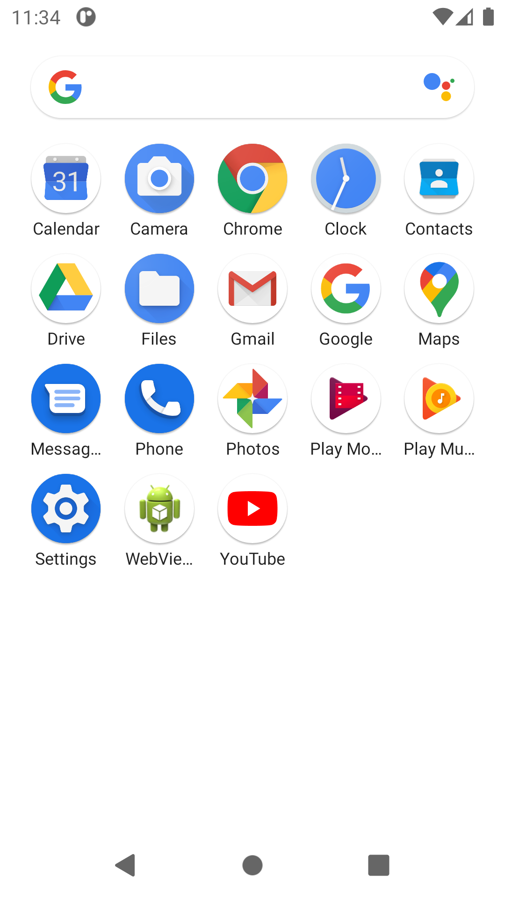

# Installation d'une VM Android


## Présentation

Cette page vous guide dans l'installation d'un environnement Android virtuel sous Linux.

Si vous n'avez pas besoin d'Android Studio (rich IDE), vous pouvez n'installer que le strict nécessaire pour monter une machine virtuelle Android.


:::info

Toutes les informations sur les outils en ligne de commande sont disponibles en ligne : [https://developer.android.com/studio/command-line](https://developer.android.com/studio/command-line)

:::


## Prérequis

Avant d'installer la machine virtuelle en elle-même, il est nécessaire de mettre en place un certain nombre de variables d'environnement et installer le *sdkmanager*.

Vous trouverez ci-dessous les actions à effectuer en fonction de votre distribution (actions génériques, commandes correspondantes pour certaines distributions).

### Linux générique

1. Installer Java 8, plus précisément openjdk-8 (cf. [https://doc.ubuntu-fr.org/java](https://doc.ubuntu-fr.org/java))
2. Télécharger les outils en ligne de commande : [https://developer.android.com/studio#command-tools](https://developer.android.com/studio#command-tools)
3. Décompresser son contenu dans `/opt/android-sdk`
    1. `sudo mkdir -p /opt/android-sdk`
4. Mettre les variables d'environnement en place (cf. [https://doc.ubuntu-fr.org/variables_d_environnement#variables_d_environnement_persistantes](https://doc.ubuntu-fr.org/variables_d_environnement#variables_d_environnement_persistantes)) :
    1. `**ANDROID\_SDK\_ROOT**=/opt/android-sdk`
    2. ajouter à **`PATH`** :
        1. `/opt/android-sdk/emulator`
        2. `/opt/android-sdk/platform-tools`
        3. `/opt/android-sdk/tools/bin`
5. Donner les droits au dossier pour le groupe `android-sdk`
    1. `groupadd android-sdk`
    2. `gpasswd -a $USER android-sdk`
    3. `setfacl -R -m g:android-sdk:rwx /opt/android-sdk`
    4. `setfacl -d -m g:android-sdk:rwX /opt/android-sdk`
    5. `chown :android-sdk /opt/android-sdk -R`
    6. `chmod u+w /opt/android-sdk`
6. ⚠️ vous devez vous relogguez ou exécuter `newgrp android-sdk`
7. Installer `tools` : `sdkmanager --sdk_root=/opt/android-sdk "tools"`


Désormais vous avez tout le nécessaire pour utiliser les outils en ligne de commande afin de gérer votre environnement.

### Instructions spécifiques

Retrouvez ici les lignes de commandes correspondant aux étapes décrites dans le chapitre ci-dessus.

#### Ubuntu


```
$ cd ~
$ wget https://dl.google.com/android/repository/commandlinetools-linux-6609375\_latest.zip
$ sudo mkdir -p /opt/android-sdk
$ sudo unzip ~/commandlinetools-linux-6609375\_latest.zip -d /opt/android-sdk
$ groupadd android-sdk
$ gpasswd -a $USER android-sdk
$ setfacl -R -m g:android-sdk:rwx /opt/android-sdk
$ setfacl -d -m g:android-sdk:rwX /opt/android-sdk
$ chown :android-sdk /opt/android-sdk -R
$ chmod u+w /opt/android-sdk
$ newgrp android-sdk
$ sdkmanager --sdk\_root=/opt/android-sdk "tools"
```


#### Arch Linux

cf. [https://wiki.archlinux.org/index.php/Android#SDK_packages](https://wiki.archlinux.org/index.php/Android#SDK_packages) et [https://wiki.archlinux.org/index.php/Android#Making_/opt/android-sdk_group-writeable](https://wiki.archlinux.org/index.php/Android#Making_/opt/android-sdk_group-writeable)


```
$ yay -S android-sdk
$ groupadd android-sdk
$ gpasswd -a $USER android-sdk
$ setfacl -R -m g:android-sdk:rwx /opt/android-sdk
$ setfacl -d -m g:android-sdk:rwX /opt/android-sdk
$ chown :android-sdk /opt/android-sdk -R
$ chmod u+w /opt/android-sdk
$ newgrp android-sdk
$ sdkmanager --sdk\_root=/opt/android-sdk "tools"
```


## Android Virtual Device

### Gérer les SDK et outils

Quelques commandes utiles de [sdkmanager](https://developer.android.com/studio/command-line/sdkmanager) :


```
$ sdkmanager --list
$ sdkmanager --update
```


Avant de continuer assurez-vous d'avoir tous les prérequis en place :

- vérifier le PATH pour l'accès aux commandes


```
$ echo $PATH
…:/opt/android-sdk/emulator:/opt/android-sdk/platform-tools:/opt/android-sdk/tools/bin:/opt/android-sdk/emulator
```


- vérifier ANDROID_SDK_ROOT


```
$ echo $ANDROID\_SDK\_ROOT
/opt/android-sdk
```


- vérifier les droits dans le dossier d'installation


```
$ ll -g $ANDROID\_SDK\_ROOT
Permissions Size User      Group Date Modified Name
drwxrwxr-x@    - user android-sdk 14 Sep 13:13  emulator
drwxrwxr-x@    - user android-sdk 14 Sep 13:19  licenses
drwxrwxr-x@    - user android-sdk 14 Sep 13:11  patcher
drwxrwxr-x@    - user android-sdk 14 Sep 13:13  platform-tools
drwxrwxr-x@    - user android-sdk 14 Sep 13:19  system-images
drwxrwxr-x@    - user android-sdk 14 Sep 13:15  tools
```


- vérifier ce qui est installé


```
$ sdkmanager --list
Installed packages:=====================] 100% Computing updates...
  Path           | Version | Description                | Location
  -------        | ------- | -------                    | -------
  emulator       | 30.0.26 | Android Emulator           | emulator/
  patcher;v4     | 1       | SDK Patch Applier v4       | patcher/v4/
  platform-tools | 30.0.4  | Android SDK Platform-Tools | platform-tools/
```


### Gérer les AVDs

Avant de créer un AVD (*Android Virtual Device*), il vous faut une image système installée sur votre environnement.

Ensuite vous pouvez créer un AVD selon un profil de hardware.

Si ce n'est pas le cas, installez les éléments nécessaires :


```
$ sdkmanager "platform-tools" "emulator" "platforms;android-30" "system-images;android-30;google\_apis;x86\_64"

```


Enfin, vous pouvez créer un AVD suivant l'image souhaitée :


```
$ avdmanager create avd -n avd-android30-pixel -k "system-images;android-30;google\_apis;x86\_64" --device "pixel"
```


Ensuite vous pouvez [démarrer votre AVD à partir de la ligne de commande](https://developer.android.com/studio/run/emulator-commandline) :


```
$ emulator -avd avd-android30-pixel
```


### Astuces

#### Clavier physique

Pour utiliser le clavier physique de votre ordinateur dans l'émulateur, modifier la valeur de la variable `hw.keyboard` dans le fichier `~/.android/avd/avd-android30-pixel.avd/config.ini`
**config.ini**

```
hw.keyboard = yes
```


#### Manipuler l'émulateur

On peut envoyer des commandes à l'émulateur pour simuler des activités particulières : recevoir un sms, modifier la position du gps, la puissance du gsm, etc.

La liste des actions possibles est disponible ici : [https://developer.android.com/studio/run/emulator-console](https://developer.android.com/studio/run/emulator-console)


```
telnet localhost 5554

Trying ::1...
Connected to localhost.
Escape character is '^]'.
Android Console: Authentication required
Android Console: type 'auth <auth\_token>' to authenticate
Android Console: you can find your <auth\_token> in
'/home/user/.emulator\_console\_auth\_token'
OK
auth FEHdxl/bQ4B24S2l
Android Console: type 'help' for a list of commands
OK
sms send 4085555555 hi there
OK
```


#### Ouvrir un root shell

Créez une console *root shell* sur le terminal actuel. Elle diffère de la commande *shell adb* des manières suivantes :

- Elle crée un shell racine qui vous permet de modifier de nombreuses parties du système.
- Elle fonctionne même si le démon adb dans le système émulé est défectueux.
- En appuyant sur Ctrl+C (⌘C), l'émulateur s'arrête à la place du shell.


cf. [https://developer.android.com/studio/run/emulator-commandline#advanced](https://developer.android.com/studio/run/emulator-commandline#advanced)

## Screenshots



## Problèmes connus

### Erreur sdkmanager "Could not create settings"

Quelle que soit la commande de `sdkmanager`, on obtient cette réponse :


```
$ sdkmanager --list
Warning: Could not create settings
java.lang.IllegalArgumentException
	at com.android.sdklib.tool.sdkmanager.SdkManagerCliSettings.<init>(SdkManagerCliSettings.java:428)
	at com.android.sdklib.tool.sdkmanager.SdkManagerCliSettings.createSettings(SdkManagerCliSettings.java:152)
	at com.android.sdklib.tool.sdkmanager.SdkManagerCliSettings.createSettings(SdkManagerCliSettings.java:134)
	at com.android.sdklib.tool.sdkmanager.SdkManagerCli.main(SdkManagerCli.java:57)
	at com.android.sdklib.tool.sdkmanager.SdkManagerCli.main(SdkManagerCli.java:48)
```


:::info

Solution

Il faut aider l'application java à trouver le root sdk :


```
$ sdkmanager --sdk\_root=/opt/android-sdk --list
```


:::

### Erreur "Warning: Failed to read or create install properties file."

Impossible d'écrire dans le répertoire `/opt/android-sdk`.


:::info

Solution


```
$ sudo chmod g+w /opt/android-sdk
```


:::

### Erreur emulator "PANIC: Broken AVD system path. Check your ANDROID_SDK_ROOT value [/opt/android-sdk]!"

cf. [https://stackoverflow.com/questions/39645178/panic-broken-avd-system-path-check-your-android-sdk-root-value](https://stackoverflow.com/questions/39645178/panic-broken-avd-system-path-check-your-android-sdk-root-value)

### Erreur emulator

Il y a deux binaires dans l'installation `/opt/android-sdk/tools/emulator` et `/opt/android-sdk/emulator/emulator`. C'est un peu obscur.

Moins de problèmes ont été rencontré avec la version installée dans `/opt/android-sdk/emulator` (cf. `sdkmanager --list`). Pour autant selon la variable `$PATH`, c'est l'autre binaire qui sera utilisé (cf. `which emulator`)

## Références

[https://medium.com/michael-wallace/how-to-install-android-sdk-and-setup-avd-emulator-without-android-studio-aeb55c014264](https://medium.com/michael-wallace/how-to-install-android-sdk-and-setup-avd-emulator-without-android-studio-aeb55c014264)


