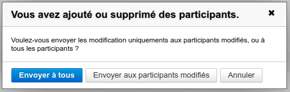
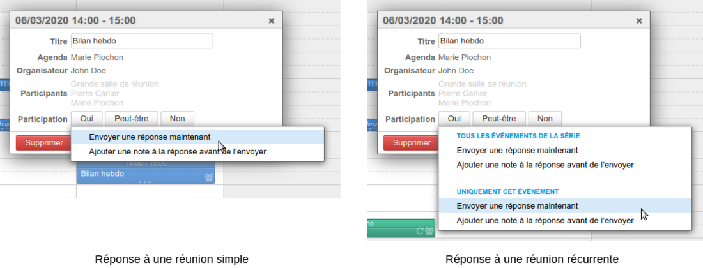
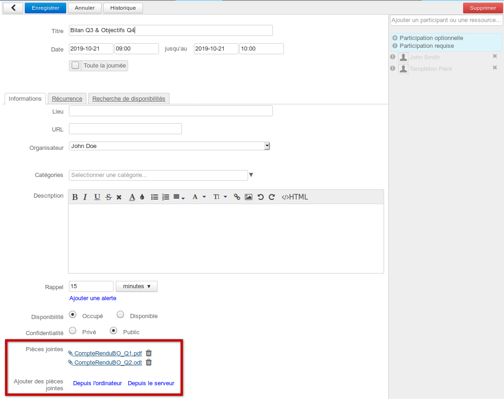
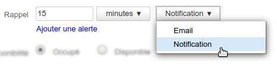
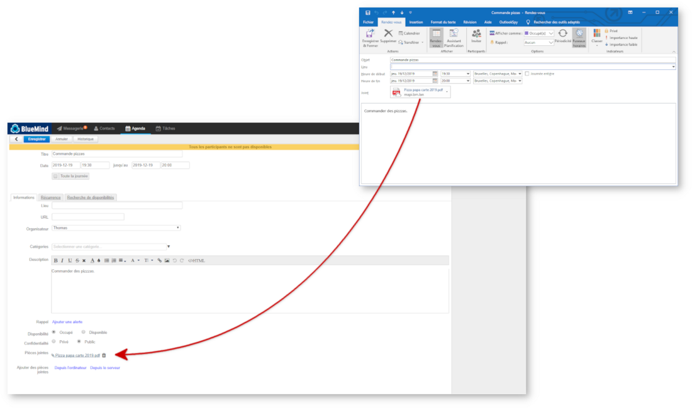
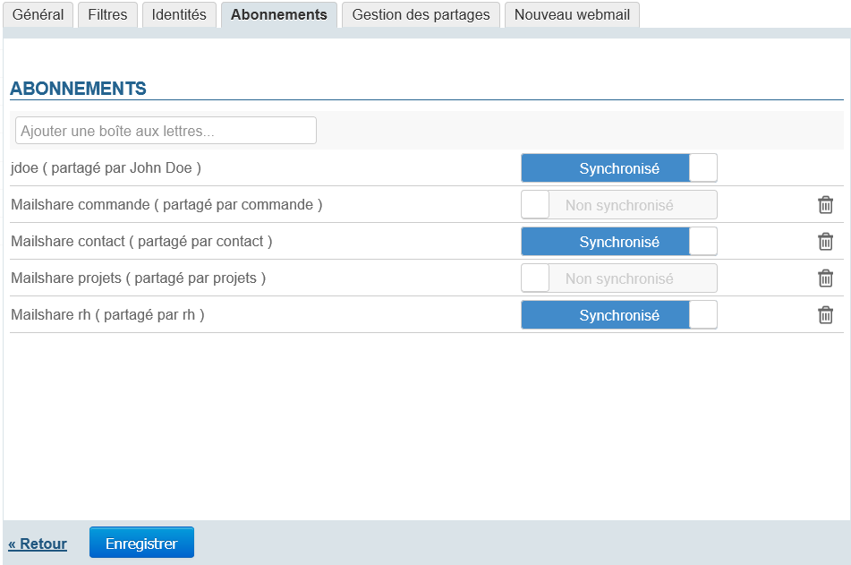
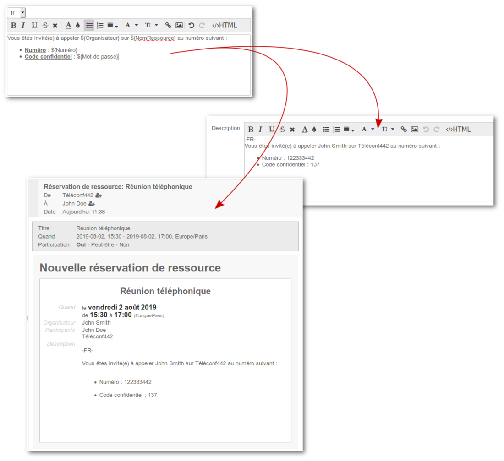
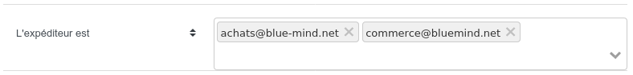

# Nouveautés BlueMind 4.0 à 4.3

## Préambule

BlueMind est fier d’annoncer la sortie de la nouvelle version de **sa messagerie collaborative Open Source.** Très attendue, cette  version 4, en proposant en exclusivité **le support d’Outlook natif donc de façon transparente pour l’utilisateur,** offre enfin aux entreprises et administrations publiques la possibilité de **concilier souveraineté et satisfaction utilisateurs**.

Cette nouvelle version est **la seule capable de supporter Outlook en mode MAPI, sans connecteur, mais aussi d’enrichir de façon collaborative les autres clients comme Thunderbird, le web ou les mobiles.**

Elle apporte aussi de nouvelles fonctionnalités comme la gestion des signatures d'entreprises, améliore l'utilisation de l'agenda et propose d'importantes amélioration de performances.

Nous vous invitons à découvrir ci-dessous les autres améliorations et nouveautés essentielles apportée par cette version, fruit de plusieurs années de travail.

- [Préambule](#NouveautesBlueMind4.0a4.3-Préambule)
- [Agenda](#NouveautesBlueMind4.0a4.3-Agenda)

    - [Améliorations sur la gestion des invitations et participations](#NouveautesBlueMind4.0a4.3-Améliorationssurlagestiondesinvitationsetparticipations)
    - [Unification du comportement pour les événements récurrents](#NouveautesBlueMind4.0a4.3-Unificationducomportementpourlesévénementsrécurrents)
    - [Pièces jointes sur les événements](#NouveautesBlueMind4.0a4.3-Piècesjointessurlesévénements)
    - [Amélioration des performances](#NouveautesBlueMind4.0a4.3-Améliorationdesperformances)
    - [Amélioration des rappels](#NouveautesBlueMind4.0a4.3-Améliorationdesrappels)
    - [Synchronisation des calendriers externes](#NouveautesBlueMind4.0a4.3-Synchronisationdescalendriersexternes)
    - [Duplication d'événements](#NouveautesBlueMind4.0a4.3-Duplicationd'événements)

- [MAPI/Outlook](#NouveautesBlueMind4.0a4.3-MAPI/Outlook)

    - [Dossiers sous la boîte de réception](#NouveautesBlueMind4.0a4.3-Dossierssouslaboîtederéception)
    - [Pièces jointes sur les événements](#NouveautesBlueMind4.0a4.3-Piècesjointessurlesévénements.1)
    - [Intégration d'un email dans un email](#NouveautesBlueMind4.0a4.3-Intégrationd'unemaildansunemail)
    - [Supprimer les pièces jointes des messages](#NouveautesBlueMind4.0a4.3-Supprimerlespiècesjointesdesmessages)
    - [Améliorations techniques et fonctionnelles](#NouveautesBlueMind4.0a4.3-Améliorationstechniquesetfonctionnelles)

- [Abonnements aux boîtes partagées](#NouveautesBlueMind4.0a4.3-Abonnementsauxboîtespartagées)
- [Patrons de contenu des ressources](#NouveautesBlueMind4.0a4.3-Patronsdecontenudesressources)
- [Signatures d'entreprise](#NouveautesBlueMind4.0a4.3-Signaturesd'entreprise)
- [Administration](#NouveautesBlueMind4.0a4.3-Administration)

    - [Expiration des mots de passe utilisateurs](#NouveautesBlueMind4.0a4.3-Expirationdesmotsdepasseutilisateurs)
    - [Stockage objet](#NouveautesBlueMind4.0a4.3-Stockageobjet)
    - [Gestion des données](#NouveautesBlueMind4.0a4.3-Gestiondesdonnées)
    - [Archivage](#NouveautesBlueMind4.0a4.3-Archivage)

- [Développement](#NouveautesBlueMind4.0a4.3-Développement)

:::info

Nouveautés 4.3

 Duplication d'événements
 Expiration des mots de passe
 Boites partagées dans MAPI et EAS
 Support d'Ubuntu 20.04 et RH/CentOS 8

:::

:::info

Nouveautés 4.2

 Améliorations de l'agenda : notifications, interface

:::

:::tip

Lien direct pour télécharger BlueMind 4 : [https://download.bluemind.net/bm-download](https://download.bluemind.net/bm-download)

Dans le cas d'une mise à jour en particulier, nous vous invitons à consulter les notes de version pour des informations détaillées sur les corrections apportées.

:::

## Agenda

### Améliorations sur la gestion des invitations et participations

**En version 4.2**, BlueMind élimine le risque d'erreur et de décalage entre collaborateurs en clarifiant les libellés et options de notifications :

1. **Pour l'organisateur :**
    - Il a désormais les boutons "Envoyer", "Enregistrer en tant que brouillon" et une flèche de retour arrière permettant d'annuler
    - L'enregistrement en tant que brouillon n'est possible qu'avant l'envoi des invitations ; une fois les participants invités l'organisateur n'a plus que le bouton "Envoyer et est alerté d'éventuelles modifications non envoyées s'il clique sur le bouton d'annulation
    - Lorsque la seule modification effectuée est l'ajout ou la suppression de participant(s), il peut choisir de prévenir tous les participants ou non :
2. **Pour le participant :**
    - Il n'a plus la possibilité d'accepter ou refuser une réunion sans envoyer la réponse, ainsi l'organisateur est assuré d'avoir une vue à jour des participations
    - Il peut toujours joindre une note à sa réponse
    - Il conserve la possibilité de répondre de façon différenciée à une série et certaines de ses occurrences :

### Unification du comportement pour les événements récurrents

**En version 4.2**, la gestion des événements récurrents est elle aussi enrichie : le choix du type de modification sur une série (modifier un événement, toute la série ou la suite de série) est généralisé à l'ensemble des actions réalisées dans la vue d'agenda :

**Pour plus de détails sur ces nouveautés, consultez les pages consacrées à [L'agenda](/Guide_de_l_utilisateur/L_agenda/) et plus particulièrement aux [événements](/Guide_de_l_utilisateur/L_agenda/Les_événements/) et à [l'organisation d'une réunion](/Guide_de_l_utilisateur/L_agenda/Organiser_une_réunion/).**

### Pièces jointes sur les événements

[Une de nos suggestions](https://community.bluemind.net/suggestions/details/SB-809) les plus demandées, l'**ajout de fichiers à des événements d'agenda** est enfin rendu possible dans BlueMind 4 avec la version 4.1 !

Découvre plus en détail cette fonctionnalité sur la page dédiée aux [événements de l'agenda](/Guide_de_l_utilisateur/L_agenda/Les_événements/).

### Amélioration des performances

Les tâches consommatrices de ressources telles que les rappels, synchronisations et sauvegardes, ont été remaniées en version 4.1.4 de façon à être plus performantes tout en allégeant la charge du serveur.

### Amélioration des rappels

Avec la refonte des tâches, dont celle des rappels particulièrement lourde sur certaines installations, des améliorations ont aussi été faites sur le fonctionnement des rappels d'événements. Le type de rappel peut être personnalisé par l'utilisateur qui peut choisir entre recevoir un email ou avoir une notification de bureau :

Les rappels peuvent toujours être multiples et il est possible d'en positionner plusieurs de types différents. Pour plus de détail, consulter la page dédiée aux [événements](/Guide_de_l_utilisateur/L_agenda/Les_événements/).

### Synchronisation des calendriers externes

Le mode de synchronisation et rafraichissement des [calendriers externes](/Guide_de_l_utilisateur/L_agenda/Les_calendriers_externes/) a été entièrement revu en 4.1 pour :

- Améliorer les performances et permettre la synchronisation d'un très grand nombre de calendriers externes
- Permettre un affichage quasi temps réel de des calendriers externes

Cette refonte est transparente pour les utilisateurs, leur interface reste inchangée, elle a en revanche un effet notable : **les calendriers sont désormais rafraichis à la demande, à chaque affichage dans l'application Agenda**. Ainsi, il n'est plus nécessaire d'attendre la synchronisation automatique qui s'effectuait une fois par heure, les modifications dans l'application tierce sont visibles dès que l'utilisateur consulte le calendrier, moyennant un éventuel délai dû à l'encombrement des serveurs (file d'attente particulièrement longue par exemple) et à la communication (qualité du réseau).

Il reste toujours possible de forcer une synchronisation depuis la gestion des calendriers de l'utilisateur.

### Duplication d'événements

La version 4.3 de BlueMind apporte [une des fonctionnalités les plus demandées de la Suggestion Box](https://community.bluemind.net/suggestions/details/SB-865) : ****la duplication d'événements****.

Plus besoin de retrouver une longue liste de participants à une réunion ou les ressources qui avaient été réservées, saisir de nouveau le lieu ou l'ordre du jour, vous avez désormais la possibilité de copier un événement afin d'en créer un nouveau sur le même modèle d'un simple clic !

Vous pouvez ainsi dupliquer un événement unique, une série complète ou seulement une occurrence d'une série de réunions.

Retrouvez les informations détaillées sur cette fonctionnalité sur la page dédiée aux [événements](/Guide_de_l_utilisateur/L_agenda/Les_événements/) d'agenda.

## MAPI/Outlook

Sans conteste la fonctionnalité la plus attendue de BlueMind, elle est enfin disponible : **le support d’Outlook complet sans connecteur.**

****

Pour plus d'information sur la mise en œuvre de la prise en charge de MAPI, consultez la page de documentation dédiée : [Mise en œuvre de MAPI pour Outlook](/Guide_de_l_administrateur/La_souscription_BlueMind/Mise_en_œuvre_de_MAPI_pour_Outlook/)

Pour plus d'information sur les versions d'Outlook supportées et les limitations connues, consultez notre page [Compatibilité](/FAQ_Foire_aux_questions_/Compatibilité/#Compatibilite-compat-outlook)

N'hésitez pas à consulter les [notes de versions](https://download.bluemind.net/bm-download/4.0-beta/changelog.html) pour des informations plus détaillées.

### Dossiers sous la boîte de réception

Dans les versions précédentes de BlueMind (4.0.x), les dossiers créés sous la boîte de réception par Outlook n'étaient pas des dossiers de messagerie mais des dossiers virtuels. **BlueMind 4.1 apporte le support des sous-dossiers de la boîte de réception (inbox)**.

:::info

Mise à jour 4.0.x vers 4.1

****Attention :**** dans le cadre d'une mise à jour de BlueMind 4.0.x vers 4.1, les dossiers virtuels ne seront pas migrés et seront supprimés.

Pour se prémunir de cela, il est possible de déplacer ces dossiers virtuels en dehors de la boîte de réception **avant la ****mise à jour** de façon à les conserver, ils pourront ensuite y être remis et seront recréés en tant que dossiers de messagerie.

:::

### Pièces jointes sur les événements

De même que dans l'agenda en ligne, BlueMind 4.1 permet aux utilisateurs d'Outlook de joindre des fichiers à leurs événements d'agenda, qui seront visibles dans BlueMind et chez tous les participants à la réunion concernée.

### Intégration d'un email dans un email

Une fonctionnalité utile fait son apparition dans Outlook : la possibilité de glisser un email depuis la boîte de réception vers la fenêtre de composition d'un message. L'email est alors ajouté de façon très simple en tant que pièce jointe afin de l'envoyer à son correspondant sans avoir à passer par une transfert ou plusieurs étapes d'export/ajout.

### Supprimer les pièces jointes des messages

Fonctionnalité très utile pour alléger et organiser sa boîte, elle est enfin disponible en 4.1 : les utilisateurs peuvent supprimer les pièces jointes liées à un message tout en conservant l'email dans leur messagerie.

### Améliorations techniques et fonctionnelles

Une attention particulière a été portée à la correction et l'amélioration du fonctionnement général ainsi que de la prise en charge de certaines fonctionnalités d'Outlook. S'en trouvent améliorées notamment la gestion des filtres de messagerie ainsi que le support des listes de distribution.

## Abonnements aux boîtes partagées

Dans le protocole Exchange Active Sync, il n'existe pas de notion de calendrier partagé, ou de boite de messagerie partagée. La version 4.3 de BlueMind permet, grâce à une nouvelle fonctionnalité d'abonnements identique à celle des calendriers et carnets d'adresse, de faire apparaître les boîtes partagées dans les clients Outlook connectés en MAPI ou encore les périphériques mobiles connectés en EAS.

Pour en savoir plus sur cette nouvelle fonctionnalité, consulter la page du guide utilisateur [Les boites aux lettres partagées](/Guide_de_l_utilisateur/La_messagerie/Les_boites_aux_lettres_partagées/) ainsi que le paragraphe dédiés aux abonnements dans la documentation sur les [Préférences de messagerie](/Guide_de_l_utilisateur/La_messagerie/Préférences_de_messagerie/).

## Patrons de contenu des ressources

La fonctionnalité, déjà présente dans BlueMind 3.5.13, est portée dans BlueMind 4.1. Il est désormais possible de définir des patrons de description d'événements. Lors de l'invitation d'une ressource de ce type à un événement, le patron sera automatiquement inséré dans la description de l'événement. Ces patrons peuvent contenir des variables et être définis dans plusieurs langues afin de s'adapter à la langue de l'organisateur de la réunion.

Ainsi, par exemple, il est possible de définir un patron de contenu pour les ressources de type visioconférence et de définir pour chaque ressource le numéro de téléphone ainsi que le code confidentiel. Le mail ensuite généré lors de la réservation de cette ressource contiendra les informations de la ressource, mises en forme d'après le patron défini :

Pour en savoir plus, consultez la [page dédiée aux ressources](/Guide_de_l_administrateur/Gestion_des_entités/Ressources/) du [Guide de l'administrateur](/Guide_de_l_administrateur/).

## Signatures d'entreprise

Une nouvelle option vient compléter l'affinage du paramétrage des [signatures d'entreprise ](/Guide_de_l_administrateur/Configuration/Signatures_d_entreprise/): en plus du choix de groupes, il est désormais possible de paramétrer une signature pour une ou des entités nommées individuellement.

## Administration

### Expiration des mots de passe utilisateurs

La version 4.3.0 apporte la gestion de l'expiration des mots de passes des utilisateurs. Lorsque la fonctionnalité est activée, l'utilisateur se voit forcé de modifier son mot de passe suite à son expiration. Le mot de passe peut être expiré immédiatement par un administrateur afin de forcer un utilisateur à procéder à son remplacement.

Pour plus de détails sur la mise en œuvre, se reporter à la page dédiée de notre base de connaissance : [Mettre en place une politique d'expiration des mots de passe](/Base_de_connaissance/Mettre_en_place_une_politique_d_expiration_des_mots_de_passe/)

### Stockage objet

En 4.3.0, diverses améliorations ont été apportées au support du stockage object. La performance et la fiabilité du système ont été améliorées.

Lors du téléchargement des messages en IMAP, le serveur CYRUS-IMAPd télécharge les messages en parallèle sur le stockage objet afin d'améliorer la performance.

Les tables d'état indiquant dans quel dossier se trouve un message sont désormais gérées directement par BlueMind pour améliorer la fiabilité du stockage IMAP.

### Gestion des données

Pour permettre un support de plus grand nombre d'utilisateurs, BlueMind 4 :

- sépare les données de l'annuaire central des données des utilisateurs
- permet de définir plusieurs serveurs de stockage (*backend*) pour les données utilisateurs

Pour savoir comment mettre en place un tel système, consultez la page dédiée à l'[Installation avec répartition des données sur plusieurs serveurs](/Guide_d_installation/Installation/Installation_avec_répartition_des_données_sur_plusieurs_serveurs/).

#### Séparation des données d'annuaire et données des utilisateurs

BlueMind 4 sépare les données d'annuaires (utilisateurs, groupes,..) des données des utilisateurs.

Une base de données est dédiée aux données d'annuaire. Les données des utilisateurs sont stockées dans une ou plusieurs autres bases de données situées sur les serveurs de stockage.

Ainsi après la phase d'authentification qui utilise la base de données d'annuaire, l'utilisateur communique essentiellement avec son serveur de stockage.

#### Stockage des données utilisateurs

BlueMind 3.5 permettait de répartir les boîtes aux lettres des utilisateurs sur plusieurs serveurs.

BlueMind 4 va plus loin en permettant de répartir aussi les données d'agendas, carnets d'adresses et autres sur plusieurs serveurs.

Toutes les données d'un utilisateur (emails, agendas, contacts,..) sont donc à présent stockées sur un même serveur de stockage de données.

#### Gestion automatisée du serveur de stockage

BlueMind peut désormais prendre en charge la configuration complète du serveur de stockage (dit *serveur Edge*). La configuration du serveur nginx est désormais réalisée automatiquement.

Une installation existante n'est pas automatiquement gérée par BlueMind, afin de ne pas perturber son fonctionnement. La gestion d'un serveur de stockage par BlueMind peut être réalisée par l'ajout du tag "bm/nginx-edge" au serveur, en utilisant la console d'administration.

Dans le cas de l'ajout du tag "bm/nginx-edge", la configuration nginx est écrasée par la configuration BlueMind. Les éventuelles spécificités de la configuration nginx devront être ré-appliquées.

### Archivage

#### Archivage entièrement automatique

L'archivage est désormais entièrement automatique.

Il devient transparent pour les utilisateurs qui n'ont plus d'archivage manuel et ne voient pas dans leur interface mail, comme c'était le cas dans les versions précédentes, de pictogramme indiquant qu'un message est archivé ni, de fait, de bouton permettant d'archiver ou désarchiver un message.

L'utilisateur n'a plus de travail fastidieux à opérer pour alléger son quota.

#### Compatible avec tous les clients de messagerie

L'archivage n'a plus besoin de plugin sur le client. Tout est géré côté serveur de façon transparente.

L'archivage fonctionne avec tous les clients de messagerie (webmail, client lourd ou mobile) : quel que soit le client IMAP, les emails sont archivés et consultables.

Pour en savoir plus, consultez la page dédiée : [Archivage](/Guide_de_l_administrateur/Configuration/Archivage/)

## Développement

BlueMind 4 ajoute toute une brique de gestion des emails dans notre API REST, que vous pouvez découvrir dans notre page de [documentation API](https://forge.bluemind.net/apidoc/).

De façon à mieux vous accompagner lors de la maintenance d'add-ons ou de scripts, cette page offre désormais la possibilité de visualiser les incompatibilités entre les versions : vous pouvez ainsi repérer rapidement si un développement nécessite une modification lors d'une montée de version.

