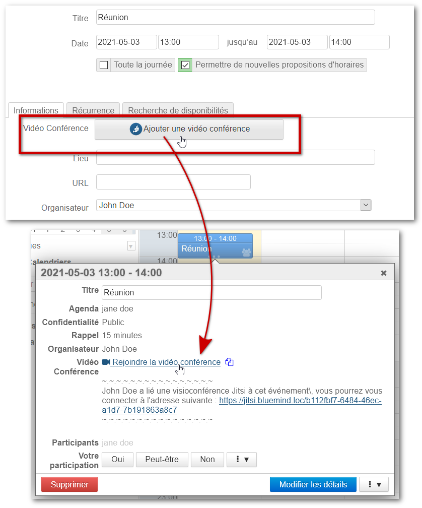
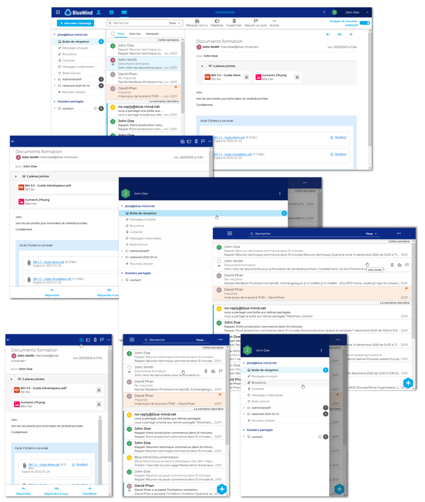
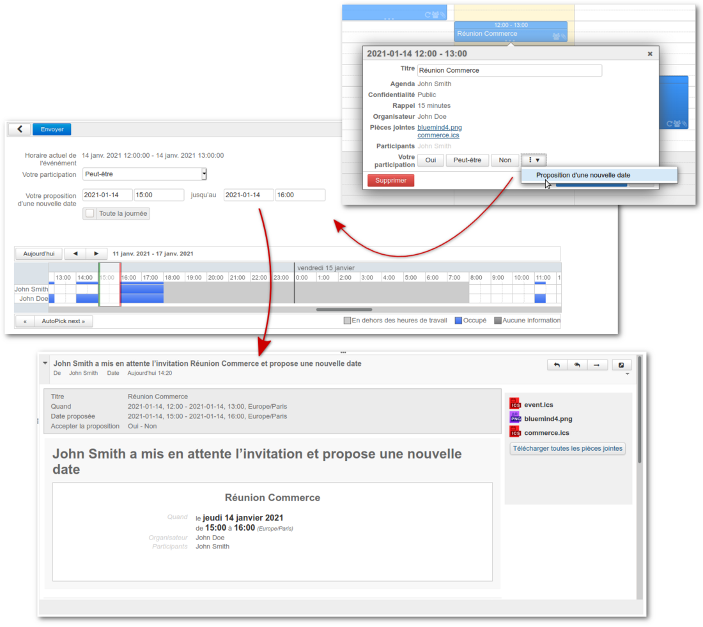

# Nouveautés BlueMind 4.4 et 4.5


## Préambule

Toute l'équipe BlueMind est heureuse de vous présenter la nouvelle mouture de sa suite de messagerie collaborative !

Un vaste travail d'améliorations des performances a été réalisé sur cette version 4.4, par ailleurs particulièrement riche en nouveautés, tant pour les utilisateurs que pour les administrateurs.

Nouveauté très attendue : le [webmail BlueMind](/Guide_de_l_utilisateur/Messagerie_BlueMind/) est disponible en test ! N'hésitez pas à découvrir la nouvelle interface réactive (*responsive*) qui s'adapte à tous les écrans et navigateurs.

Les utilisateurs auront accès à de nouvelles fonctionnalités, parmi lesquelles :

- proposition d'un nouvel horaire par un invité à une réunion
- restauration de messages supprimés (depuis Outlook ou sur demande à un administrateur)
- messages d'absence au format HTML (depuis Outlook)


Les administrateurs, quant à eux, peuvent paramétrer encore plus finement leur installation et bénéficier de nouveaux outils :

- paramétrage d'un fuseau horaire par défaut
- modification et personnalisation du nom de domaine
- définition d'un proxy HTTP
- outil en ligne de commande amélioré et enrichi
- réparation des boîtes partagées
- nouveaux tableaux de bord de supervision
- affichage des alertes de supervision dans la console d'administration


Nous vous invitons à consulter [les notes de version](https://download.bluemind.net/bm-download/4.4.0/changelog.html) pour plus d'informations détaillées sur les améliorations techniques et corrections apportées par la version.


:::tip

Lien direct pour télécharger BlueMind 4 : [https://download.bluemind.net/bm-download](https://download.bluemind.net/bm-download)

Dans le cas d'une mise à jour en particulier, nous vous invitons à consulter les notes de version pour des informations détaillées sur les corrections apportées.

:::

## Nouveautés 4.5

### Visioconférences avec Jitsi et StarLeaf

BlueMind 4.5 apporte la possibilité de lier un serveur Jitsi ou un serveur StarLeaf à un domaine et ainsi permettre aux utilisateurs de générer et lier à leurs événements d'agenda des visioconférences :

Pour en savoir plus sur la mise en œuvre, consultez la page du guide d'administration : [Visioconférence intégrée](/Guide_de_l_administrateur/Configuration/Visioconférence_intégrée/)

Pour en savoir plus sur l'utilisation depuis l'agenda, consultez la page du guide de l'utilisateur : [Lier une visioconférence à un événement](/Guide_de_l_utilisateur/L_agenda/Lier_une_visioconférence_à_un_événement/)

### Partage du statut de lecture des boites partagées

Afin de gagner en clarté et de ne plus modifier les habitudes des utilisateurs ayant manipulé d'autres systèmes de messagerie, les indicateurs de messages "lu" ou "non lu" d'une boite partagée sont désormais communs à tous les utilisateurs de la boite partagée.

Ce comportement ne peut plus être configuré par les administrateurs.

### Boites aux lettres partagées dans Outlook

Désormais, les boites aux lettres partagées apparaissent comme des boites partagées (shared mailbox) dans l'arborescence principale d'Outlook et non plus dans la partie "Dossiers publics" :


### Administration

#### Mise à jour à chaud

Afin de faciliter le travail des intégrateurs et administrateurs de BlueMind, les opérations de maintenance, telles que la réparation partielle des utilisateurs, sont désormais réalisées automatiquement par un système de mise à jour a chaud. Ainsi le processus de mise à jour et la remise en production du système ne sont pas bloqués par ces opérations.

#### Maintenances sans perturbations

Les maintenances de base de donnée s’exécutent désormais en parallèle de la production, sans bloquer celle-ci. Ainsi, la maintenance est désormais contrôlée par une tâche planifiée, visible et désactivable par l'administrateur et n'engendrent plus de perturbations pour les utilisateurs.

#### Redémarrage sans déconnexion

Désormais, les utilisateurs ne sont plus déconnectés lors d'un redémarrage de BlueMind. Les perturbations lors de l'application d'un correctif ou d'une mise à jour sont alors réduites au maximum pour l'utilisateur final qui ne perd plus son travail en cours (rédaction d'email par exemple).

## Nouveautés 4.4

### Nouveau client de messagerie

Découvrez en avant-première le [nouveau webmail BlueMind](/Guide_de_l_utilisateur/Messagerie_BlueMind/) !

BlueMind a développé un tout nouveau webmail basés sur les technologies web proposées par les navigateurs récents : Web App Javascript, elle offre une ergonomie repensée et intuitive, avec les 3 volets adaptés aux écrans larges. Elle permet surtout une fonctionnement plus rapide et fluide grâce à l'utilisation du stockage local du navigateur.

Nous vous invitons à la tester et l'expérimenter dès maintenant en attendons vos retours avec impatience !



### Proposition d'une nouvelle date

Fonctionnalité très demandée, la proposition d'un nouvel horaire est enfin possible dans BlueMind ! Compatible avec les gestionnaires d'agenda proposant la fonctionnalité, celle-ci est proposée par BlueMind tant dans son application web que dans Outlook (connecté en mapi) et Thunderbird !

L'organisateur d'une réunion reste maître d'offrir ou non la possibilité aux invités de proposer un nouvel horaire.

Pour plus de détails sur le processus de proposition de nouvel horaire, vous pouvez consulter le paragraphe dédié dans la documentation des événements d'agenda : [Guide utilisateur](/Guide_de_l_utilisateur/) > [L'agenda](/Guide_de_l_utilisateur/L_agenda/) > [Les événements](/Guide_de_l_utilisateur/L_agenda/Les_événements/) [§.5.3 Proposer un nouvel horaire](/Guide_de_l_utilisateur/L_agenda/Les_événements/#Lesevenements-newtime)

Dans Outlook, les invités et l'organisateur utilisent les menus et outils intégrés habituels pour émettre/accepter/refuser des propositions :


### Corbeille à double fond

La corbeille à double fond est une fonctionnalité de récupération d'emails supprimés accessibles aux simples utilisateurs. Elle propose un délai côté serveur pendant lequel les emails effacés sont conservés ; pendant ce délai une récupération peut être effectuée par l'utilisateur directement depuis son client Oulook (connecté en mapi) ou par l'administrateur depuis le serveur en ligne de commande (voir ci-dessous).

Cette fonctionnalité sera implémentée dans le nouveau webmail dans une prochaine version de BlueMind.

### Mapi

En plus de corrections d'erreurs, la version apporte de nouvelles fonctionnalités désormais disponibles dans Outlook connecté en mapi.

#### Message d'absence en texte riche

Les réponses d'absence automatique paramétrés depuis Outlook peuvent désormais être rédigés en HTML. L'utilisateur a le choix entre le format TEXTE (seul disponible auparavant) et le format de texte enrichi (gras, italique, couleur, taille de texte, image, etc.).

#### Restauration de message supprimé

La version ajoute une fonctionnalité à Outlook : l'utilisateur peut accéder à la liste des messages récemment supprimés et procéder à leur restauration (*unexpunge*).
*Pour plus de détail, voir chapître précédent "**Corbeille à double fond**".*

### Calendrier

Désormais les catégories (tags) sont importées lors des [imports ICS](/Guide_de_l_utilisateur/L_agenda/#L'agenda-exportimportics) de calendriers et événements.

### Administration

#### Fuseau horaire par défaut d'un domaine

Il est désormais possible pour les administrateurs de spécifier un fuseau horaire sur un domaine spécifique. Le fuseau devient le fuseau horaire par défaut pour les nouveaux utilisateurs et les utilisateurs déjà existant qui utilisaient l'ancien (dans le cas d'une modification).

Pour en savoir plus, consulter la page de [Gestion des domaines](/Guide_de_l_administrateur/Configuration/Gestion_des_domaines/).

#### Modification du nom de domaine affiché

Depuis la version 4.3 de BlueMind, afin de permettre aux administrateurs de faire évoluer leurs domaines, tous les nouveaux domaines sont créés avec un identifiant unique généré ("XXXXX.internal"). L'interface d'administration présentait dans cette version le premier alias comme nom de domaine, et l'identifiant interne était toujours présent dans la plupart des écrans.

A partir de la version 4.4, un domaine dispose d'un identifiant (XXXXX.internal), d'un ou plusieurs alias **dont un alias par défaut**. Celui-ci peut être choisi et changé dans la console d'administration.

Les écrans de création d'adresse de messagerie ont été adaptés et simplifiés pour utiliser l'alias par défaut et ne plus présenter le nom technique du domaine.

Pour plus de détails, consultez la page dédiée [Gestion des domaines](/Guide_de_l_administrateur/Configuration/Gestion_des_domaines/).

#### Support d'un proxy HTTP

Dans divers scénarios, comme l'interrogation de calendriers externes, certaines installations nécessitent l'utilisation d'un serveur proxy HTTP.

Une fois le serveur proxy HTTP paramétré et activé dans la console d'administration (Gestion du système > Configuration système), les requêtes externes passées par BlueMind transitent par celui-ci.

Pour plus de détails, consultez la page dédiée [Configuration système](/Guide_de_l_administrateur/Configuration/Configuration_système/).

#### Outil d'administration en ligne de commande (bm-cli)

##### Support en ligne de commande de la corbeille à double fond

Comme indiqué ci dessus, la corbeille à double fond propose un délai côté serveur : celui-ci conserve les emails effacés pendant un certain temps, ce qui permet une récupération via certains clients ou par l'administrateur.

Une nouvelle commande permet donc de récupérer les messages supprimés par l'utilisateur mais qui n'ont pas encore été définitivement supprimés par cyrus : `bm-cli mail unexpunge`

Cette commande bm-cli est nécessaire car la commande cyrus "unexpunge" permettant de faire en apparence la même chose ne renvoie pas des informations suffisantes au protocole de réplication, et casse le lien entre Cyrus et BlueMind.

Pour en savoir, consultez la page de dédiée dans notre base de connaissance : [Restaurer les messages supprimés par un utilisateur](/Base_de_connaissance/Restaurer_les_messages_supprimés_par_un_utilisateur/).

##### Nouvelles commandes

La version apporte, en plus de la restauration des messages supprimés, plusieurs améliorations et nouvelles commandes.

###### Nouvelles commandes et options :

- `server tag / untag / add` : permet d'automatiser l'ajout d'un serveur et les actions permettant de *tagguer* un serveur (par exemple mail/imap).
- `main reindexpending` : permet de ré-indexer l'index "mailspool_pending"
- `user import / export` : permet d'importer et exporter de et vers des archives cyrus
- `setup install --admin0-pass` : cette nouvelle option permet de définir le mot de passe d'admin0 dès l'installation. Exemple : bm-cli setup install


```
bm-cli setup install --external-url bluemind.domain.net --domain domain.net --sw-pass Passw0rd --admin0-pass SuperSecurePassword
```


###### Améliorations :

- La commande `bm-cli index info` ne compte désormais plus les messages supprimés
- l'option --addressbook-uid des commandes "`contact import`" et "`contact reset`" supporte les carnets d'adresses de domaines : il est désormais possible d'importer un fichier VCF vers un carnet de domaine et de remettre à zéro un carnet de domaine.
- remplacement de la librarie *airlift* par la librarie *picocli*. Cette librairie apporte des améliorations comme par exemple le support de l'option `--help`.
- Les schémas de couleur ont été améliorés et tous les messages d'erreur sont désormais envoyés vers la sortie d'erreur.
- Les informations sur la progression d'une commande sont désormais envoyées à la sortie d'erreur (`stderr`). Cela permet la génération directe de données json pour les commandes concernées, par exemple :


```
bm-cli user get test.lan | jq
```


#### Réparation des boites partagées

Les administrateurs ont désormais la possibilité de procéder à la [réparation d'une boîte partagée](/Guide_de_l_administrateur/Gestion_des_entités/Boites_aux_lettres_partagées/) de la même façon qu'ils en ont l'habitude avec les utilisateurs.

#### Supervision TICK

De nouveaux tableaux de bords sont ajoutés permettant de superviser Elasticsearch et PostgreSQL :

- Le tableau "Elasticsearch" permet de consulter l'état du cluster ElasticSearch et son activité.
- Le tableau "ElasticSearch Mailspool" est plus spécifique à la messagerie BlueMind, il permet de diagnostiquer un éventuel problème d'équilibrage dans la répartition des utilisateurs au sein des différents index.
- Le tableau "PostgreSQL" permet de surveiller l'état du cluster PostgreSQL.


De plus, la page de monitoring de la console d'administration contient désormais une présentation des alertes tick :


#### Améliorations techniques

##### Indexation

1. Le stockage dans ElasticSearch est amélioré par la réduction de la quantité de données enregistrées dans ElasticSearch : certains champs étaient stockées plusieurs fois sans nécessité. **Afin de pouvoir profiter de la réduction de la quantité de données stockées, une re-indexation est nécessaire.**
2. Le schéma "mailspool_pending" est mis à jour, permettant de ne pas indexer les documents depuis mailspool_pending. Avec 339315 documents, l'espace utilisé passe de 741MB à 267MB, tout en réduisant la charge CPU nécessaire.
3. Le cluster ElasticSearch peut passer en status "red" lorsque l'espace disque viens a manquer. **Lorsque de l'espace disque est ajouté, le cluster repasse désormais automatiquement "green"** grâce à une alerte Kapacitor.


##### Sentry

La version apporte le support des produits Java du système de reporting d'erreurs Sentry : des rapports d'erreurs améliorés, contenant les stacktraces le cas échéant, sont envoyés vers le gestionnaire d'erreurs sentry.

L'activation de l'envoi des rapports sentry peut être réalisée en utilisant la commande :


```
# Activation
bm-cli sysconf set -v https://[dsnsentry] sentry\_endpoint
# Désactivation
bm-cli sysconf set -v "" sentry\_endpoint
```


Le rapport d'erreurs Sentry est désactivé par défaut.

##### Sécurité des ports d'envoi

Les ports d'envoi de mail (ports TCP 465 et 587) utilisent à présent une version TLS v1.2 minimum.

##### Mapi

Une [suite de test](https://github.com/OfficeDev/Interop-TestSuites) "protocolaire" à été implémentée dans BlueMind afin d'améliorer encore nos outils de tests, et proposer une implémentation encore plus proche du protocole Microsoft.


