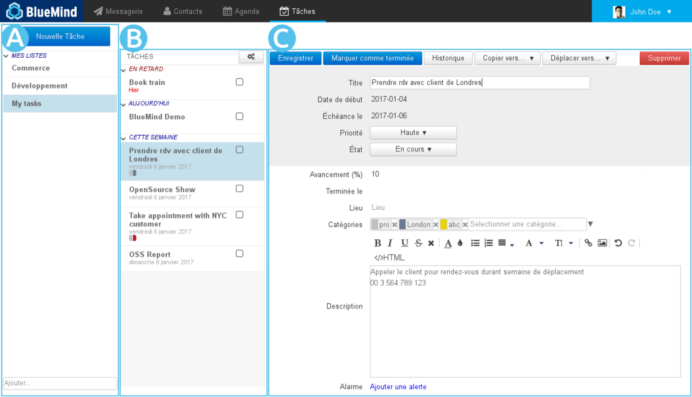
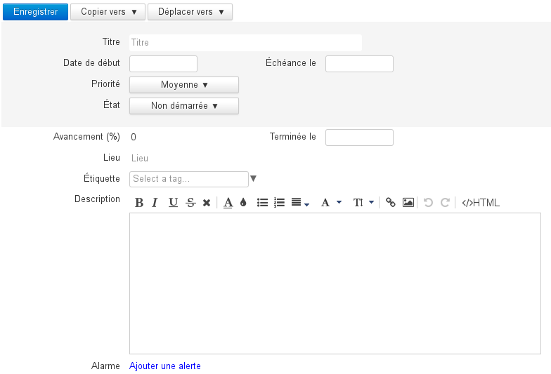
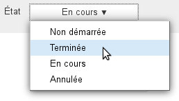
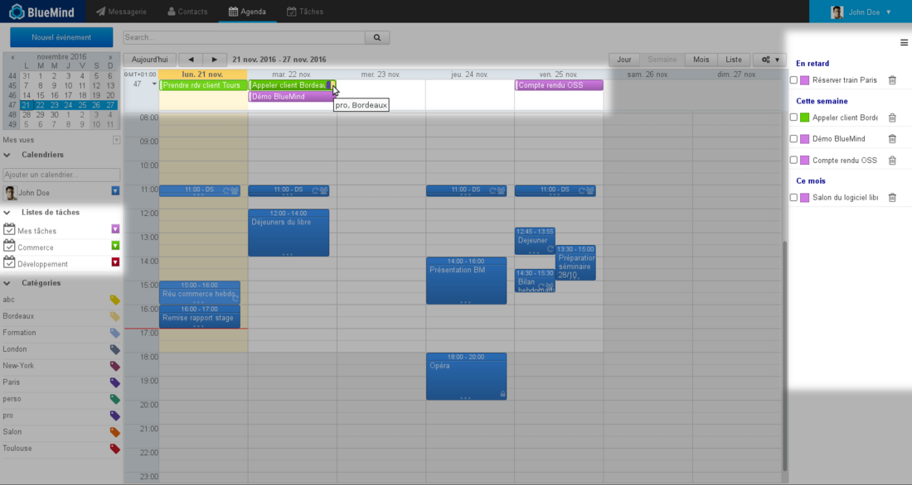
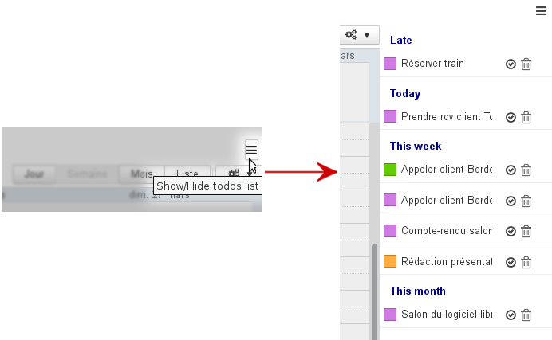

# Débuter avec les tâches

Créer et modifier les tâches rapidement

## Se repérer dans les tâches

La vue principale du gestionnaire de tâches se présente sous la forme d'une application en 3 colonnes :

-   : dans la 1ère colonne se trouve, sous le bouton «Nouvelle tâche», les listes de tâches auxquelles l'utilisateur est abonné : sa liste par défaut "Mes tâches", et d'autres listes qu'il a créées ou auxquelles il s'est abonné (via sa gestion des paramètres)
-  : dans la 2ème colonne se trouve les tâches contenues dans la liste sélectionnée, le bouton d'action en haut de colonne permet l'export des tâches de la liste ou l'import de tâches dans celle-ci
-  : la 3ème colonne, zone d'affichage principale, présente la fiche de la tâche sélectionnée ou en cours de création

## Créer et modifier une tâche

Le bouton 

Cliquer sur une tâche permettra d'afficher ses détails sous forme de formulaire directement modifiable :

- **Titre : nom ou résumé de la tâche**
- Date de début : date à laquelle la tâche doit commencer
- Échéance le : date de fin attendue
- Priorité : basse, moyenne (par défaut), haute
- État : statut actuel d'exécution : non démarrée, terminée, en cours, annulée
- Avancement : permet de renseigner au fur et à mesure de l'exécution de la tâche, son niveau d'avancement en pourcentage
- Terminée le : date de fin effective
- Lieu
- Étiquette : les étiquettes (tags) sont partagées avec les applications contacts et agenda, les étiquettes accessibles sont celles de domaine ou de l'utilisateur.
- Description : description plus complète de la tâche, informations utiles ou complémentaires
- Alarme : rappel pour le début d'exécution de la tâche

Une fois le formulaire rempli, cliquer sur  pour créer la tâche ou valider les modifications.

## Terminer une tâche

BlueMind offre plusieurs possibilités pour terminer une tâche accomplie :

- cliquer sur le bouton  du formulaire d'édition de la tâche
- utiliser la liste déroulante "État" du formulaire d'édition de la tâche : 
- cliquer sur la coche  dans le panneau des tâches de l'Agenda

## Supprimer une tâche

De même que pour terminer une tâche, plusieurs solutions sont possibles :

- cliquer sur le bouton  en haut à droite du formulaire d'édition
- cliquer sur l'icône poubelle  dans le panneau des tâches de l'Agenda

## Intégration des tâches dans l'agenda

Vous pouvez retrouver toutes vos tâches dans l'agenda. Les listes sont présentées comme des calendriers dans la colonne de gauche et les tâches sont présentées dans la zone "journée" à leur date d'échéance et une nouvelle colonne, sur la droite de la vue, permet une vue d'ensemble des tâches non encore terminées :

Le bouton    permet de faire apparaître ou masquer le panneau des tâches :

Ce panneau propose, en outre, les actions principales utiles sur les tâches : terminer ou supprimer.

**Pour aller plus loin**, consulter [Les tâches](../Guide_de_l_utilisateur/Les_taches/Decouvrir_les_taches.md)

