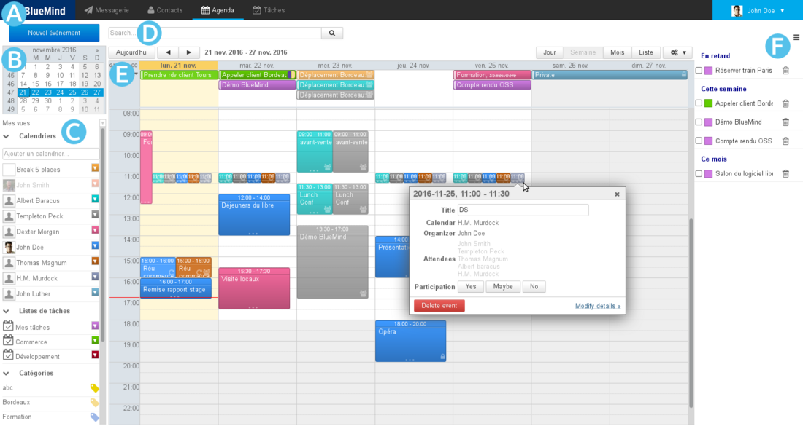
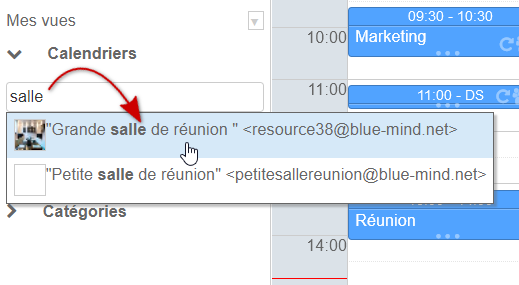
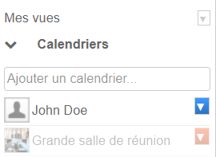
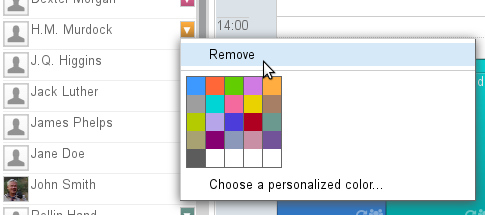
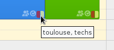
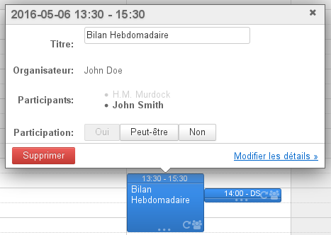
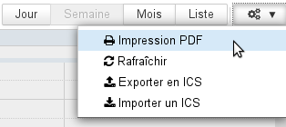
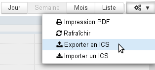

# Débuter avec l'agenda

# Se repérer dans l'agenda

La vue principale par défaut de l'agenda BlueMind se compose de plusieurs parties :

-  : la barre des tâches, permettant de passer d'une application à l'autre
-  : le calendrier permet de rechercher et se rendre à une date : faire défiler les mois avec les flèches « et » puis cliquer sur la date. Dans la zone principale s'affiche alors la période comprenant la date sélectionnée (jour, semaine ou mois selon le paramétrage en cours).
-  : la liste des calendriers actuellement affichés, ainsi que l'accès aux vues et étiquettes
-  : le moteur de recherche permet de rechercher des événements par nom, étiquettes, détails, participant, etc.
-  : l'affichage principal de l'agenda de l'utilisateur ainsi que les agendas auxquels il est abonné et/ou d'autres agendas de son choix (utilisateurs, ressources)
  - Les boutons en haut à gauche de la zone principale permettent de ramener à la période incluant la date du jour et naviguer vers des dates précédentes ou suivantes.
  - Les boutons en haut à droite permettent de choisir la période ou le type d'affichage ainsi que d'accéder aux fonctions d'**impression** et d'**import/export ics**. Le menu des outils permet aussi de rafraîchir la vue en cours.
-  : le panneau de visualisation des tâches peut être affiché ou masqué grâce au bouton  situé en haut à droite

# Les agendas

## Sélectionner les agendas

La liste des agendas affichés est visible à gauche de la page, en 

- Pour **ajouter** un agenda, taper son nom dans le champs de saisie et choisir l'agenda proposé par l'autocomplétion :
- Pour **masquer** temporairement un agenda, cliquer sur son nom dans la liste : le nom devient grisé et les événements disparaissent de la vue :
- Pour **retirer** un agenda cliquer sur l'icône de couleur en face de son nom puis cliquer sur "Remove" dans le menu de personnalisation proposé :

## Gérer les vues

BlueMind vous permet de sauvegarder sous forme de vues un ou plusieurs ensembles d'agendas. Par exemple pour pouvoir afficher en un clic les agendas des ressources, ceux des commerciaux, les agendas des membres de direction ou encore les regrouper par agence ou équipe.

Une fois les agendas souhaités ajoutés dans l'affichage en cours, ouvrir le menu "Mes vues" et cliquer sur "Enregistrer cette vue" :

- Pour **créer une nouvelle vue**, taper son nom dans le champs de saisie proposé.
- Pour **modifier une vue** taper son nom ou la sélectionner dans la liste déroulante proposée.

:::important

Vue par défaut

La vue par défaut définit la vue qui est affichée lorsque l'utilisateur se connecte à l'application. Cette vue ne peut pas être supprimée mais peut être modifiée à tout moment.

Lorsqu'elle n'a pas été personnalisée, celle-ci contient uniquement l'agenda par défaut de l'utilisateur.

:::

*Pour en savoir plus sur l'affichage de l'agenda et la gestion des vues, consulter la page * * [Le partage d'agenda](/Guide_de_l_utilisateur/L_agenda/Le_partage_d_agenda/) et [L'agenda > Vues](/Guide_de_l_utilisateur/L_agenda/Vues/).*

# Les événements

## Vue d'un événement

Un événement, ou "rendez-vous", est présenté de la couleur de l'agenda auquel il appartient avec ses informations principales :

En haut de l'événement les horaires et le titre.

En bas de l'événement, des icônes permettent de voir d'un seul coup d’œil ses caractéristiques :

-  il y a plusieurs participants
-  l'événement est privé
-  l'événement est récurrent
- un carré présente la ou les couleurs (2 au maximum) des étiquettes associées, au survol de la souris la liste complète des étiquettes apparaît :

Un clic sur l'événement fait apparaître des détails supplémentaires : organisateur (si différent du propriétaire de l'agenda consulté), agenda concerné (si autre que celui de l'utilisateur), participants, boutons de modification de la participation, etc.

Cette boite de dialogue permet d'accéder à plus d'informations ainsi qu'à la page de modification de l'événement grâce au lien «Détail» (ou «Modifier les détails» si l'agenda est accessible en écriture).

## Création d'un événement

Pour créer un événement :

- ** **Création rapide :** **
  - se positionner sur la date et l'heure souhaitées et cliquer pour créer le rdv.La durée par défaut est de 30mn, laisser appuyé et glisser pour dessiner la durée souhaitée .
  - renseigner le titre et l'agenda concerné dans la fenêtre qui s'ouvre :
  - cliquer sur «Nouvel événement» pour valider la création
- ** **Création complète :** **
  - cliquer sur le bouton «Nouvel événement» en haut à gauche de la page ou cliquer sur le lien "Modifier les détails" depuis la fenêtre de création rapide.
  - renseigner les champs désirés, définir une récurrence s'il y a lieu, inviter les participants, etc.**NB : seuls le titre et la date sont obligatoires**
  - 
une fois toutes les informations saisies et les participants ajoutés, cliquer sur «Enregistrer» en haut de page pour créer l'événement et revenir à la vue de l'agenda
:::important

Si des participants sont invités, une boite de dialogue demande lors de l'enregistrement si des invitations doivent être envoyées. Si c'est le cas, un email sera envoyé à chacun des participants, y compris les personnes hors du domaine BlueMind.

:::

Pour en savoir plus sur la création d'un événement et le détail des options possibles, consulter la page [Les événements - §1 Création d'un rendez-vous](/Guide_de_l_utilisateur/L_agenda/Les_événements/)

Pour plus d'information sur le processus d'organisation et de gestion d'une réunion et de ses participants, consulter la page [Organiser une réunion](/Guide_de_l_utilisateur/L_agenda/Organiser_une_réunion/).

# Les étiquettes (tags)

Les étiquettes permettent d'affecter un ou plusieurs mots clefs aux événements et aux contacts, les étiquettes étant communes aux 2 applications.

La liste des étiquettes est consultable et modifiable dans l'interface de gestion des préférences utilisateur > rubrique "Mon compte" > onglet "Étiquettes". Les étiquettes partagées, créées par l'administrateur du domaine, y apparaissent en gras et avec un cadenas en début de liste, elles ne sont pas modifiables par les utilisateurs.

Pour affecter une ou plusieurs étiquettes à un événement, utiliser le champs prévu dans le formulaire d'édition de l'événement, onglet "Informations" :

- Le champs de saisie propose l'autocomplétion au cours de la frappe
- Si une étiquette n'existe pas, une infobulle permettant de la créer apparaît
- La flèche en fin de champs permet de faire apparaître la liste déroulante des étiquettes existantes

Les étiquettes d'un événement sont consultables sur la vue principale de l'agenda, *voir ci-dessus **§ 2.1 Vue d'un événement** *

*Pour en savoir plus sur le fonctionnement et la gestion des étiquettes, consultez la page  [Les étiquettes (tags](/Guide_de_l_utilisateur/Les_catégories_tags_/))  *

# Impression

Pour imprimer la vue en cours, ouvrir le menu Outils situé en haut à droite de la zone d'affichage principale :

La boite de dialogue d'impression propose alors l'impression de la vue en cours, sous forme de calendrier ou de liste, les options d'impression permettant de visualiser directement en aperçu la sélection : orientation de la page, noir et blanc, détails des événements en vue liste.

*Pour en savoir plus sur le paramétrage des impressions, consulter la page * * [L'agenda](/Guide_de_l_utilisateur/L_agenda/) * *.*

# Export et import ICS

- **L'export** vous permet de télécharger un fichier au format ICS de tout ou partie des événements de votre agenda.
- **L'import** permet d'importer dans l'agenda de votre choix (agenda de l'utilisateur ou agenda délégué) des événements contenus dans un fichier au format ICS.

Pour accéder à ces fonctions, passer par le menu Outils situé en haut à droite de la zone principale :

*Pour en savoir plus sur l'import ou l'export ICS, consulter la page * * [L'agenda](/Guide_de_l_utilisateur/L_agenda/) * *.*

