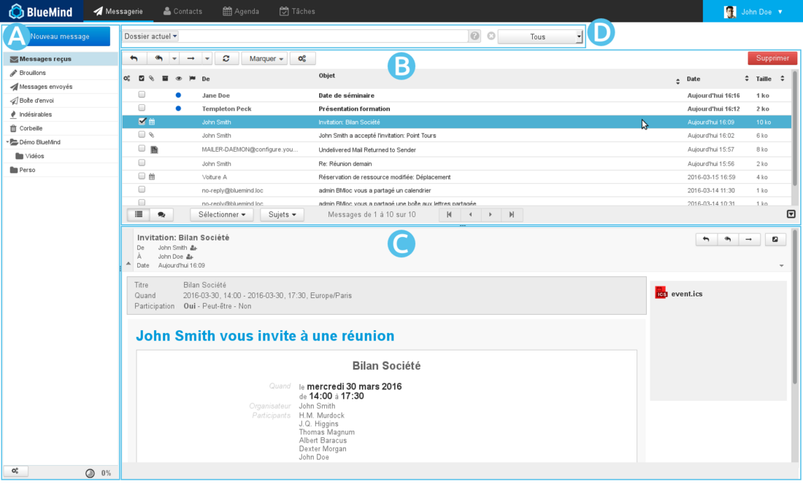
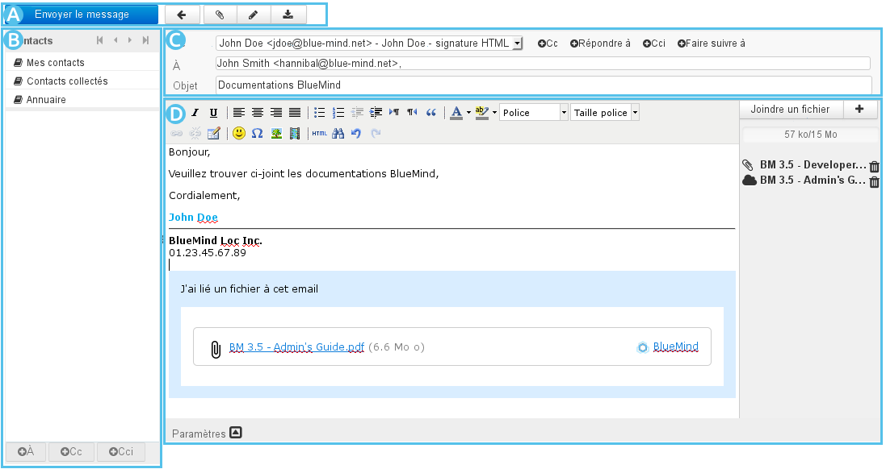

# Débuter avec le webmail

## Se repérer dans le webmail

-  : la barre latérale présente l'arborescence des dossiers de la messagerie de l'utilisateur, celle-ci comprend ses dossiers propres ainsi que les [boîtes partagées](/Guide_de_l_administrateur/Gestion_des_entités/Boites_aux_lettres_partagées/) auxquels il a accèsVoir [La messagerie - §3 Barre Latérale](/Guide_de_l_utilisateur/La_messagerie/)
-  : cette zone présente la liste des messages correspondant au dossier sélectionné ainsi que les boutons d'actions qui y sont associés.Les messages non lus apparaissent en gras. Les colonnes permettent de trier les messages en ordre ascendant ou descendant et les messages peuvent être triés par discussions.Voir [La messagerie - §4 Liste des messages](/Guide_de_l_utilisateur/La_messagerie/)
-  : l'affichage du message sélectionné dans la liste. L'utilisateur peut choisir via sa gestion des préférences de ne pas afficher cette zone et afficher sa messagerie en vue à 2 panneaux seulement.Les boutons d'actions permettent de répondre à un message ou de le faire suivre. La partie droite permet de visualiser la liste des pièces jointes et les télécharger.Voir [La messagerie - §5 Affichage d'un message](/Guide_de_l_utilisateur/La_messagerie/)
-  : le [moteur de recherche](/Guide_de_l_utilisateur/La_messagerie/Moteur_de_recherche_avancé/) avancé full-text et multi-dossiers permet de rechercher des messages avec un ou plusieurs critères, sur tout le contenu des messages (expéditeur, destinataire, objet, etc.) ainsi qu'à l'intérieur même des pièces jointes.

:::tip

L'icône  en bas à droite de la liste des messages permet de basculer entre les modes 2 ou 3 panneaux, le panneau de droite affichant soit la liste des messages seule (mode "2 panneaux") soit un message sélectionné en dessous de la liste des messages (mode "3 panneaux").

:::

## Consulter ses messages

- Pour** consulter un message**, cliquer sur celui-ci dans la liste, il s'affiche alors en** **  pour la vue 3 panneaux ou remplace la liste des messages en  pour la vue 2 panneaux.

:::tip

Pour** ouvrir un message en pleine page** même si l'on est en vue 3 panneaux : double-cliquer sur le message.

Pour **revenir à la vue « 3 panneaux »**, cliquer sur la première flèche en haut à gauche :

:::

- Les **pièces jointes** sont listées à droite du message. Cliquer sur les pièces pour les ouvrir avec l'application associée si disponible, sinon elles sont proposées au téléchargement.

:::tip

Pour **télécharger toutes les pièces jointes**, cliquer sur le bouton idoine en fin de liste.

:::

- La **liste des messages se met à jour régulièrement**. Pour forcer la vérification de nouveaux messages, cliquer sur le dossier pour rafraîchir l'affichage ou sur l'icône  «Vérification des nouveaux messages» au dessus de la liste des messages.

## Accéder aux autres dossiers

- Les **dossiers** de l'utilisateur et ses [dossiers partagés](/Guide_de_l_utilisateur/La_messagerie/Les_boites_aux_lettres_partagées/) sont listés dans la barre latérale.

- 6 dossiers existent par défaut : « Messages reçus », « Brouillons », « Messages envoyés », « indésirables », « Corbeille » et « Boîte d'envoi ».

- L'utilisateur peut créer des **dossiers et sous dossiers** dans sa boîte aux lettres.

## Créer, rédiger un nouveau message

Cliquer sur  pour ouvrir la [fenêtre de composition de message](/Guide_de_l_utilisateur/La_messagerie/Le_composeur/) :

Le composeur de message facilite la rédaction des messages grâce à :

- la sélection de [l'identité](/Guide_de_l_utilisateur/La_messagerie/Les_identités/) d'expéditeur par une liste déroulante simple d'accès
- l'accès direct aux [Préférences des contacts](/Guide_de_l_utilisateur/Les_contacts/Gestion_des_carnets_d_adresses/) et l'autocomplétion des [contacts](/Guide_de_l_utilisateur/Les_contacts/) dans les champs de saisie de destinataires
- la rédaction d'un message avec texte enrichi ou en texte simple
- la visualisation des pièces jointes et leur ajout par glisser/déposer depuis l'explorateur de fichiers
- la personnalisation des paramètres avancés d'expédition : mode d'édition (html/texte), priorité, demande d'accusé de réception, etc.

Pour plus de détails et d'aide, consulter la page [Le composeur](/Guide_de_l_utilisateur/La_messagerie/Le_composeur/).

