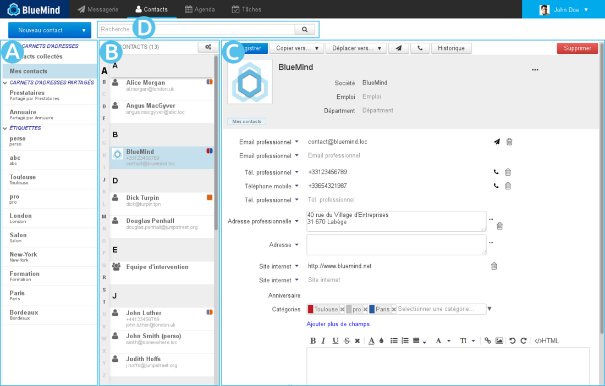
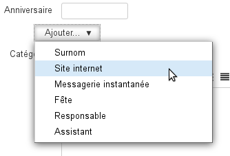
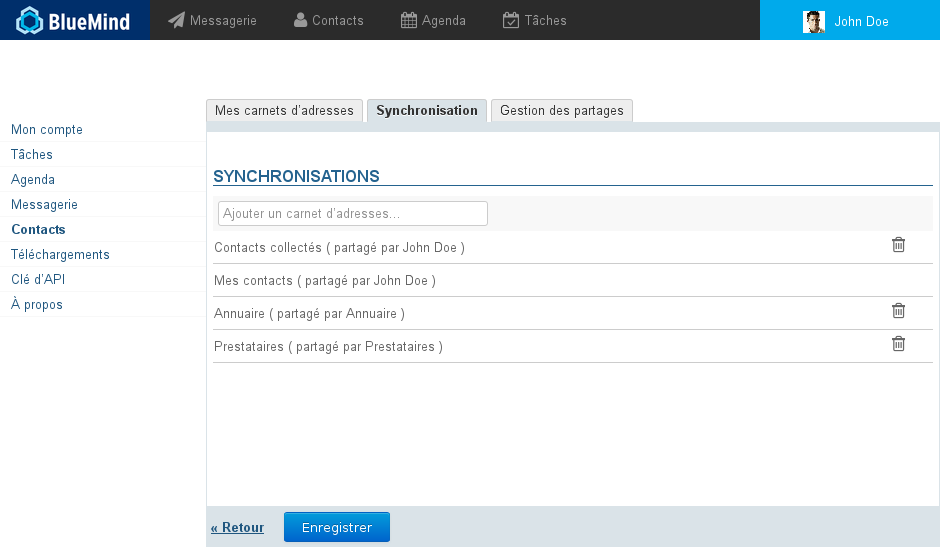

# Débuter avec les contacts

# Se repérer dans les contacts

-  : dans la 1ère colonne se trouve, sous le bouton «Nouveau contact», la liste des carnets accessibles par l'utilisateur : ses carnets d'adresses par défaut, ses carnets personnels ainsi que ceux qui lui ont été partagé et auxquels il est abonné ;
- 
 : dans la 2ème colonne se trouve la liste des contacts présents dans le carnet sélectionné en 1ère colonne
:::important

l'alphabet vertical sur la gauche de la zone permet de naviguer plus rapidement dans les contacts, les lettres auxquelles se trouvent des contacts sont mises en évidence en noir et gras pour une meilleure visibilité.

:::

- 
 : la 3ème colonne, zone d'affichage principale, présente la fiche de l'utilisateur sélectionné en 2ème colonne.

- 
 : champs de recherche

# Les contacts

Pour des informations détaillées sur l'application Contacts de BlueMind, consulter la page [Les contacts](/Guide_de_l_utilisateur/Les_contacts/)

## Ajouter un contact

Cliquer sur  en haut à gauche de la page, une fiche vierge apparaît en 

Remplir les champs désirés puis cliquer sur  en haut à gauche de la 

**Le contact est créé dans le carnet en cours de consultation.**

## Éditer un contact

Lorsqu'un contact est éditable, sa fiche apparaît modifiable lorsqu'elle est affichée. Pour éditer un contact, il suffit donc de consulter sa fiche.

Remplir les champs désirés puis cliquer sur  en haut à gauche de la 
:::important

Pour ajouter un type de champs qui n'apparaît pas par défaut, utiliser le bouton "Ajouter" :

:::

## Supprimer un contact

De même que pour l'édition (voir paragraphe précédent) il suffit de consulter la fiche d'un contact pour pouvoir la supprimer.

Une fois la fiche présentée en , cliquer sur le bouton  en haut à droite puis valider la suppression.

# Les carnets d'adresses

## Les carnets par défaut

BlueMind propose par défaut aux utilisateurs 3 carnets d'adresses :

- 
**Mes contacts** : un carnet d'adresses personnel dans lequel l'utilisateur peut placer et gérer ses contacts

- **Annuaire** : carnet d'adresses public rassemblant tous les utilisateurs publics du domaine. Ce carnet n'est pas modifiable et rempli automatiquement par BlueMind, il comprend les utilisateurs, les groupes de distributions et les boîtes partagées.
- 
**Contacts collectés** : réunit automatiquement les destinataires des messages de l'utilisateur non présents dans l'annuaire

## Gérer ses carnets d'adresses

La gestion des carnets d'adresses s'effectue depuis la gestion des paramètres de l'utilisateur :

### Les carnets de l'utilisateur

Le 1er onglet permet la gestion des carnets d'adresses de l'utilisateur :

- La 1ère partie de l'onglet permet de créer un nouveau carnet, éventuellement en y important des contacts contenus dans un fichier Vcard.Une fois le nom et, le cas échéant le fichier concerné, remplis, cliquer sur «Ajouter» pour créer le carnet.
- 
La 2ème partie de l'onglet présente la liste des carnets de l'utilisateur.
:::important

À noter

  - Les carnets "Contacts" (équivalent à "Mes Contacts") et "Contacts collectés" ne peuvent être supprimés.
  - Le carnet "Annuaire" n'apparaît pas car aucune action n'est possible : l'utilisateur ne peut ni le partager, ni y importer des contacts, ni le supprimer, ni s'en désabonner.

:::

### Les abonnements aux carnets partagés

Le 2ème onglet permet la gestion des abonnements aux carnets d'adresses partagés (domaine, utilisateurs, groupes...) :

- **Pour ajouter un abonnement**, saisir le nom du carnet d'adresses qui a été partagé puis valider avec la touche &lt;Entrée>. L'autocomplétion permet de trouver plus facilement les carnets qui ont été partagés avec l'utilisateur (le propriétaire ou l'administrateur du carnet lui a attribué des droits de partage en lecture et/ou écriture)
- 
**Pour annuler un abonnement** à un carnet, cliquer sur l'icône  de la ligne correspondante
:::important

À noter

Les abonnements à l'annuaire et au carnet d'adresses personnels ne peuvent être supprimés, tous les utilisateurs y sont automatiquement et obligatoirement abonnés.

:::

### Partager ses carnets d'adresses

Le 3ème onglet des paramètres de Contacts permet de partager ses carnets d'adresses personnels avec d'autres utilisateurs ou groupes du domaine.

1 Choisir le carnet d'adresse à partager.Un utilisateur peut partager :
  - ses carnets d'adresses personnels : Contacts (ou «Mes Contacts»), Contacts Collectés et les carnets qu'il a créé
  - les carnets pour lesquels il a délégation : on lui a attribué le droit "Peut modifier les contacts de ce carnet et gérer ses partages"
1 Si l'on souhaite partager le carnet avec tous les utilisateurs du domaine, cocher la case "Autoriser le partage public" et choisir le type de droits à attribuer aux utilisateurs
1 ** **Choix recommandé :** ** Si l'on préfère attribuer des droits individuellement à certains utilisateurs ou groupe, rechercher la personne grâce au champs de saisie puis sélectionner le droit à lui attribuer
1 Une fois tous les droits attribués comme souhaité, valider en cliquant sur «Enregistrer»

### Pour aller plus loin

Pour plus de détails sur la gestion des carnets d'adresses et le fonctionnement des différentes parties, voir la page dédiée [Préférences des contacts](/Guide_de_l_utilisateur/Les_contacts/Gestion_des_carnets_d_adresses/)

