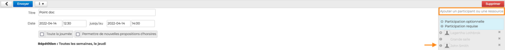
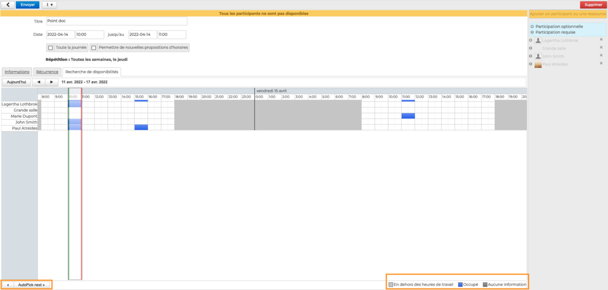
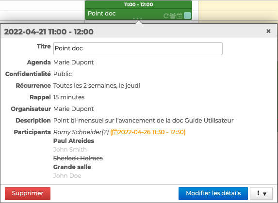
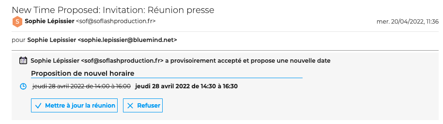
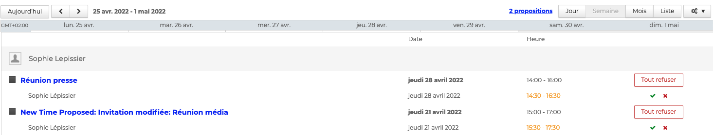

# Organiser une réunion

L'agenda BlueMind permet d'organiser des évènements participatifs, ponctuels ou récurrents, de réserver une salle ou du matériel et d'ajouter une visioconférence.

## Ajouter des utilisateurs et des ressources

Une fois l'[évènement créé](/STAGING/Guide_de_l_utilisateur_4.7/L_agenda_4.7/Créer_un_évènement/), aller dans la **partie droite de la fiche**, et taper les premières lettres des **utilisateurs ou des groupes** qui sont invités - l'autocomplétion proposera l'ensemble des utilisateurs de l'organisation.

La **réservation d'une ressource**, c'est &lt;s>à&lt;/s> dire un moyen (salle de réunion, véhicule, rétroprojecteur, etc.) mis à disposition des utilisateurs, s'effectue de la même façon que les participants. Aller dans la partie droite de la page et taper les premières lettres de la ressource - l'autocomplétion proposera l’ensemble des ressources partagées par l'administrateur.

:::tip

Pour indiquer si la présence de l'utilisateur est obligatoire (valeur par défaut) ou optionnelle, **cliquer sur l'icône** devant son nom.

:::

## Vérifier les disponibilités

Lorsqu'un utilisateur ou une ressource parmi les participants n'est pas disponible sur le créneau horaire choisi, **un message d'alerte apparaît **en haut de la fiche.

Pour chercher un créneau horaire sur lequel l'ensemble des utilisateurs et des ressources soient disponibles, aller sur l'onglet "**Recherche de disponibilités**".

BlueMind propose automatiquement, encadré de vert et rouge, le premier créneau disponible en fonction de la date saisie dans le formulaire. Pour aller automatiquement au prochain créneau, cliquer sur "**Autopick next**" en bas à gauche

Il est également possible de déplacer le créneau par glisser-déplacer avec la souris et de le réduire ou l'agrandir en faisant glisser les lignes verte ou rouge indépendamment.

:::tip

Comme indiqué dans la légende, les zones gris claires correspondent aux plages horaires hors temps de travail telles que définies par l'utilisateur dans les [paramètres de son agenda](/STAGING/Guide_de_l_utilisateur_4.7/L_agenda_4.7/Paramétrer_l_agenda/). 
Les zones bleues correspondent aux évènements où l'utilisateur est noté comme "[occupé](https://forge.bluemind.net/confluence/pages/viewpage.action?pageId=86762178#id-.Cr%C3%A9erun%C3%A9v%C3%A8nementvBM4-Pr%C3%A9ciserlesnotifications,disponibilit%C3%A9etconfidentialit%C3%A9Disponibilite)"

:::

## Ajouter une visioconférence

BlueMind propose la possibilité de lier des visioconférences à des événements.

Les systèmes compatibles sont :

- BlueMind Video (service SAAS intégré depuis BlueMind 4.6.0)
- Jitsi (service externe)
- StarLeaf (service externe)

Cette fonctionnalité doit tout d'abord être [installée par les administrateurs](https://forge.bluemind.net/confluence/display/DA/.Visioconference+integree+vBM-4) qui la mettent à disposition des utilisateurs.

Pour ajouter une visioconférence à une réunion, aller sur "**Ajouter une visioconférence**"

**Un lien est ajouté automatiquement** à l'événement, avec un texte d'accompagnement s'il a été paramétré par les administrateurs.

Les 2 icônes à côté de l'événement permettent de :

-  supprimer une visioconférence de l'événement
- copier l'adresse dans le presse-papier de l'ordinateur

## Envoyer les invitations

Une fois la réunion paramétrée, cliquer sur pour enregistrer la réunion et envoyer les invitations.

**Pour chaque utilisateur**, la réunion est ajoutée à son calendrier et il reçoit une notification par e-mail afin de [valider sa participation](/STAGING/Guide_de_l_utilisateur_4.7/L_agenda_4.7/Participer_à_un_évènement/).

**Pour les ressources**, 2 cas sont possibles selon la politique de réservation choisie :

- la réservation automatique est activée : en fonction de sa disponibilité, la réservation de la ressource est validée ou refusée. L'organisateur reçoit une notification par e-mail de la part de la ressource
- la réservation automatique n'est pas activée : le [gestionnaire de la ressource](/STAGING/Guide_de_l_utilisateur_4.7/L_agenda_4.7/Gérer_les_réservations_de_ressources/) reçoit une notification de demande de réservation. Une fois que la demande est validée ou refusée, l'organisateur reçoit une notification par e-mail de la part du gestionnaire de la ressource.

## Gérer les participations

L'organisateur peut **consulter les réponses** aux invitations en cliquant sur l'évènement : 

- les utilisateurs ayant **confirmé** leur participation apparaissent en noir
- les utilisateurs **en attente** (ou ayant répondu "peut-être") sont grisés
- les utilisateurs ayant **refusé** l'événement apparaissent grisés et barrés
- les utilisateurs ayant **proposé un nouvel horaire** apparaissent en italique et avec la proposition de nouvel horaire

Lorsqu'un utilisateur envoie une **proposition de nouvel horaire**, l'organisateur reçoit la demande par e-mail.

- **Si l'organisateur accepte la proposition** :
    - la réunion est modifiée
    - tous les participants reçoivent un e-mail de modification de l'événement.
- **Si l'organisateur refuse la proposition** :
    - la réunion est inchangée
    - le participant ayant fait une proposition reçoit un message indiquant le refus de l'organisateur
    - la proposition disparait de la popup des agendas où elle apparaissait
    - les autres participants ne reçoivent rien

:::tip

La demande de nouvel horaire peut également être traitée depuis l'agenda. La notification apparait dans la barre d'actions

:::

