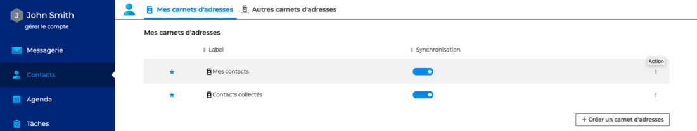
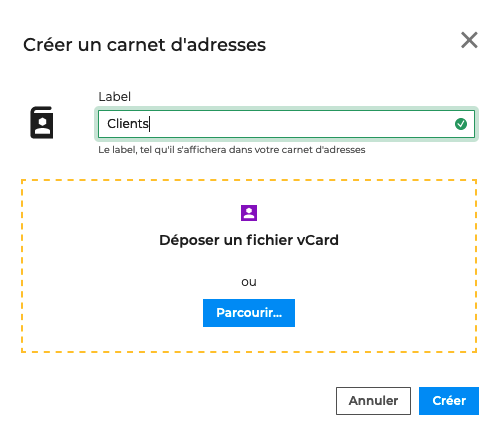
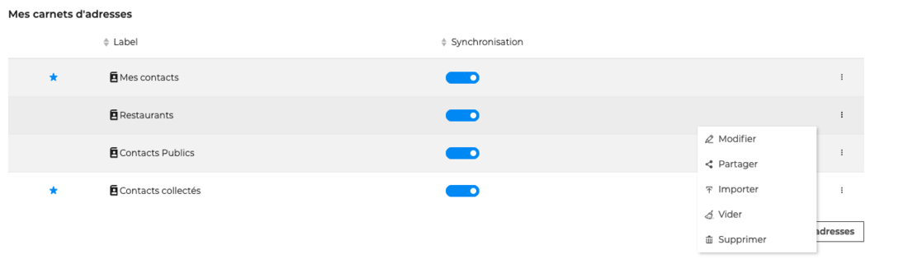

# Créer et éditer un carnet d'adresses personnel

Les carnets d'adresses personnels permettent à l'utilisateur d'organiser l'ensemble de ses contacts. Par défaut BlueMind en configure deux :

- **Mes contacts** : carnet d'adresses où l’utilisateur peut ajouter ses contacts personnels
- **Contacts collectés** : carnet d'adresses personnel qui réunit automatiquement les destinataires des messages de l'utilisateur non présents dans l'annuaire

La gestion des carnets d'adresses personnels s'effectue dans les dans les paramètres des contacts, en allant sous **Préférences - Contacts - Mes carnets d'adresses**

**

**

## Créer un carnet d'adresses personnel

En plus de ces 2 carnets d'adresses par défaut, l'utilisateur peut en créer autant qu'il le souhaite.

** Pour créer un carnet d'adresses**, cliquer sur  afin d'ouvrir la fenêtre pop-up.

Nommer le carnet d'adresses puis cliquer sur **Créer**.

Il est possible de créer un carnet d'adresses vide ou d'ajouter des contacts directement dans le carnet d'adresses en [important un fichier vCard](/STAGING/Guide_de_l_utilisateur_4.7/Les_contacts_4.7/Importer_et_exporter_des_contacts/).

## Éditer un carnet d'adresses personnel

Pour agir sur un carnet d'adresses personnel, aller sur le menu d'actions

- **Modifier** ouvre la fenêtre pop-up de création du carnet d'adresses et permet de changer le label
- **Partager** ouvre la fenêtre pop-up de [gestion des partages](/STAGING/Guide_de_l_utilisateur_4.7/Les_contacts_4.7/Partager_un_carnet_d_adresses/)
- **Importer** ouvre la fenêtre pop-up d'[import de fichier](/STAGING/Guide_de_l_utilisateur_4.7/Les_contacts_4.7/Importer_et_exporter_des_contacts/)
- **Vider** permet de supprimer tous les contacts du carnet mais de le conserver vide
- **Supprimer** permet de supprimer définitivement les contacts et le carnet d'adresses

:::info

Les 2 carnets d'adresses personnels configurés par défaut, "**Mes contacts**" et "**Contacts collectés**", ne peuvent être ni modifiés ni supprimés. Cependant l'utilisateur peut en gérer les contacts en vidant les adresses du carnet ou en [important des contacts](/STAGING/Guide_de_l_utilisateur_4.7/Les_contacts_4.7/Importer_et_exporter_des_contacts/).

:::

