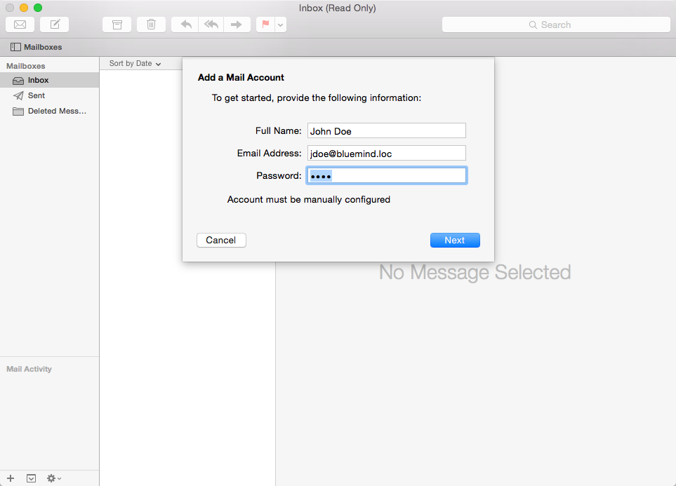
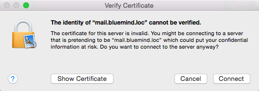
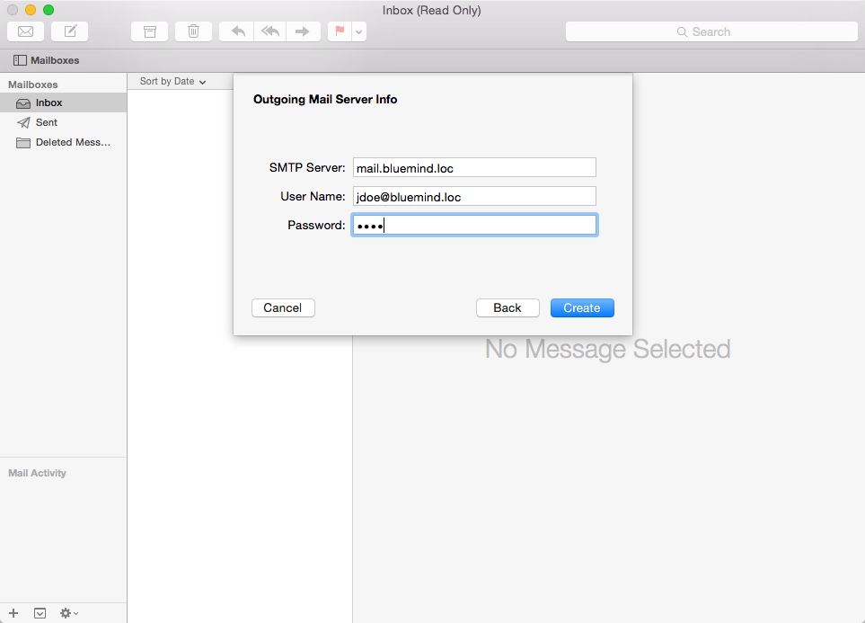

# Configuration d'Apple Mail

## Présentation

 

:::info

Le guide suivant a été réalisé sous un OS X Mavericks

:::

## Création du compte

Un nouveau compte de courrier peut être créé de plusieurs façons :

- Se rendre dans la gestion des comptes internet : System Preferences > «Internet Accounts» ("Comptes internet") > «Add other account» ("Ajouter un autre compte") > sélectionner «Add a mail account» ("Ajouter un compte de courrier") et cliquer sur «Create» ("Créer")
- depuis le client Apple Mail :
    - lors de sa première ouverture, lorsqu'aucun compte n'est encore paramétré, le logiciel propose la création d'un nouveau compte de courrier
    - en allant dans le menu Mail > «Accounts» ("Comptes")

Choisir «Add other mail account» ("Ajouter un autre compte courrier") :

Saisir les informations demandées :

- Full Name : Nom Complet, c'est le nom qui apparaîtra pour le compte et dans les messages envoyés, il est libre.
- Email Address : l'adresse mail qui vous a été fournie
- Password : le mot de passe de l'utilisateur

Cliquer sur «Next» ("Suivant")

Vérifier et corriger si besoin les informations de connexion au compte :

- Mail Server : L'adresse du serveur doit vous être indiquée par votre administrateur, elle est en général de la forme &lt;nom-serveur>.domaine.com 
- User Name : Le nom d'utilisateur doit être le nom d'utilisateur **complet **avec le domaine****.
- Password : Le mot de passe est le mot de passe qui a été fourni par l'administrateur et permet de se connecter à BlueMind.

 

Cliquer sur «Next» ("Suivant")

 

Une alerte indique que la connexion n'est pas sécurisée, ce qui n'est techniquement pas totalement vrai :

 

Cliquer sur «Connect» ("se connecter") pour confirmer la connexion au serveur.

Vérifier et corriger si besoin les informations de connexion au serveur sortant :

Valider en cliquant sur «Create» ("Créer") afin de créer le compte de courrier.

 

