# Synchronisation IMAP sous Android

:::info

Ce guide a été réalisé avec un LG Nexus 5 sous Android 5.0.1

Pour les autres téléphones ou versions d'Android, les opérations sont les mêmes même si les écrans peuvent différer sensiblement. En particulier dans les versions précédentes d'Android le courrier se consultait depuis l'application "E-mail", désormais c'est l'application "Gmail" qui permet de regrouper tous ses comptes courriers, qu'ils soient fournis par Google Mail ou non.

:::

## Configuration du nouveau compte courrier

Ouvrir l'application Gmail :

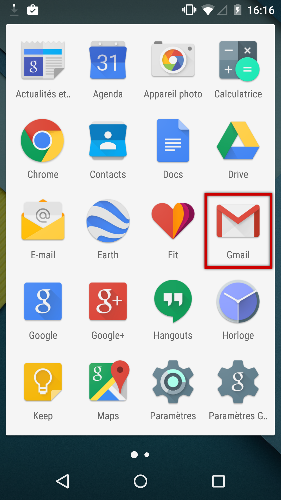

*NB : l'application E-mail est toujours présente mais une alerte redirige vers l'application Gmail lors de son ouverture*

Ouvrir le menu :

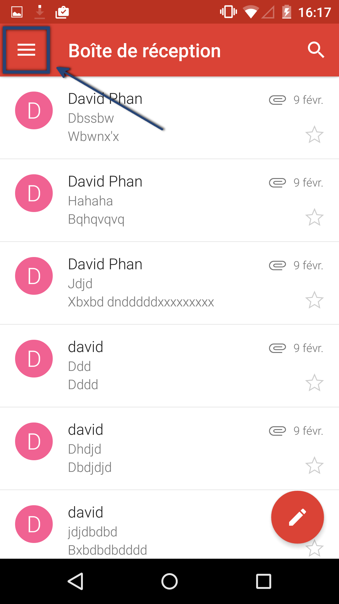

Choisir d'ajouter un compte :

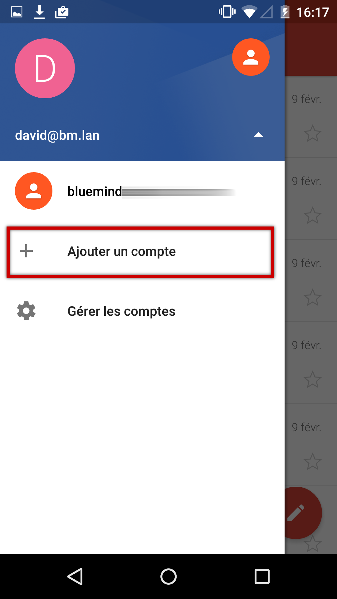

Choisir un type de compte personnel :

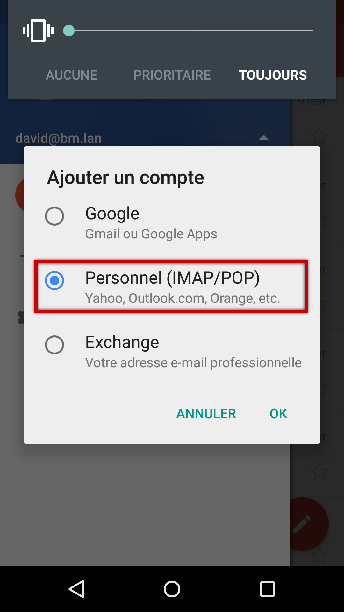

Saisir l'adresse email :

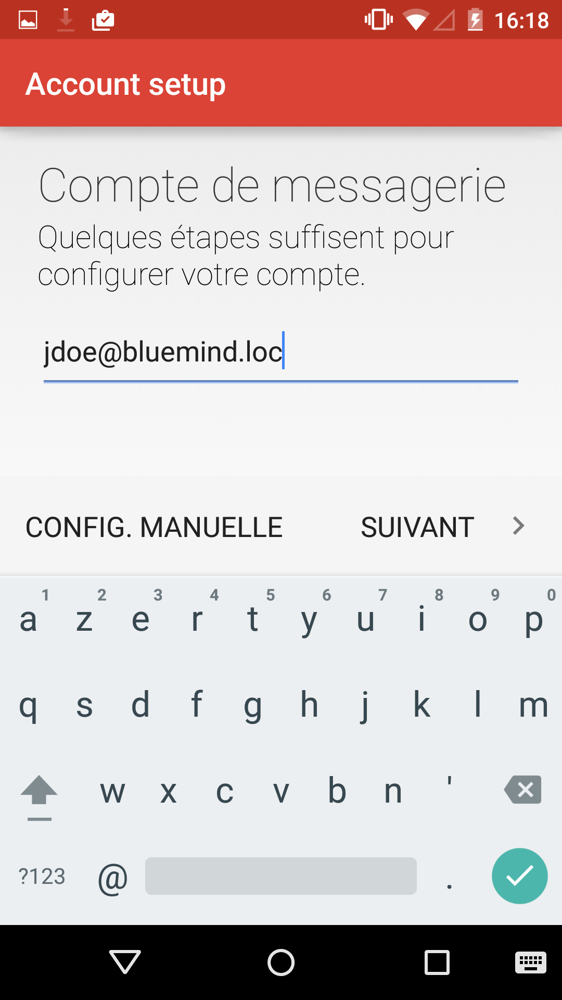

Choisir de configurer un compte IMAP :

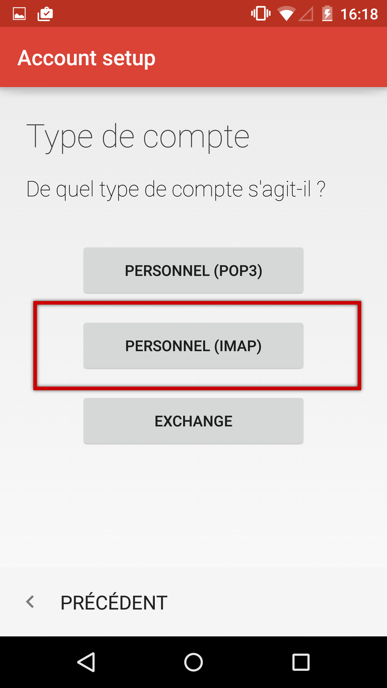

Saisir le mot de passe de l'utilisateur :

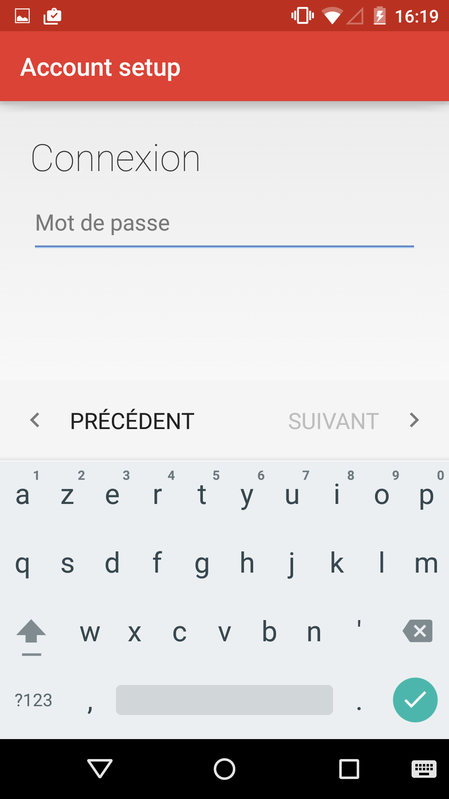

Saisir les informations du serveur entrant (serveur permettant de recevoir/consulter les messages) :

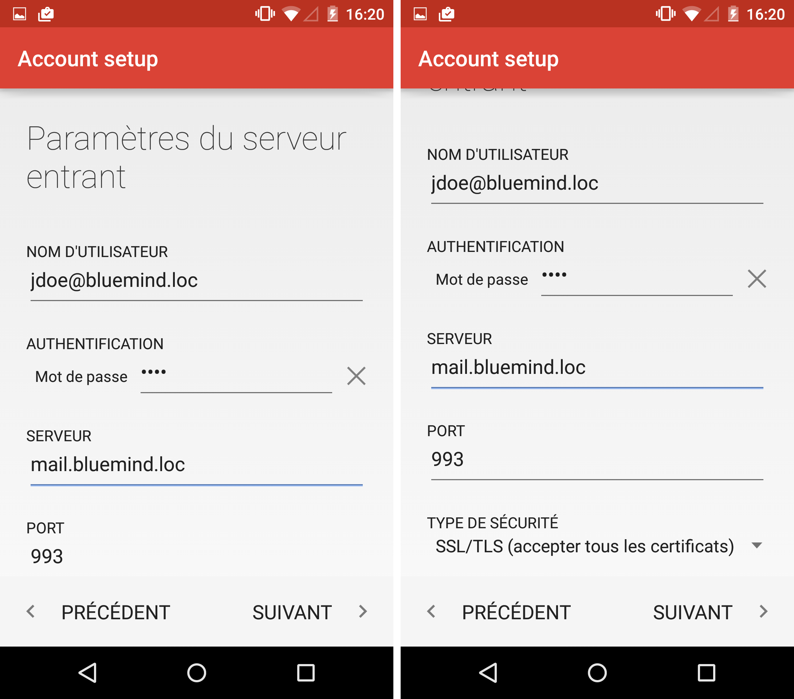

Sauf cas particulier :

- le nom d'utilisateur est identique à votre adresse e-mail
- l'adresse du serveur (ici *mail.bluemind.loc*) est identique à l'url d'accès à BlueMind (en enlevant https://).Par exemple, si vous accédez à BlueMind depuis votre navigateur à l'adresse [https://mail.bluemind.loc](https://mail.bluemind.loc) alors vous devez saisir **mail.blumind.loc**
- le type de sécurité doit être **SSL/TLS (accepter tous les certificats)** et non SSL/TLS simple

Saisir les informations du serveur sortant (serveur permettant d'envoyer des messages) :

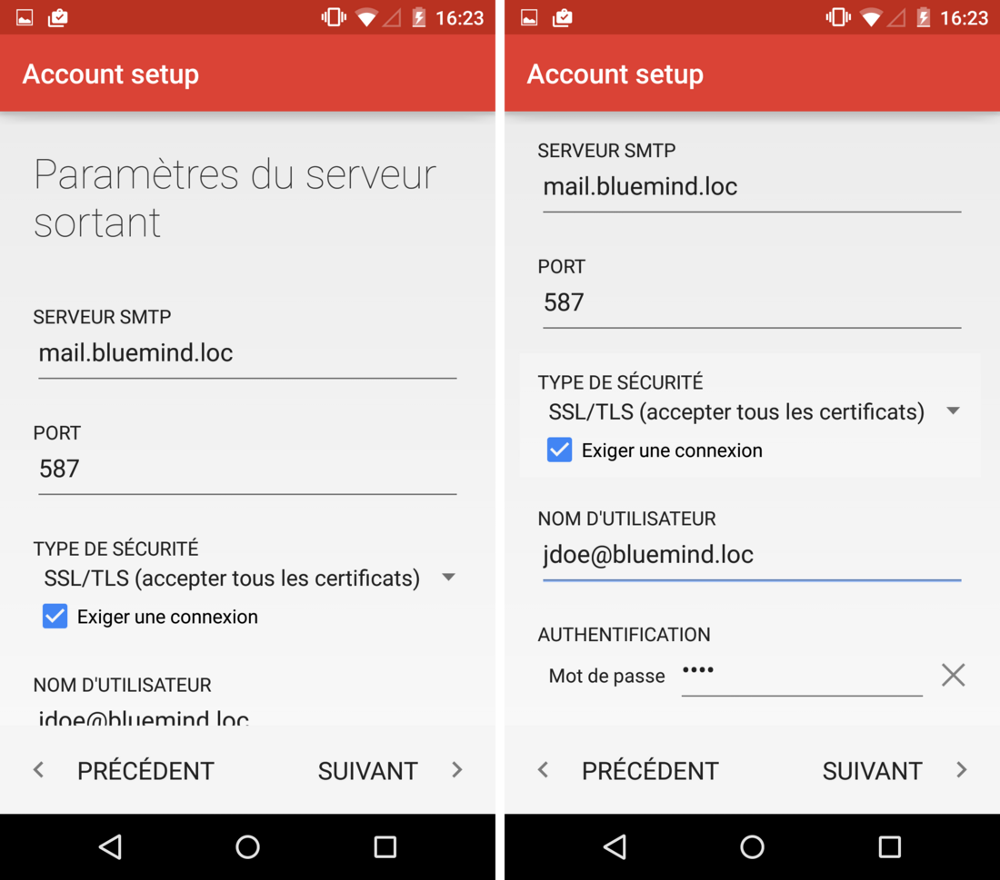

Sauf cas particulier, les informations et notamment l'adresse du serveur sont les mêmes que pour le serveur entrant.

:::info

Ne pas oublier de cocher la case "Exiger une connexion".
Pour des raisons de sécurité, le serveur n'autorise que ses utilisateurs à envoyer des messages. Cette option indique donc à l'application de demander au serveur de l'authentifier lors de l'envoi de messages.

:::

:::info

Ports et sécurité

Les options présentées ci-dessus sont les informations par défaut. Les ports et méthodes de connexions peuvent varier, en cas de problème contactez votre administrateur qui vous indiquera les informations particulières à saisir.

IMAP (serveur entrant) :

- 143: TLS possible
- 993: SSL

SMTP (serveur sortant) :

- 25: TLS possible mais pas obligatoire
    - sans authentification: envoi possible uniquement vers un des domaines BlueMind
    - avec authentification ou depuis une IP listée dans l'interface de l'administrateur dans Gestion du système > Configuration système > onglet Messagerie > champs 'Mes réseaux': envoi possible vers n'importe quel destinataire
- 465: SSL + authentification obligatoire - envoi possible vers n'importe quel destinataire
- 587: TLS + authentification obligatoire - envoi possible vers n'importe quel destinataire

:::

Une fois la connexion correctement testée et établie, l'application propose de configurer les options principales du compte :

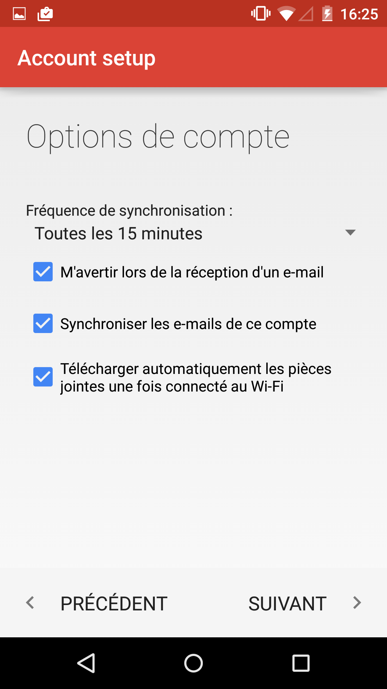

Cocher les options souhaitées et appuyez sur "Suivant".

Renseigner le nom du compte et le nom qui apparaîtra en tant que nom de l'utilisateur dans les messages envoyés :

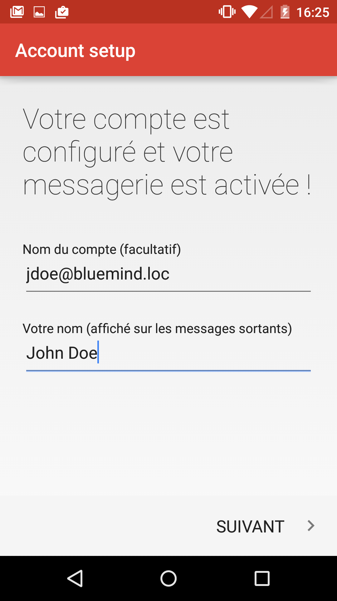

Le compte de courrier apparaître alors dans la liste des comptes de l'application :

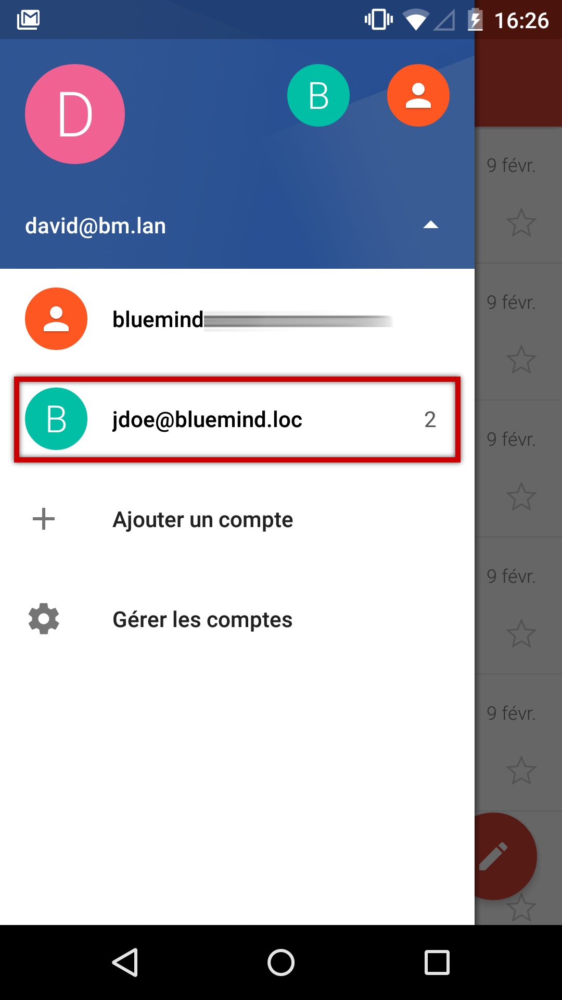

Les mails sont relevés et affichés :

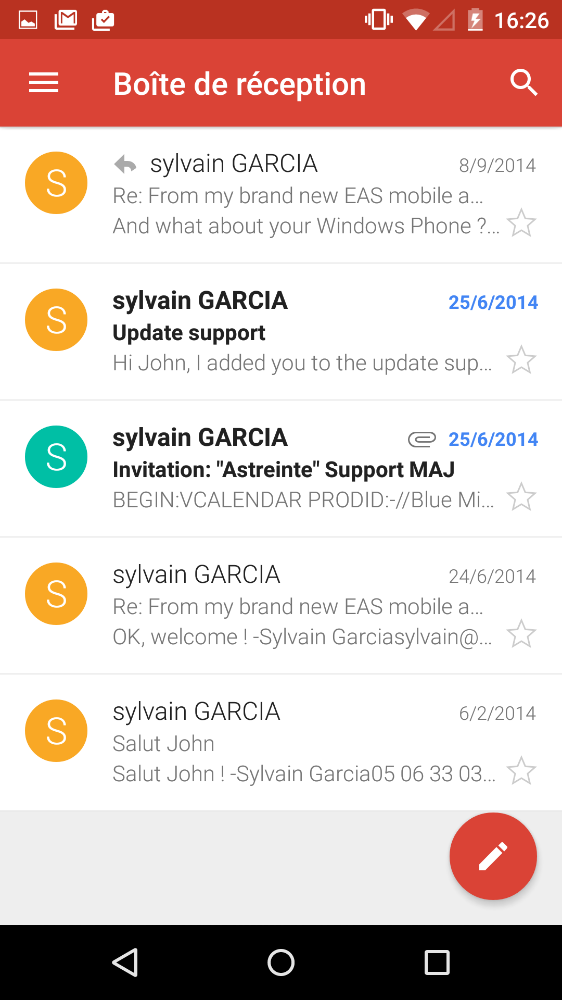

 

 

 

 

 

 

