# Synchronisation avec Android

## Présentation

La synchronisation ActiveSync est le mode de synchronisation à privilégier car il permet en une seule configuration de synchroniser les messages ainsi que les contacts et agendas alors que la [synchronisation IMAP](/Guide_de_l_utilisateur/Configuration_des_périphériques_mobiles/Synchronisation_avec_Android/Synchronisation_IMAP_sous_Android/) ne permet d'accéder qu'à ses emails.

Pour en savoir plus, consulter la page [Synchronisation des périphériques externes](/Guide_de_l_utilisateur/Configuration_des_périphériques_mobiles/).

:::info

Ce guide a été réalisé avec un LG Nexus 5 sous Android 4.4.2

Pour les autres téléphones Android, les opérations sont les mêmes même si les écrans peuvent différer sensiblement.

**Pour plus d'information sur les modèles compatibles et limitations connues, veuillez consulter la page de ** ** [Compatibilité](/FAQ_Foire_aux_questions_/Compatibilité/) ** **.**

:::

## Configuration du compte ActiveSync

:::info

La possibilité de connecter un smartphone au serveur BlueMind dépend de la politique d'autorisation définie par les administrateurs. Assurez-vous auprès d'eux que vous êtes bien autorisé à vous connecter avec un smartphone. En particulier, certaines configurations nécessitent une autorisation manuelle d'un administrateur.

Se référer à cette page : [Configuration du serveur EAS](/Guide_de_l_administrateur/BlueMind_et_mobilité/Configuration_du_serveur_EAS/).

:::

### Création du compte

Allez dans le menu de votre téléphone et choisissez « Paramètres » :

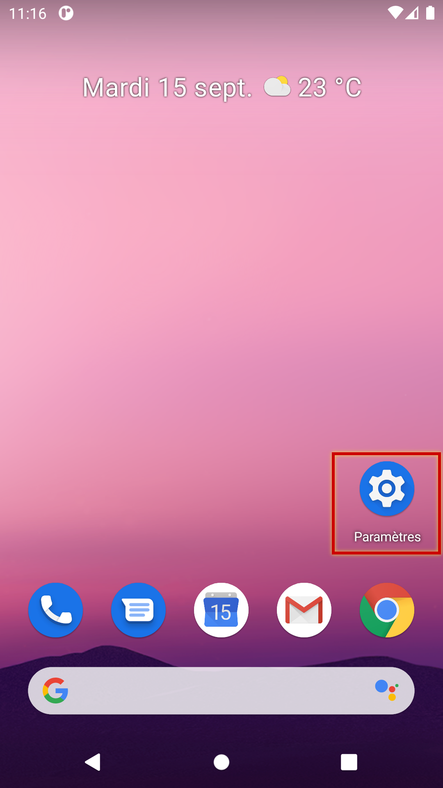

Se rendre dans la gestion des comptes :

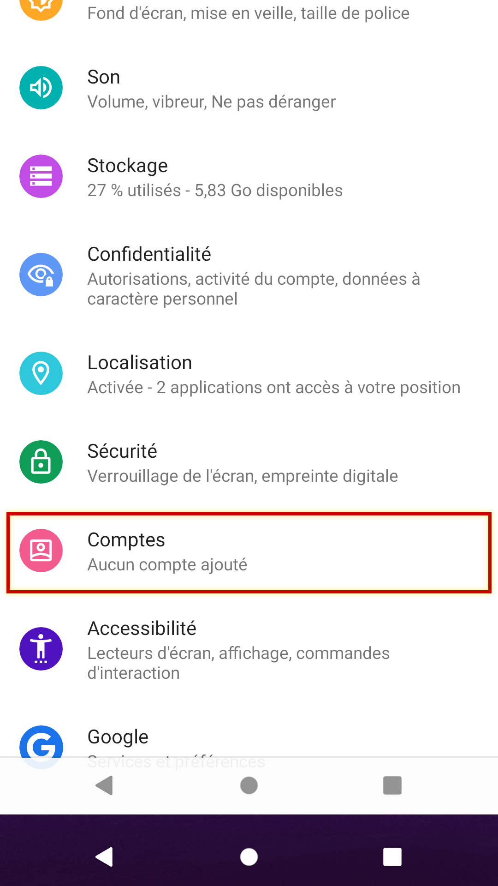

Choisir ici « Ajouter un nouveau compte » :

Choisir de créer un compte de type « Exchange » :

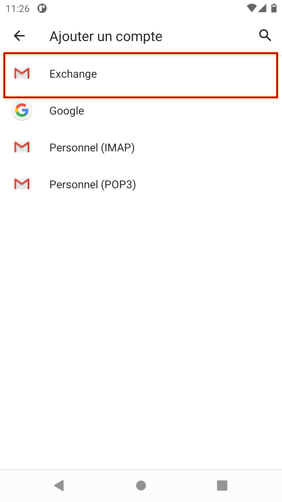

Saisir l'adresse de messagerie et le mot de passe de l'utilisateur puis appuyer sur « Configurer manuellement »

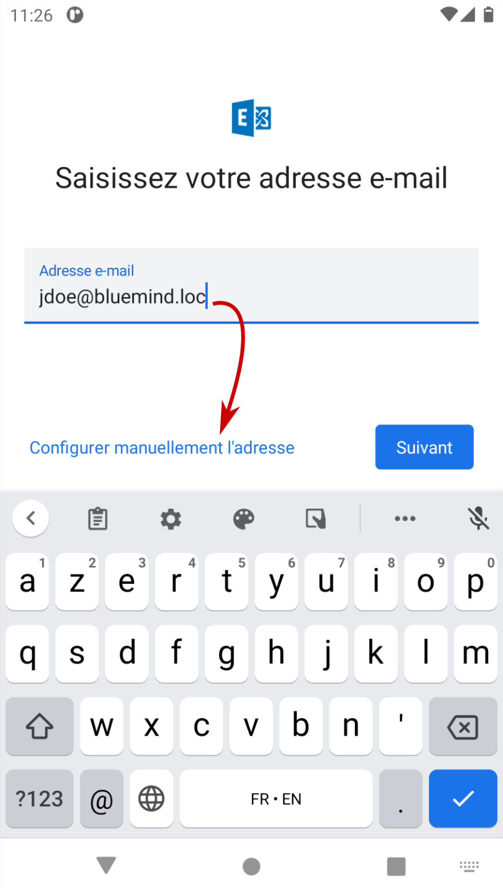

Les informations sont alors pré-remplies en fonction de l'adresse de messagerie. Vérifier qu'elles sont correctes, il peut notamment être nécessaire de corriger l'adresse du serveur :

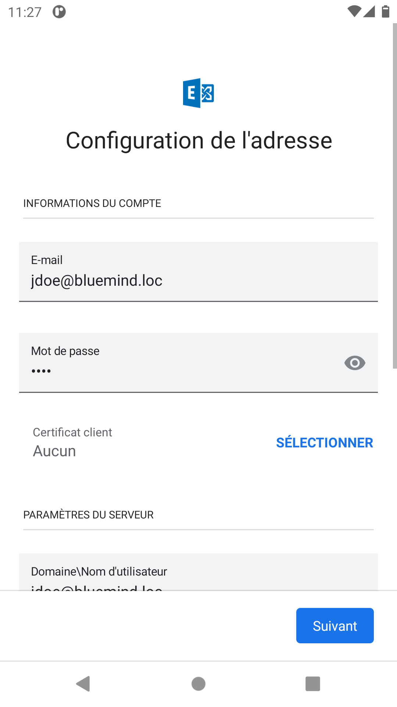 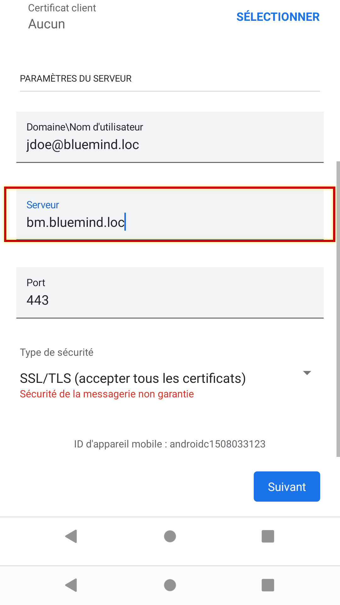

Sauf cas particulier :

- le login est identique à votre adresse e-mail
- l'adresse du serveur (ici *bluemind.loc*) est identique à l'url d'accès à BlueMind (en enlevant https://). Par exemple, si vous accédez à BlueMind depuis votre navigateur à l'adresse  [https://bm.bluemind.loc](https://bm.domaine.com)  alors vous devez saisir **bm.blumind.loc**

:::info

Dans certaines versions d'Android, un champs supplémentaire "Domaine\nom d'utilisateur" est demandé, il faut alors indiquer dans ce champs le domaine et le nom d'utilisateur sans la partie droite de l'adresse e-mail.
Par exemple, dans notre cas : `bluemind.loc\jdoe`

Certains appareils mobiles acceptent aussi pour ce champs l'adresse mail complète de l'utilisateur.

:::

Si cela est demandé, confirmer l'autorisation d'accès en appuyant sur « OK » :

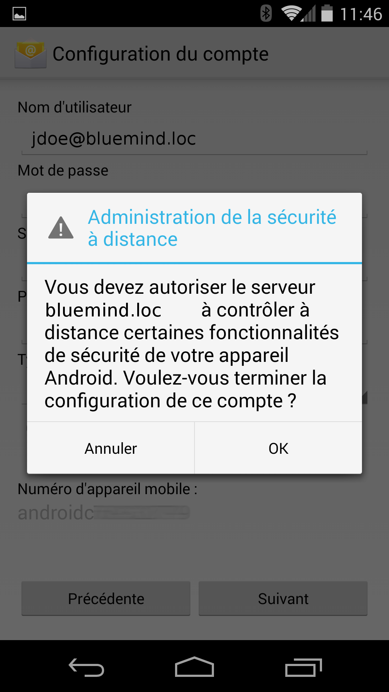

L'appareil procède alors au paramétrage puis affiche une confirmation de bon déroulement :

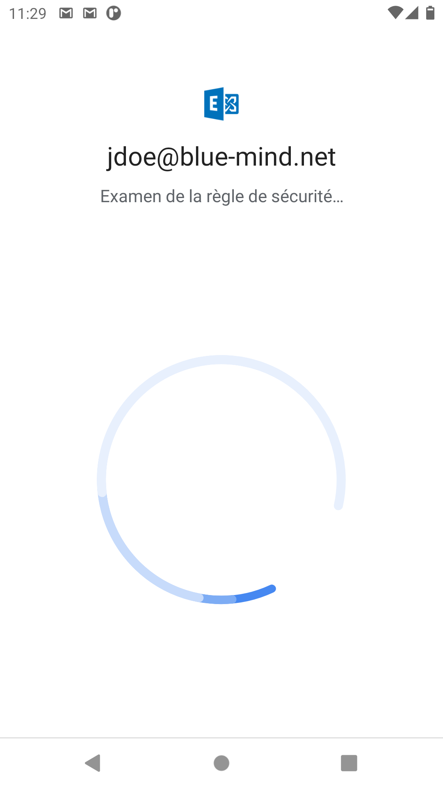 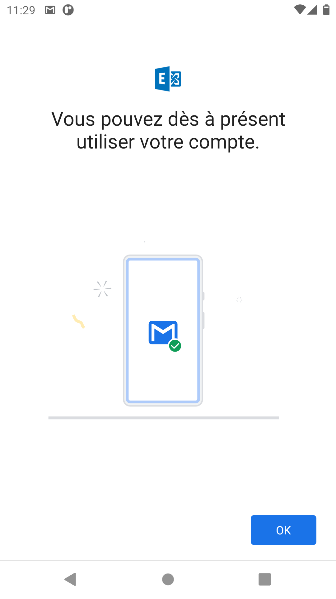

Cliquer sur OK pour terminer.

### Choix des éléments à synchroniser

:::info

Multi-calendriers

Android ne permettant pas de visualiser les différents calendriers au moyen de couleurs différenciées, l'affichage des calendriers partagés n'est pas possible par défaut, seul l'agenda de l'utilisateur apparaît et est fonctionnel.

Il est cependant possible d'activer la fonctionnalité afin de la coupler avec une application tiers : [Multi-calendrier sur les smartphones](/Base_de_connaissance/Multi_calendrier_sur_les_smartphones/)

:::

Les paramètres de synchronisation peuvent être consultés et modifiés en allant dans la configuration du compte :

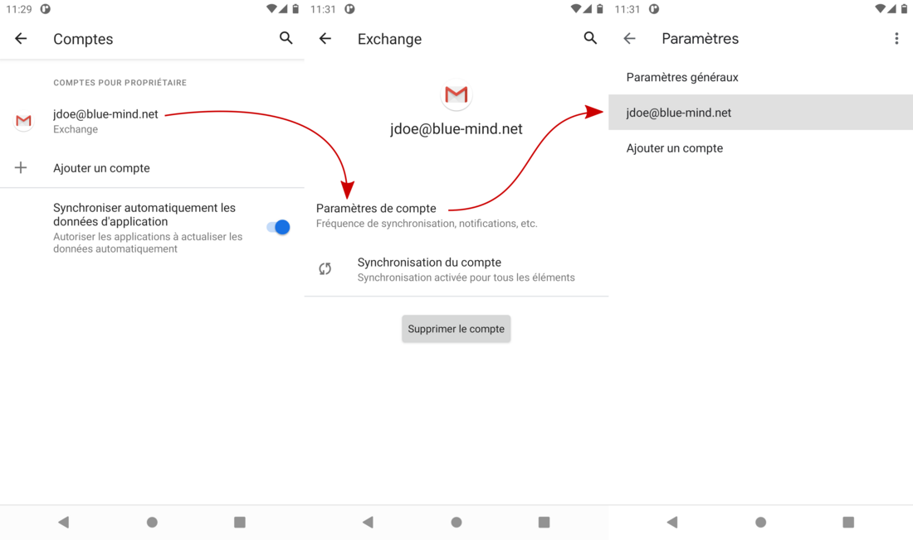

Appuyer sur « Synchroniser les e-mails depuis le » pour choisir la période de synchronisation (la configuration par défaut dépend des appareils, elle peut être d'un mois ou d'une semaine seulement) :

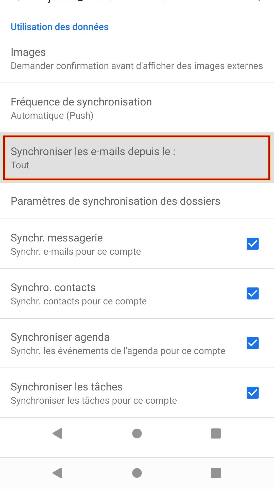 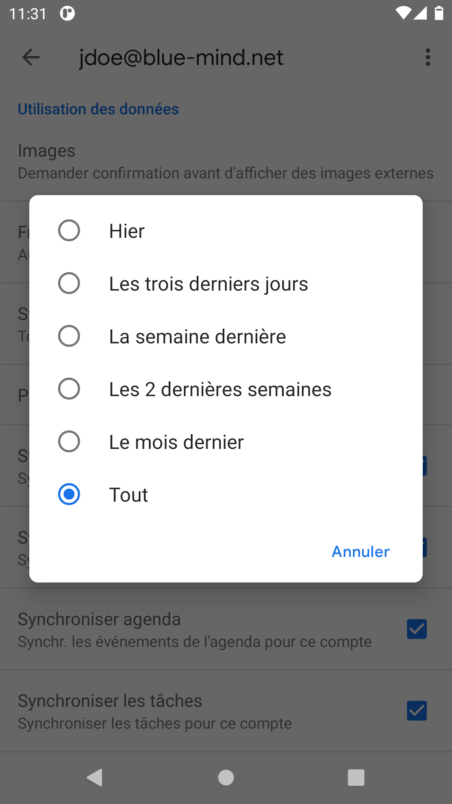

:::info

Fréquence de synchronisation

Par défaut, c'est le mode * [Push Mail](http://fr.wikipedia.org/wiki/Push_mail) * qui est proposé, cela signifie que c'est le serveur qui enverra les mails au téléphone dès leur réception. Dans les autres options, c'est le téléphone qui ira périodiquement interroger le serveur pour savoir si de nouveaux mails sont arrivés.

:::

Plus bas, vous pouvez choisir de synchroniser toutes les données ou seulement l'une ou l'autre parmi Messagerie (e-mails), Contacts (Carnet d'adresse "Mes contacts") et Agenda (votre calendrier seulement, voir encart ci-dessus) :

NB : bien que le choix "Tâches" apparaisse, très peu d'appareils mobiles sous Android permettent effectivement de synchroniser les tâches.

:::info

Contacts

Seul le carnet d'adresse personnel "Mes Contacts" est synchronisé avec l'appareil, cependant les adresses des autres carnets [auxquels l'utilisateur est abonné](/Guide_de_l_utilisateur/Les_contacts/Gestion_des_carnets_d_adresses/) (Annuaire, Contacts collectés...) sont accessibles via les fonctions de recherche du smartphone (contacts, rédaction d'email, appel téléphonique...)

:::

