# Synchronisation avec iOS

## Présentation

### La synchronisation

La synchronisation ActiveSync est le mode de synchronisation à privilégier car il permet en une seule configuration de synchroniser les messages ainsi que les contacts et agendas alors que la [synchronisation IMAP](/Guide_de_l_utilisateur/Configuration_des_périphériques_mobiles/Synchronisation_avec_iOS/Synchronisation_IMAP_avec_iOS/) ne permet d'accéder qu'à ses e-mails.

Pour en savoir plus, consulter la page [Synchronisation des périphériques externes](/Guide_de_l_utilisateur/Configuration_des_périphériques_mobiles/).

:::info

Ce guide a été réalisé avec un modèle d'IPad, les écrans sont généralement identiques sur tous les produits Apple mais peuvent varier suivant les versions.

:::

### Éléments synchronisés

#### Contacts

Les périphériques mobiles Apple synchronisés via EAS bénéficient à présent de la synchronisation de plusieurs carnets d'adresses : les carnets d'adresses personnels et partagés.

Tous les carnets d'adresses de l'utilisateur (à l'exception du carnet d'adresses collectés et de l'annuaire) peuvent ainsi être synchronisés.

Toutefois, les fiches des carnets collectés et de l'annuaire sont accessibles en recherche et par autocomplétion depuis les applications Mail pour l'envoi de messages, Calendrier pour l'invitation de participants et Contacts pour la consultation des fiches. Pour ce dernier, se rendre dans Groupes > Liste d'adresses globale > taper la recherche souhaitée dans le champs idoine.

:::tip

Sous iOS, la recherche n'est lancée qu'à partir du 4ème caractère saisi.

:::

#### Calendriers

iOS permet de synchroniser l'ensemble des calendriers personnels et partagés avec l'utilisateur.

## Configuration du compte ActiveSync

:::info

La possibilité de connecter un smartphone au serveur BlueMind dépend de la politique d'autorisation définie par les administrateurs. Assurez-vous auprès d'eux que vous êtes bien autorisé à vous connecter avec un smartphone. En particulier, certaines configurations nécessitent une autorisation manuelle d'un administrateur.

Se référer à cette page : [Configuration du serveur EAS](/Guide_de_l_administrateur/BlueMind_et_mobilité/Configuration_du_serveur_EAS/).

:::

Se rendre dans les réglages de l'appareil > rubrique «Mails, Contacts, Calendrier» et appuyer sur «Ajouter un compte» :

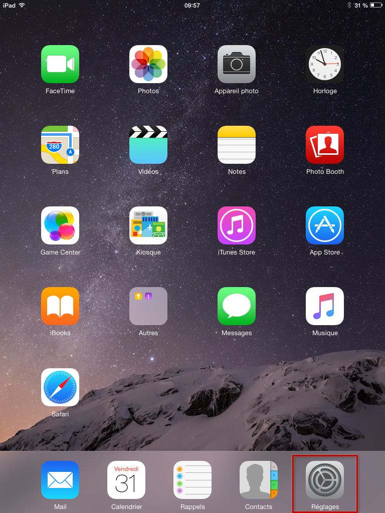 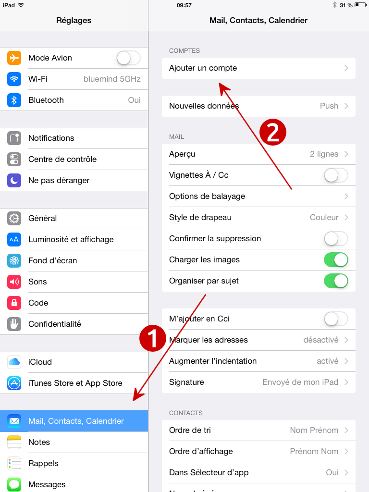

Choisir d'ajouter un compte de type «Exchange» :

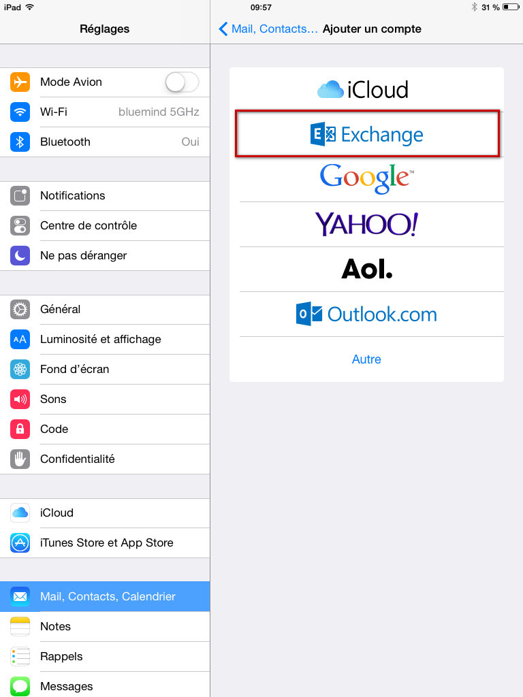

Remplir les informations de l'utilisateur (la description est libre, elle servira à identifier le compte sur l'appareil) puis appuyer sur "Suivant" en haut à droite :

Saisir les informations détaillées de connexion au serveur :

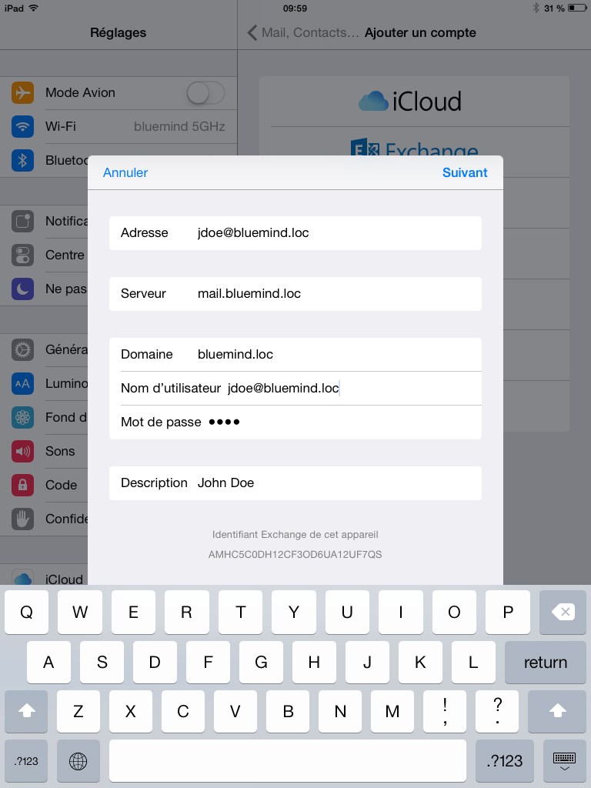

- **Adresse** : votre adresse e-mail
- **Serveur** : l'adresse (l'URL) à laquelle votre téléphone doit accéder au service Active Sync. Il s'agit généralement de ce qui est décrit comme «*external URL*», elle est identique à l'adresse à laquelle vous accéder à BlueMind (en enlevant https://).

- **Domaine** : votre domaine de messagerie, généralement la partie droite de votre adresse e-mail.

- **Nom d'utilisateur et mot de passe** : vos identifiants de messagerie BlueMind, tels qu'ils vous ont été donné par votre administrateur, en général l'identifiant correspond à votre adresse mail **complète**, domaine compris.

- **Description** : facultative, permet d'identifier le compte créé dans la liste des comptes

Puis appuyer sur «Suivant».

Votre appareil iOS tente maintenant de se connecter à votre serveur BlueMind.

Une fois cela effectif, vous pouvez choisir les éléments à synchroniser avant d'appuyer sur « Suivant » ou « Enregistrer »  :

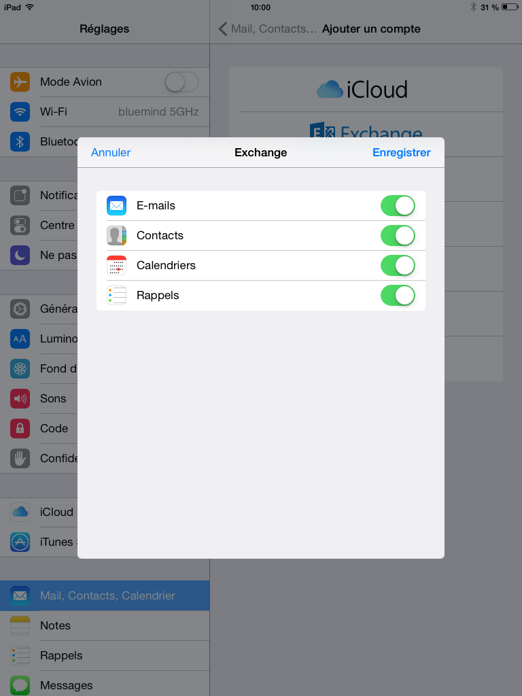

Votre compte apparaît alors dans la liste des comptes de l'appareil :

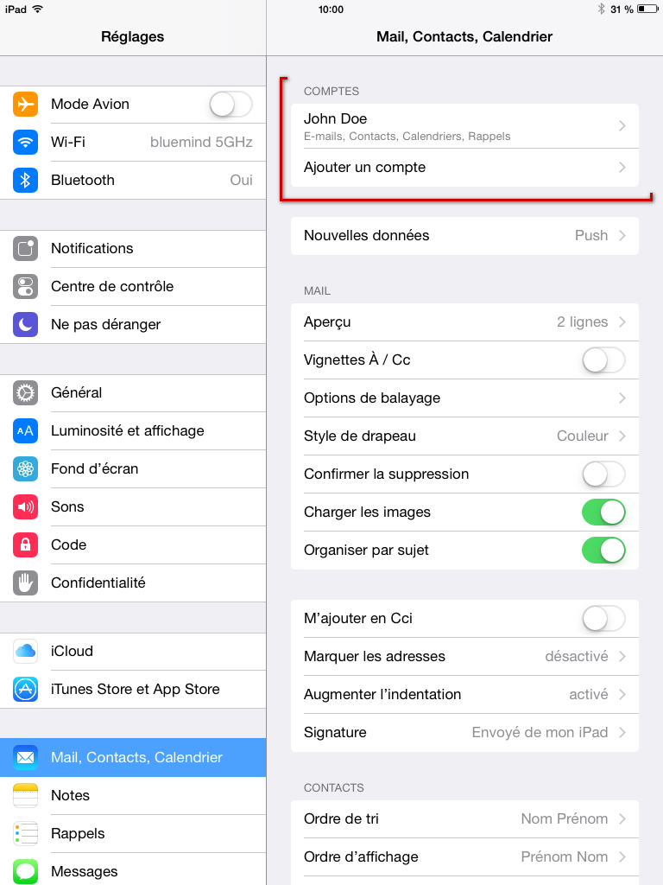

En appuyant sur celui-ci vous pouvez accéder à la modification des réglages de synchronisation (éléments à synchroniser, durée) :

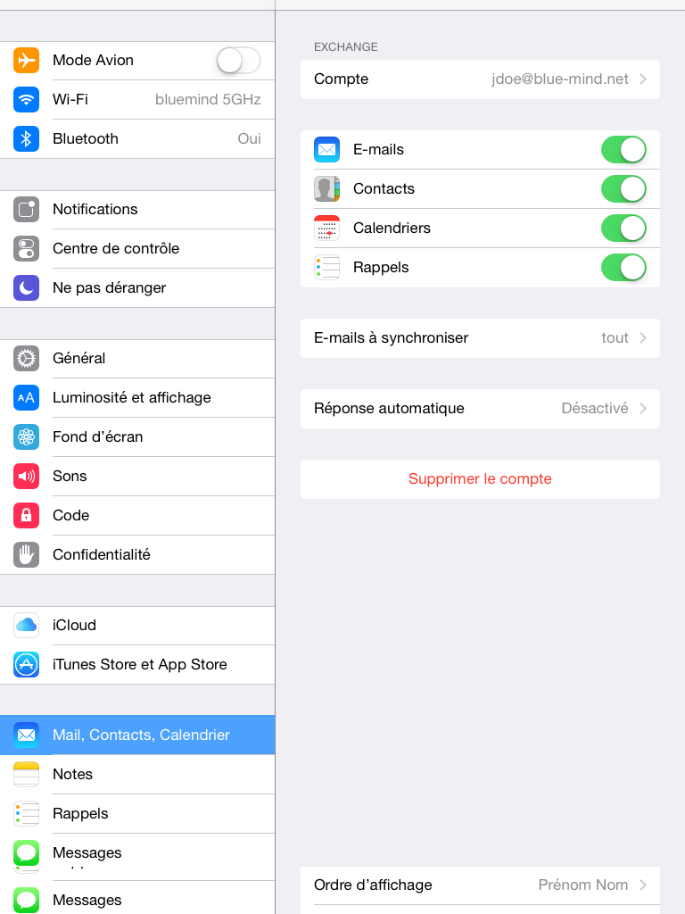

Félicitations ! Votre appareil est maintenant synchronisé avec BlueMind !

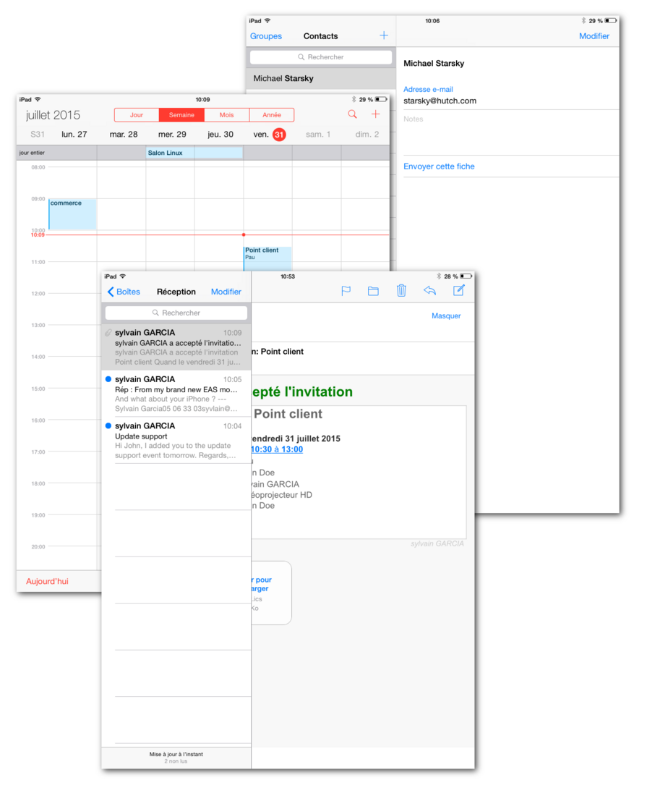

## Forcer le rafraichissement du calendrier

:::info

Cette partie du guide a été réalisée avec un iPad sous iOS 8.4

:::

Dans l'application, faire apparaître la fenêtre des calendriers affichés :

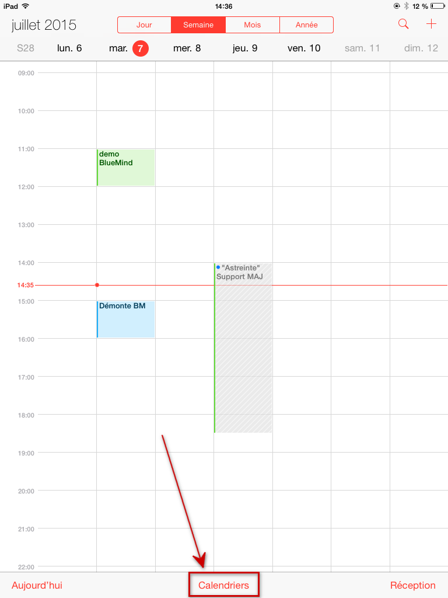

Faire glisser le contenu en le tirant vers le bas :

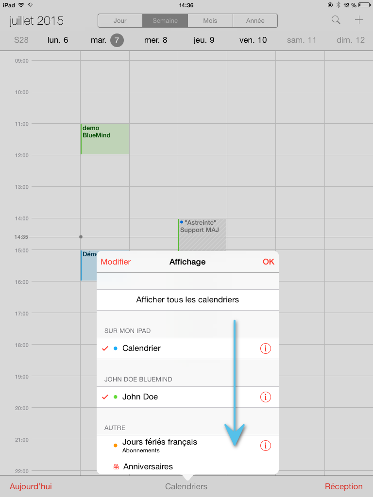

La roue de mise à jour apparaît alors, indiquant que l'appareil est en train d'effectuer la synchronisation des calendriers :

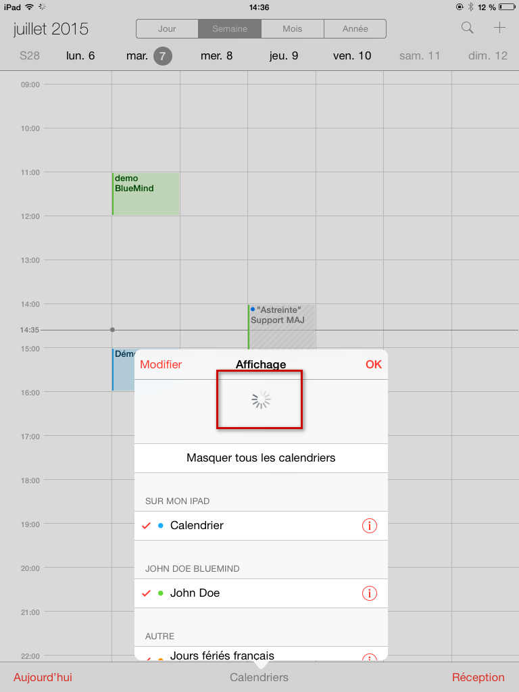

Lorsqu'elle disparait et que le contenu reprend sa place, le rafraichissement est terminé.

