# Les événements

## Création d'un rendez-vous

### Création rapide

- Dans la vue du calendrier, se positionner sur la date et l'heure souhaitées et cliquer pour créer le rdv (ou laisser appuyé et glisser pour dessiner la durée souhaitée) :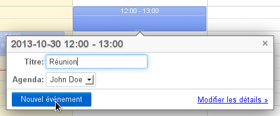

- Pour un rendez-vous sur la journée entière, cliquer sur le jour concerné au dessus des plages horaires :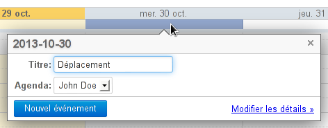 Glisser sur plusieurs jours si le rdv s'étend sur plusieurs jours.
- Renseigner les informations utiles :
    - titre
    - choix de l'agenda : peuvent être sélectionnés les agendas personnels de l'utilisateur ou ceux qui lui ont été partagés avec droit d'écritures.**Seuls apparaissent les agendas actuellement affichés dans la vue courante.**
- Cliquer sur « Nouvel événement »
 Le rdv est créé.

:::info

Disponibilité par défaut

Un événement court, ayant des date et heure de début et de fin, est par défaut en disponibilité "Occupé".

Un événement sur la journée entière est par défaut en disponibilité "Disponible".

:::

Le lien « Modifier les détails » permet de basculer en création complète du RDV.

### Création complète

Cliquer sur le bouton "Nouvel événement" en haut de la barre latérale afin d'accéder à la page de création d'un rendez-vous :

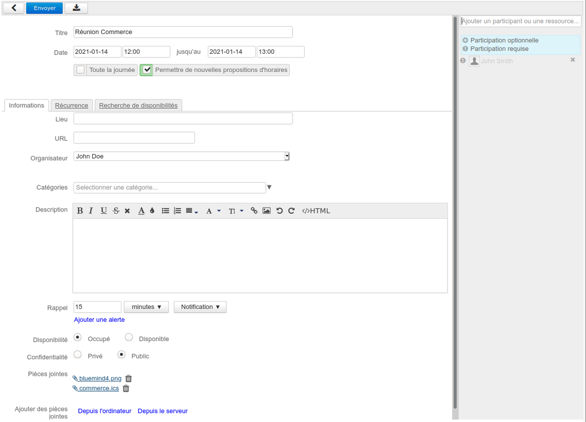

La partie haute de la page permet de saisir les informations principales du rendez-vous :

- **Titre**
- **Dates et heures** de début et fin
- **Toute la journée** : l'événement n'est pas borné par des heures
-  **Permettre de nouvelles propositions d'horaires** : lorsque cette case est cochée, une interface permettant de proposer un nouvel horaire en réponse à l'invitation sera proposée aux participants

La partie droite de la fenêtre permet d'inviter des participants.
En cliquant sur l'icône de début de ligne de chaque participant on peut indiquer si leur participation est optionnelle ou requise :

À noter :

- L'utilisateur peut inviter toutes les personnes connues du domaines lui ayant donné le droit d'invitation (partage "peut m'inviter à un événement", voir paragraphe [Le partage de l'agenda](https://forge.blue-mind.net/confluence/display/DA/L%27agenda#L%27agenda-Lepartaged%27agenda)  ).
- L'utilisateur peut inviter toute personne d'un de ses carnets d'adresses ou toute autre personne extérieure en saisissant simplement son adresse e-mail.
- Il est aussi possible d'associer des ressources à des événements en les ajoutant de la même façon que les utilisateurs, une [demande de réservation](/Guide_de_l_utilisateur/Les_ressources/) est alors envoyée à son gestionnaire
- L'ajout d'un groupe ajoute ses membres individuellement

Les onglets permettent d'accéder aux fonctions supplémentaires : récurrence et recherche de disponibilités.

#### Propriétés d'un rendez-vous

Le premier onglet, "Informations", permet de définir les propriétés principales d'un rendez-vous :

- **Lieu** de l'événement
- **Organisateur** (apparaissent les utilisateurs ayant donnés les droits d'écriture sur leur rendez-vous ET dont l'agenda est affiché dans la vue principale)
- [Les étiquettes (tags)](/Guide_de_l_utilisateur/Les_catégories_tags_/)
- **Description** de l'événement
- **Rappel** : permet de définir une alerte pour être prévenu avant l'événement. Une liste déroulante permet de choisir le type de notification :

    - **Email** : un message est envoyé à l'utilisateur (ancien comportement par défaut)
    - **Notification** : une popup de  [notification du navigateur](/Guide_de_l_utilisateur/Paramètres_utilisateur/#Parametresutilisateur-Parametresutilisateurs-Notifications)   est affichée

:::tip

Il est aussi possible de définir un rappel par défaut pour les événements (un rappel pré-configuré pour tout nouvel événement). Pour plus d'information, voir [Préférences de l'agenda](/Guide_de_l_utilisateur/L_agenda/Préférences_de_l_agenda/)

:::

- **Disponibilité** : permet aux utilisateurs visionnant votre agenda de voir si vous êtes joignable pendant l'événement.
**La disponibilité par défaut pour les événements courts est "Occupé", en revanche la disponibilité par défaut des événements sur journée entière est "Disponible".** 
Lorsqu'un utilisateur se déclare comme disponible, l'événement apparaît alors dans son agenda avec une bordure claire sur le côté gauche :
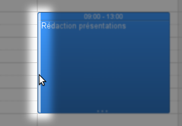

- **Confidentialité** : permet de masquer aux autres utilisateurs le contenu de l'événement, ils verront simplement la plage horaire réservée :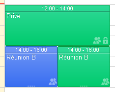
- ** **Pièces jointes** ** : cette partie de la page permet de joindre des fichiers aux événements de calendrier.

:::tip

 Cette fonctionnalité est disponible à partir de la version 4.1. Pour plus d'information, voir le paragraphe dédié [Pièces jointes](#Lesevenements-pjevents)

:::

#### Récurrence

L'onglet "récurrence" permet de définir une fréquence de répétition pour un rendez-vous : quotidienne, hebdomadaire, mensuelle ou annuelle.

- La **période de la récurrence** (ex : toutes les 2 semaines) est à indiquer dans le champs « Tous les** **» en dessous de la récurrence.
- Pour une **récurrence hebdomadaire**, indiquer le ou les jours de répétition.
- Pour une **récurrence mensuelle**, indiquer si l'événement doit se répéter le jour du mois (ex : le 3 de chaque mois) ou le jour de la semaine (ex : le 2ème mardi du mois).

:::tip

Une phrase d'information permettant de visualiser la récurrence est mise à jour au dessus de l'onglet au fur et à mesure du remplissage du formulaire :

:::

Pour **supprimer une occurrence** :

- afficher l'événement concerné
- cliquer sur celui-ci, puis sur « Supprimer »
- sélectionner « Uniquement cet événement » pour conserver toutes les autres occurrences

#### Recherche de disponibilités

L'onglet de recherche de disponibilités permet de rechercher un créneau disponible commun aux participants :

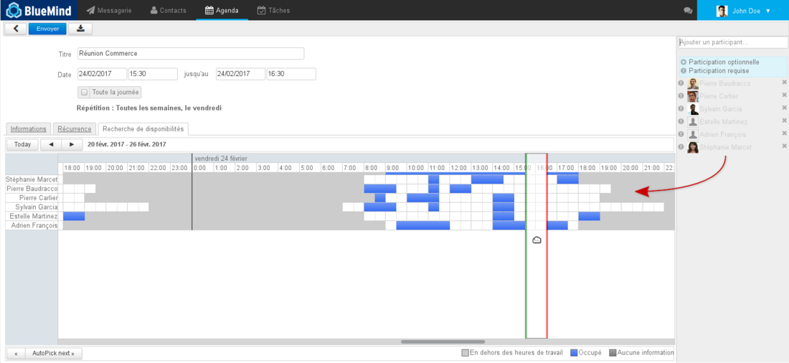

BlueMind propose automatiquement, encadré de vert et rouge, le premier créneau disponible en fonction de la date saisie dans le formulaire.

Il est possible de déplacer le créneau par glisser-déplacer avec la souris, ainsi que de le réduire ou l'agrandir en faisant glisser les lignes verte ou rouge indépendamment.
Lorsque le créneau inclut un rendez-vous d'au moins un utilisateur, un message d'information apparaît en haut de la page :

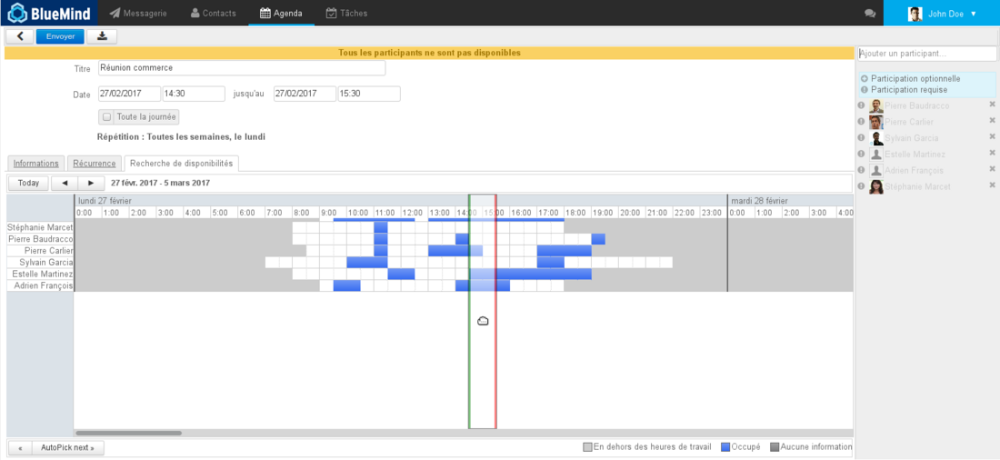

### Pièces jointes

Le service de [détachement des pièces jointes](/Guide_de_l_utilisateur/La_messagerie/Fichiers_volumineux_et_détachement_des_pièces_jointes/) de la messagerie permet à partir de la version 4.1 d'attacher des fichiers aux événements de l'agenda également.

:::info

Disponibilité

Pour pouvoir bénéficier de cette fonctionnalité, les utilisateurs doivent avoir [les rôles](/Guide_de_l_administrateur/Gestion_des_entités/Utilisateurs/Les_rôles_droits_d_accès_et_d_administration/) :

- **Pièces jointes détachées** : permet d'attacher des fichiers
- **Drive** : permet d'utiliser l'espace de stockage de BlueMind

Si vous ne voyez pas la zone indiquée ci-dessous, ou l'un des liens, veuillez vous rapprocher de votre administrateur.

:::

Une fois lié à un événement, le fichier est disponible au téléchargement à tout moment dans les détails de l'événement et il est envoyé dans l'email d'invitation aux participants le cas échéant.

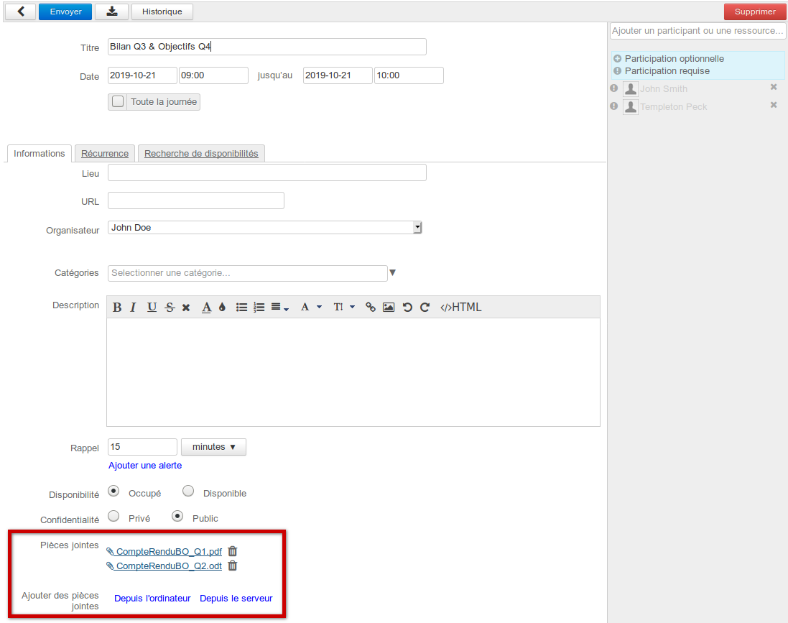

#### Ajouter/Supprimer des fichiers

Pour ajouter un fichier :

- cliquer sur "Depuis l'ordinateur" pour téléverser un nouveau fichier

Si l'utilisateur possède le rôle dédié (« Drive »), un 2ème lien est disponible :

- cliquer sur "Depuis le serveur" pour ouvrir le sélecteur de fichier BlueMind et joindre un fichier déjà disponible dans l'espace de stockage de l'utilisateurLes fichiers peuvent ensuite être retrouvés via le sélecteur de fichier afin d'être joints à d'autres événements d'agenda [ou à des messages](/Guide_de_l_utilisateur/La_messagerie/Fichiers_volumineux_et_détachement_des_pièces_jointes/).

Cliquer sur l'icône poubelle  en face du nom de fichier pour supprimer celui-ci.

#### Transmission des fichiers aux participants

Les fichiers joints à une réunion sont transmis aux participants dans l'email d'invitation :

- sous forme de fichiers joints si la taille totale du message ne dépasse pas la taille autorisée par le serveur :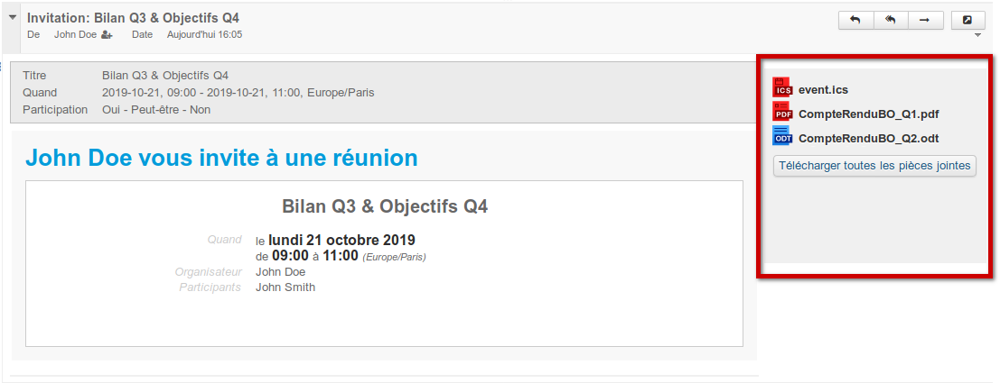
- sous forme de liens de téléchargement si la taille totale du message dépasse la limite autorisée par le serveur :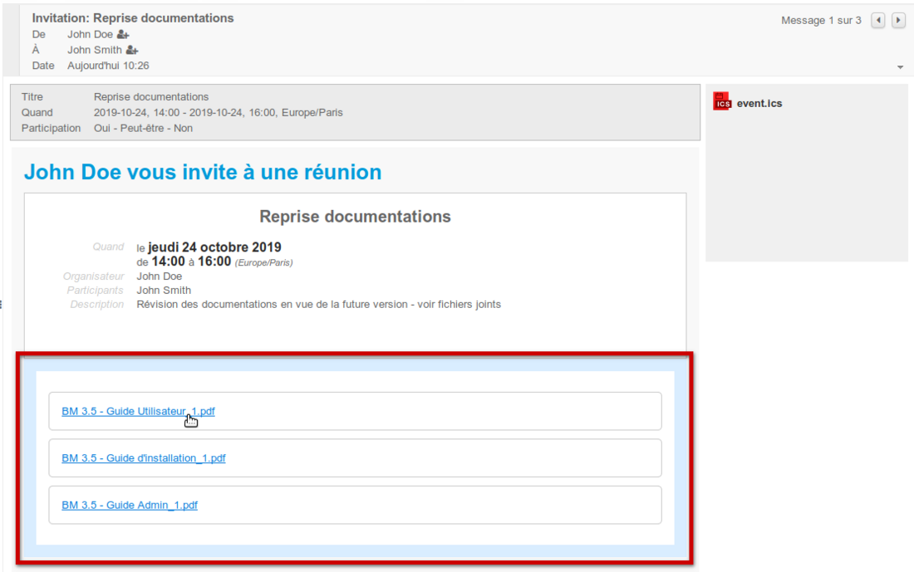

:::info

Le système d'attachement/détachement est entièrement automatique, il ne peut pas être forcé et concerne l'ensemble des pièces jointes même si certaines sont de petite taille.

:::

#### Télécharger un fichier

Lorsqu'un événement comporte une pièce jointe, celle-ci est signalée par un pictogramme dans la vue de l'agenda :

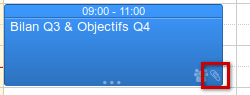

À tout moment les fichiers joints à un événement peuvent être téléchargés en se rendant sur ce même formulaire de consultation/édition complet de l'événement :

:::tip

Pour les participants

Le fonctionnement est le même pour les invités à une réunion : ils retrouvent dans leur agenda les fichiers avec les liens de téléchargement.

Ils peuvent eux-mêmes rajouter des fichiers mais, comme pour le reste des modifications qu'ils effectuent, ceux-ci ne seront pas partagés avec l'organisateur ni les autres invités.

:::

## Modification d'un événement

Pour modifier un événement :

- dans la vue de l'agenda, cliquer sur le rendez-vous
    - modifier le titre et cliquer sur enregistrer
    - ou cliquer sur le lien "Modifier les détails" : l'interface est alors le formulaire complet, identique à celui de la création (voir ci-dessus)
- une fois les modifications terminées, cliquer sur le bouton "Enregistrer" (ou "Envoyer" s'il y a des invités) en haut à gauche de la page pour qu'elles soient prises en compte

:::tip

Modification et Notification
Les ajouts/suppressions/modifications des tags et des rappels sont considérés comme des changements privés qui ne sont pas envoyés aux participants. Toute autre modification génère un envoi des informations mises à jour aux participants s'il y a lieu.
:::

En cas de modification d'un événement récurrent, par un déplacement dans la vue d'agenda ou en accédant au formulaire complet, l'interface propose le choix du type de modification à effectuer :

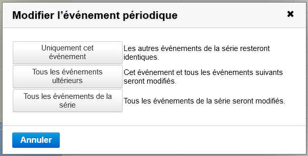

- **Uniquement cet événement** : seul l'événement sur lequel l'utilisateur a cliqué sera modifié, il deviendra une exception de la série qui reste inchangée
- **Tous les événements ultérieurs** : l'événement sur lequel l'utilisateur a cliqué ainsi que toute la suite de la série seront modifiés. Tous les événements antérieurs de la série restent inchangés.
- **Tous les événements de la série** : l'ensemble de la série sera modifié

## Duplication d'un événement

 A partir de BlueMind 4.3, il est possible de dupliquer un événement ou une réunion afin d'en créer une copie qui pourra être modifiée ou déléguée à un autre organisateur indépendamment de l'événement d'origine.

### Cas général

Pour dupliquer un événement :

- cliquer sur l'événement dans la vue d'agenda
- dérouler le menu en bas à droite et choisir l'option "Dupliquer" :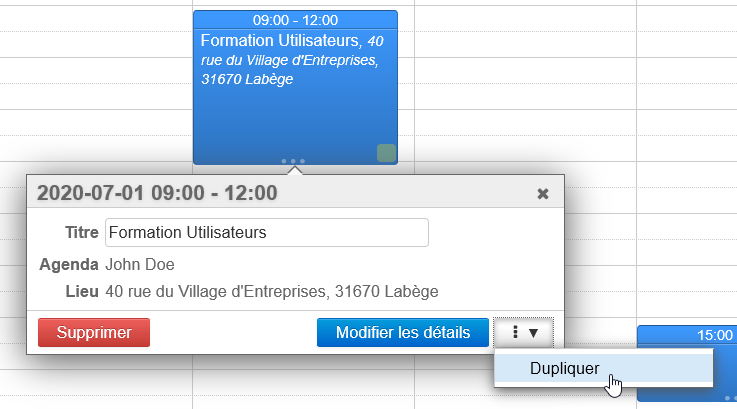
- Le formulaire de création d'événement est proposé avec les informations de l'événement d'origine (jour, horaires, description, organisateur, participants, etc.)
- Effectuer les modifications souhaitées :
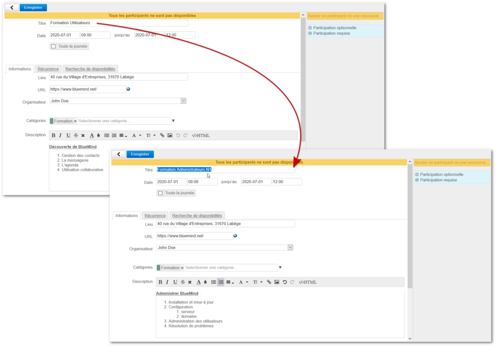

:::info

Toutes les modifications apportées sont similaires aux modifications effectuées sur un événement déjà existant (voir paragraphe précédent).

Ainsi dans le cas de calendriers partagés, seuls apparaissent dans la liste déroulante des organisateurs les utilisateurs ayant donné [le droit d'écriture](/Guide_de_l_utilisateur/L_agenda/Le_partage_d_agenda/) sur leur agenda et dont l'agenda est actuellement affiché dans la vue principale.
Pour plus d'informations à ce sujet, voir ci-dessous la section *Agenda partagé*.

:::

- **Cliquer sur Enregistrer pour valider la création du nouvel événement :** * 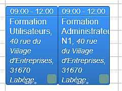 *  Ici l'événement "Formation Utilisateurs" a été dupliqué et renommé en "Formation Administrateur", la description a aussi été adaptée : on a ainsi créé un nouvel événement avec les mêmes informations de durée et de lieu mais une description adaptée, il suffira ensuite de le déplacer à l'horaire adéquat.

### Événement récurrent

Dans le cas d'un événement récurrent, le menu déroulant de duplication propose 2 options :

- **Dupliquer** : duplique toute la série avec sa récurrence

:::info

La nouvelle série est créée avec les horaires de la 1ère occurrence et sa récurrence, ainsi elle est régulière et ne comporte pas les exceptions que pouvait contenir la série d'origine.

:::

- **Dupliquer cette occurrence** : crée un événement unique (i.e. non récurrent) aux horaires de l'occurrence désignée

### Réunions (événements avec invités)

Lors de la duplication d'une réunion, la nouvelle réunion est créée à l'identique avec ses participants.

La nouvelle réunion étant considérée comme une nouvelle réunion indépendante :

- Les participants reçoivent une nouvelle invitation **lors de l'enregistrement du formulaire**
- Les statuts de participation de la réunion d'origine ne sont pas conservés : tous les participants sont placés en statut "en attente de réponse"
- Toute modification sur l'une des réunions (originale ou duplicata) ne sera pas répercutée sur l'autre

:::info

Des modifications d'organisateur ou de participants peuvent être visible en fonction du droit de partage du calendrier dans lequel on duplique l'événement, voir la section suivante pour des détails.

:::

### Agenda partagé

Si l'événement à dupliquer se trouve sur l'agenda d'un autre utilisateur, plusieurs cas de figure se présentent :

- **l'utilisateur a donné le droit d'écriture** sur son agenda : il est alors désigné organisateur de l'événement dupliqué, qu'il soit lui-même déjà organisateur ou simplement participant
- **l'utilisateur n'a pas donné le droit d'écriture** sur son agenda : la duplication se fait vers l'agenda de la personne effectuant les manipulations, c'est elle qui est automatiquement désignée organisatrice.

:::tip

Dans ce cas, si l'utilisateur était organisateur, il devient participant à la réunion et y sera invité.

:::

**Exemples**

2 utilisateurs effectuent des manipulation :

- Nathalie : responsable de service, elle partage son calendrier en lecture uniquement (droit "peut m'inviter et voir mes rendez-vous")
- Jean-Claude : formateur, il a donné le droit de modification sur son calendrier à Nathalie (droit "peut modifier mes rendez-vous")

##### 1er cas : Nathalie souhaite créer à Jean-Claude une nouvelle formation, sur la base d'une existante

Nathalie affiche le calendrier de Jean-Claude et clique sur son événement "Formation utilisateur" puis sur "Dupliquer" :

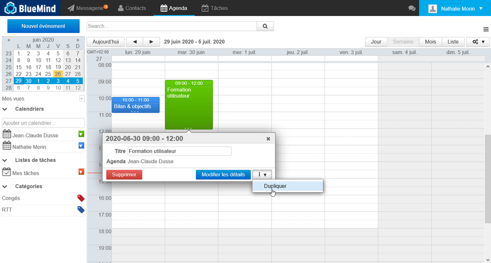

Nathalie ayant le droit d'écriture, l'organisateur est conservé, l'événement cible sera toujours sur l'agenda de Jean-Claude. Nathalie modifie l'événement afin de le transformer en "Formation administrateur" le lendemain :

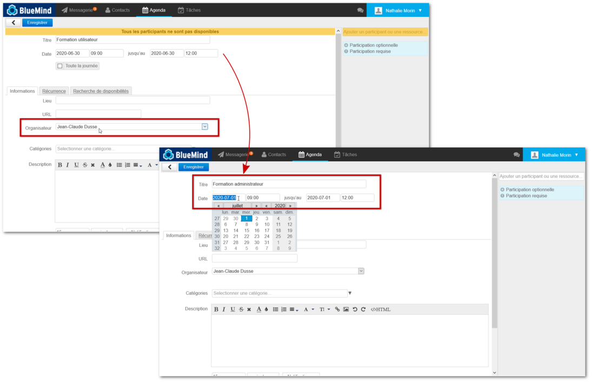

Une fois enregistré, le nouvel événement apparait sur l'agenda de Jean-Claude :

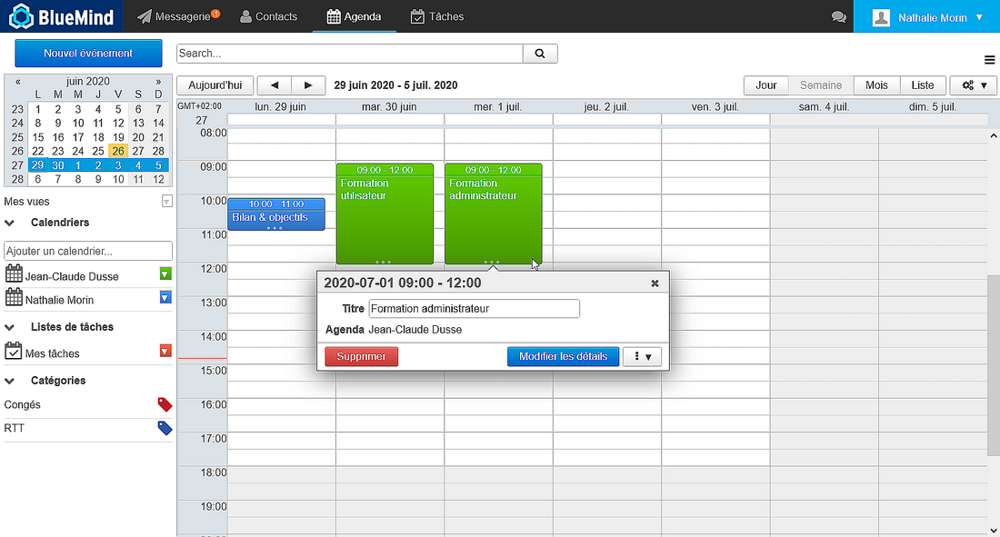

##### 2ème cas : Jean-Claude souhaite copier une réunion organisée par Nathalie afin de l'organiser lui-même la semaine suivante

Bien que n'ayant pas le droit de modifier le calendrier de Nathalie, Jean-Claude a tout de même la possibilité de dupliquer ses événements :

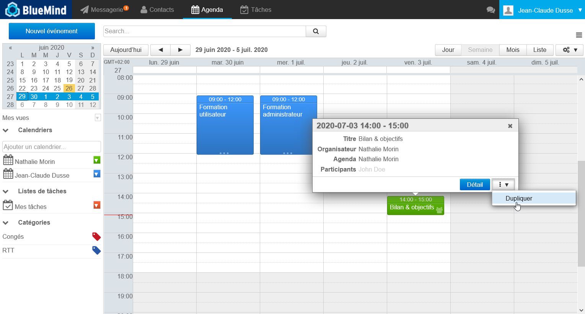

L'événement est alors copié sur son agenda à lui (=il est désigné organisateur) et Nathalie est invitée à la réunion :

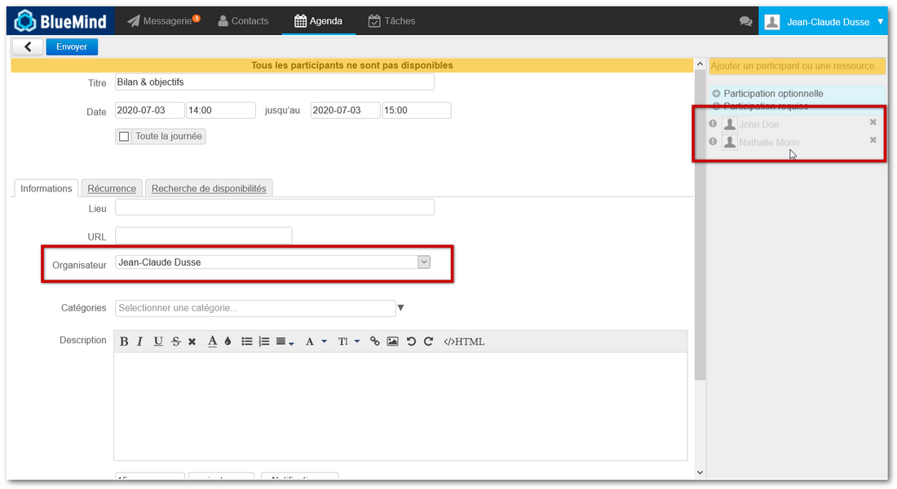

Jean-Claude modifie la date pour prendre en charge l'organisation de la même réunion la semaine suivante :

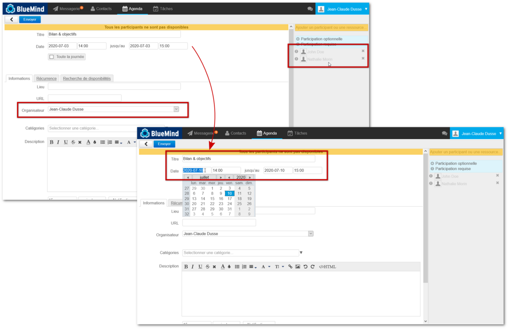

Après enregistrement, la réunion apparait dans leurs agendas telle que paramétrée :

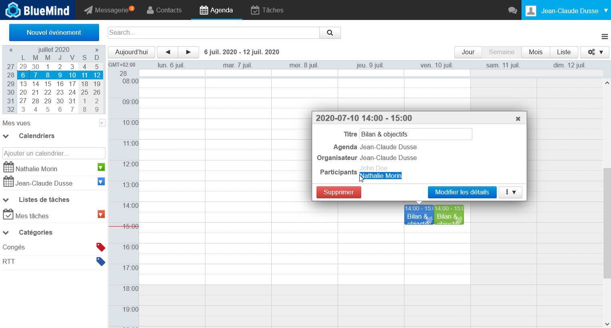

La réunion d'origine n'a pas changé :

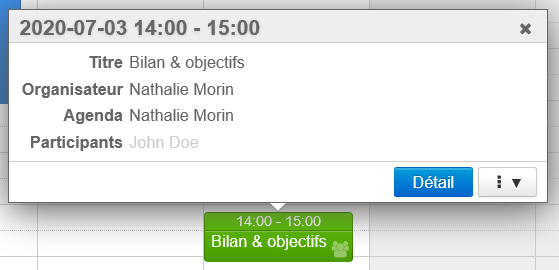

## Suppression d'un événement

Pour supprimer un événement :

- cliquer sur celui-ci dans la fenêtre principale
- dans la popup qui s'affiche, cliquer sur le bouton "Supprimer"
    - si l'utilisateur est l'organisateur et qu'il a invité plusieurs participants, l'événement est supprimé chez tous les participants et ceux-ci reçoivent un mail d'information
    - si l'utilisateur est un simple participant à un événement, seule sa participation est annulée, l'événement est toujours présent chez les autres participants.L'organisateur ne reçoit pas de mail d'information mais l'utilisateur est marqué comme non participant dans la liste des invités à l'événement.
- en cas de suppression d'un rendez-vous récurrent, choisir de supprimer :
    - seulement cette occurrence
    - toutes les occurrences passées et à venir
    - seulement les occurrences futures

:::info

ATTENTION
  En cas de suppression d'un événement par un participant, celui-ci n’apparaît plus dans l'agenda, il n'est donc plus possible par la suite de modifier sa participation.
:::

## Participation à un événement

### Affichage

Dans l'agenda, un rendez-vous apparaît différemment selon la participation de l'utilisateur :

- Rendez-vous accepté : couleur pleine
- Rendez-vous en attente de réponse : transparence
- Participation positionnée volontairement à "peut-être" : couleur pleine entourée de pointillés
- Rendez-vous refusé : transparence, contenu barré

:::tip

L'utilisateur peut choisir d'afficher ou non les événements refusés, pour cela il doit se rendre dans la gestion de ses paramètres > Agenda > onglet Général : "Afficher les événements refusés".

Cette option n'est pas activée par défaut mais peut s'avérer utile dans le cas où l'on souhaiterait modifier sa participation à un événement refusé auparavant.

:::

Affichage des événements selon la participation de l'utilisateur

### Indiquer sa participation

Pour confirmer ou refuser un événement :

- cliquer sur celui-ci dans la fenêtre principale
- dans la popup qui s'affiche, cliquer sur le bouton de son choix
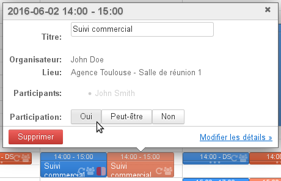 
 Un message est envoyé à l'organisateur de la réunion pour lui indiquer le choix de l'utilisateur.
 Le statut est mis à jour dans la vue d'agenda de l'organisateur.

:::info

Changement de comportement à partir de BlueMind 4.2

Dans les versions antérieures à 3.5.15 il est possible de modifier sa participation sans en informer l'organisateur : ce choix n'est pas recommandé car dans ce cas l'organisateur ne voit pas le statut du participant dans son agenda.

:::

Pour plus d'informations sur la visualisation des participations à une réunion, veuillez consulter la page   [L'agenda - §3 Modèle de gestion des réunions](/Guide_de_l_utilisateur/L_agenda/#L'agenda-Modèledegestiondesréunions)

### Proposer un nouvel horaire

 La version 4.4 apporte la possibilité pour les participants de proposer un nouvel horaire pour une réunion.

:::info

Cette fonctionnalité est compatible avec Outlook (sans connecteur) ainsi que tous les gestionnaires d'agenda permettant cette même fonction.

Le fonctionnement est identique avec BlueMind dans Thunderbird.

:::

Lorsque l'organisateur a accordé aux invités le droit de le faire (voir ci-dessus **§1.2 Création complète**), ceux-ci ont alors dans la popup de l'événement de l'agenda un menu dédié :

En cliquant dessus, l'utilisateur accède au formulaire complet de recherche et proposition :

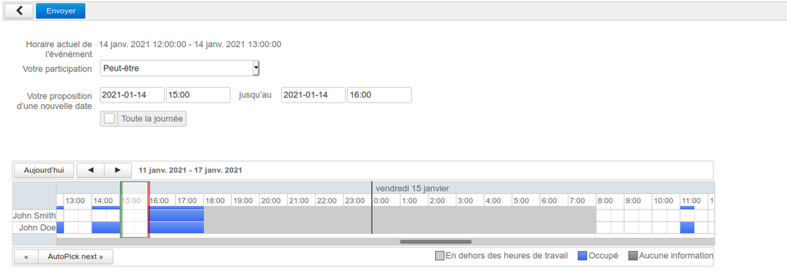

L'utilisateur peut alors indiquer :

- **Sa participation** :
    - Non : ne participera pas à la réunion à l'horaire actuel
    - Peut-être : participera peut-être quand même à la réunion à l'horaire actuel
- **La nouvelle date** et/ou le nouvel horaire souhaitéPour cela, l'utilisateur dispose de la même interface de recherche de disponibilité que lors de la création d'un nouvel événement (voir [§1.2.c](#Lesevenements-rechdispo) ci-dessus)

Une fois le formulaire rempli, cliquer sur « **Envoyer** » en haut de page pour envoyer la proposition à l'organisateur.

 Dans la popup de l'événement, tant chez l'organisateur que chez le participant, la proposition du participant est indiquée en orange entre parenthèses à côté de son nom :

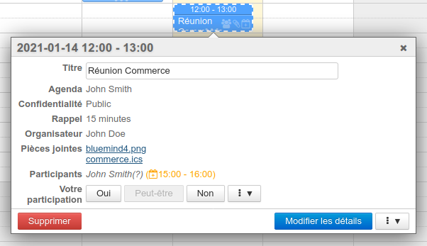

L'organisateur reçoit un message de ce type :

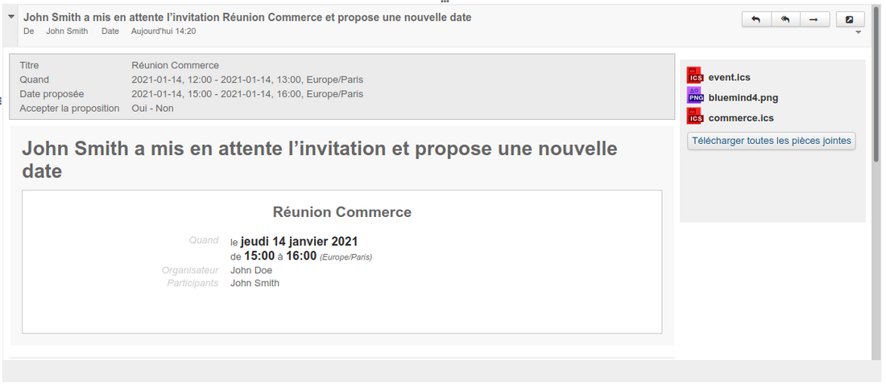

Le bloc d'en-tête du message résume les informations et propose des liens permettant d'accepter ou refuser directement le nouvel horaire.

- **Si l'organisateur accepte la proposition** :
    - la réunion est modifiée
    - tous les participants reçoivent un email de modification de l'événement.
- **Si l'organisateur refuse la proposition** :
    - la réunion est inchangée
    - le participant ayant fait une proposition reçoit un message indiquant le refus de l'organisateur
    - la proposition disparait de la popup des agendas où elle apparaissait
    - les autres participants ne reçoivent rien

:::info

Modification de réponse

Une demande ne peut être traitée qu'une seule fois, l'organisateur ne peut pas revenir se sa décision. Une fois qu'il a répondu, le bloc n'est plus proposé mais une information apparait, indiquant que la proposition a été traitée :

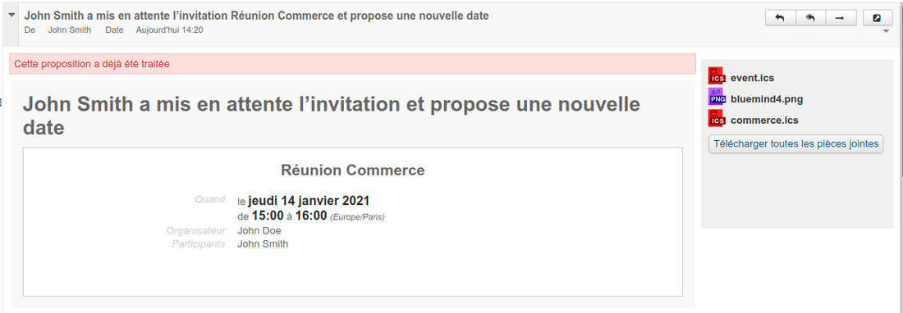

:::

:::tip

Cas des réunions récurrentes

La proposition d'un nouvel horaire n'est possible que pour l'ensemble de la série de réunion, un invité ne peut pas proposer de nouvel horaire pour une occurrence seulement.

:::

## Historique d'un événement

Il est désormais possible de visualiser l'historique de création et modifications d'un événements.

Depuis la vue détaillée d'un événement, cliquer sur le bouton « History » :

L'historique renseigne sur :

- la date de l'action
- le type d'action : création ("created") ou modification ("updated")
- l'utilisateur ayant effectuée l'action ("author")
- l'origine : client BlueMind, client tiers (lourd ou mobile), etc.

