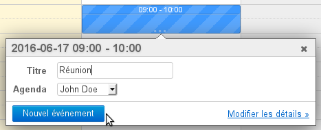
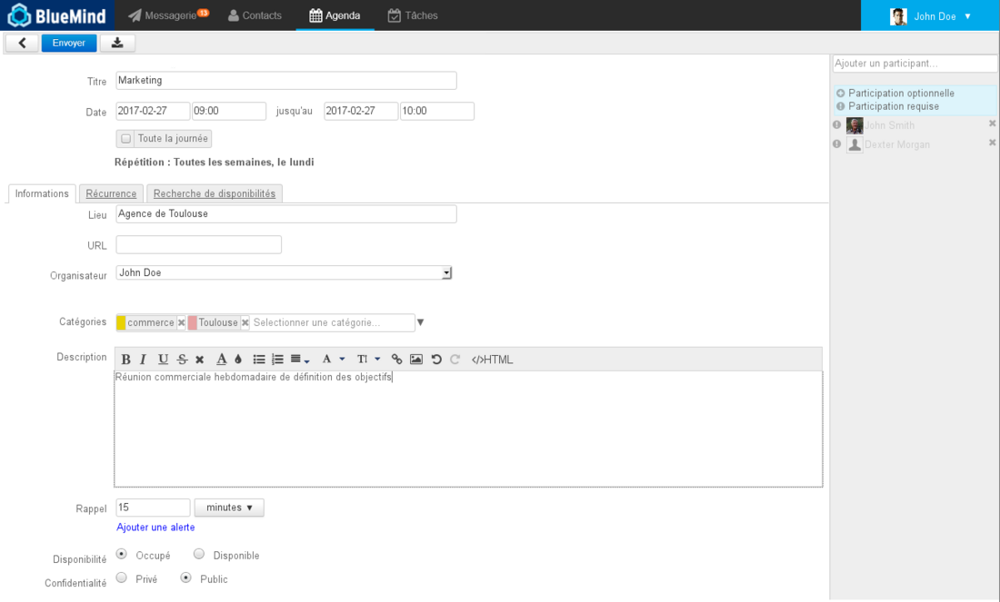
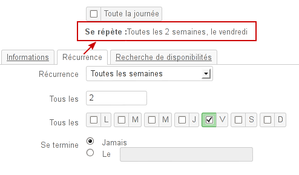
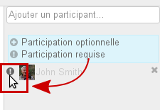
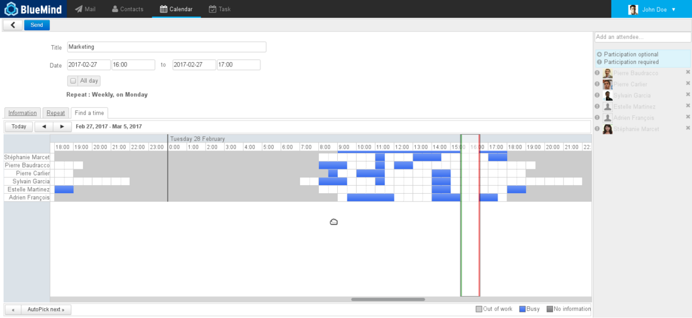
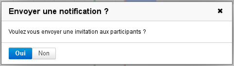
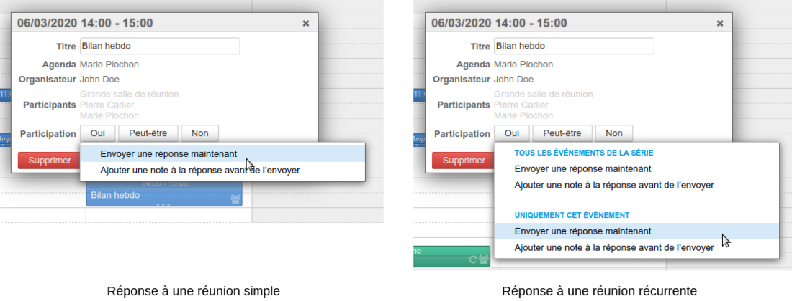
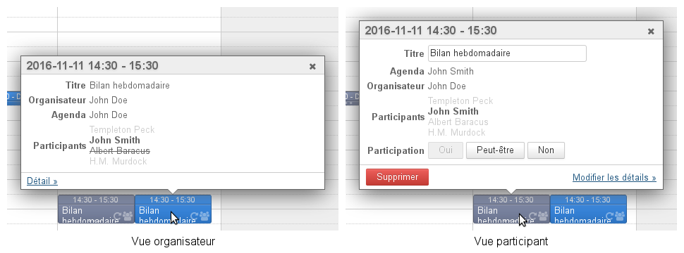

# Organiser une réunion

## Création de la réunion

### Créer l'événement

Commencez par créer l'événement dans l'agenda, soit en création complète en cliquant sur "Nouvel événement" soit en création rapide en pré-définissant l'horaire auquel vous souhaitez organiser votre réunion puis en accédant à la création complète grâce au lien "Modifier les détails" :

Dans l'écran de création du rendez-vous, renseigner les informations souhaitées : lieu, étiquettes, description, etc.

### Définir une récurrence

Si vous souhaitez organiser une réunion régulière, rendez-vous dans l'onglet "Récurrence" afin de définir la fréquence de la réunion :

:::tip

La récurrence de la réunion peut être renseignée avant ou après l'ajout des participants et la recherche de créneau, de même qu'elle pourra être ajoutée plus tard en éditant l'événement.

:::

### Inviter les participants

Dans la partie droite de la page, ajoutez les utilisateurs ou groupes que vous souhaitez inviter.

Vous pouvez leur indiquer si leur présence est requise (choix par défaut) ou optionnelle en cliquant sur l'icône devant leur nom après les avoir ajoutés :

### Réserver des ressources

Pour réserver une ressource, il suffit de l'inviter à la réunion de la même façon qu'un participant.

:::tip

Pour en savoir plus sur le processus de réservation des ressources, consultez la page [Les ressources](/Guide_de_l_utilisateur/Les_ressources/)

:::

### Rechercher un créneau disponible

Si un ou plusieurs participants ne sont pas disponible pour le créneau prédéfini, ou si vous souhaitez en chercher un autre, vous pouvez utiliser l'outil de recherche de disponibilités via l'onglet idoine :

Celui-ci vous permet de visualiser les créneaux occupés et disponibles des participants et ressources invités.

- Faire glisser le bandeau de droite à gauche pour déplacer le créneau
- Cliquer et glisser les barres verte et rouge pour allonger ou raccourcir la durée
- Utiliser les boutons de navigation en haut à gauche de l'onglet pour changer de période et l’ascenseur horizontal en bas de l'onglet pour naviguer dans la période

### Envoyer l'invitation

Une fois la réunion paramétrée, il faut envoyer l'invitation à chacun des participants.

**À partir de la version 4.2**, l'interface de BlueMind a été revue et clarifiée, l'organisateur qui crée une réunion a les choix suivants :

- ****Envoyer****

    - envoie un email d'invitation aux participants

    - envoie une demande de réservation aux ressources
    - ajoute la réunion à l'agenda des invités

- ****Enregistrer ce brouillon****

    - l'événement est enregistré dans l'agenda de l'organisateur

    - les invités ne reçoivent pas d'email

    - les ressources ne sont pas réservées
    - la réunion n'apparaît pas dans l'agenda des invités et ressources

- ****Annuler (flèche retour arrière)****

    - aucune action n'est effectuée

Lors de la modification d'une réunion, là aussi dans une volonté de limiter les erreurs et décalages possibles, l'enregistrement en tant que brouillon n'est plus possible. L'organisateur qui modifie une réunion a les choix suivants :

- ****Envoyer****
    - les participants (utilisateurs, externes et ressources) reçoivent un email d'information
    - la réunion est mise à jour dans leur agenda
- ****Annuler (flèche retour arrière)****

    - aucune action n'est effectuée

Lorsque la seule modification apportée à une réunion est l’ajout et/ou la suppression d’un ou plusieurs participants, une popup propose 2 possibilités :

- ****Envoyer à tous**** : cette option permet que tous les participants aient la liste des invités à jour dans leur agenda, comprenant leur statut de participation (tel que connu de l'organisateur au moment de l'envoi)
- ****Envoyer aux participants modifiés**** : seuls les participants ajoutés ou supprimés sont prévenus.
Ce choix permet de limiter l’envoi de messages lorsqu'il n'est pas nécessaire que chacun connaisse la liste complète et le statut des participants.

:::tip

Dans l'agenda de chaque utilisateur ou ressource, un rendez-vous apparaît en couleur pleine si la participation de l'utilisateur est confirmée, en transparence si elle est en attente (ou que l'utilisateur a répondu "peut-être") et en transparence hachurée si l'utilisateur a refusé l'événement :

:::

:::info

Versions antérieures à 4.2

Pour les versions précédentes de BlueMind, cliquer sur «Enregistrer» en haut de page. La boite de dialogue suivante apparaît alors :

- Cliquer sur **« Oui »** génère l'envoi d'un message (email) à chaque participant et gestionnaire de ressource, l'événement est ajouté dans leur agenda en attente de la validation (ou refus) de leur participation
- ** En cliquant sur « Non » l'invitation n'est pas transmise par email et n'est pas non plus ajoutée à l'agenda des participants **, permettant de finaliser l'événement à la manière d'un brouillon en y apportant des modifications avant de lancer les invitations.

:::

## Gérer les participations

### Réponses à une réunion

Lorsqu'un participant valide, refuse, met en attente (réponse «peut-être») l'organisateur de la réunion en est informé par email.

Afin d'éliminer le risque de confusion ou de décalage entre les agendas des organisateurs et participants, à partir de BlueMind 4.2 **il n'est plus possible de modifier sa participation sans en informer l'organisateur**.

Le participant peut tout de même toujours envoyer une réponse simple ou ajouter une note à celle-ci. Dans le cas d'une réunion récurrente, il conserve aussi la possibilité de répondre pour l'ensemble de la série ou une occurrence seulement :

:::info

Versions antérieures à 4.2

Si un participant modifie sa participation par la suite, le choix lui est laissé de notifier l'organisateur. S'il choisit de ne pas notifier l'organisateur alors c'est sa version seulement de l'événement qui est modifiée, **l'organisateur n'est pas tenu au courant et ne voit pas le changement dans sa vision de la réunion**.

:::

### Consulter le statut de participation

Un participant autre que l'organisateur ne voit pas dans sa version de la réunion les statuts des autres participants. Pour les voir, il doit consulter la version de la réunion de l'organisateur, s'il a les droits de lecture sur l'agenda de celui-ci :

- les utilisateurs ayant **confirmé** leur participation apparaissent en noir
- les utilisateurs **en attente** (ou ayant répondu "peut-être") sont grisés
- les utilisateurs ayant **refusé** l'événement apparaissent grisés et barrés

:::info

- Les participants ne voient plus le détail des participations des autres participants, seul l'organisateur est tenu au courant.
- Les participants ont la possibilité d'indiquer une **participation différente suivant les occurrences** d'une réunion récurrente. Ainsi **ils peuvent accepter toute la série d'une réunion et, au besoin, indiquer qu'il ne participeront pas à l'une ou l'autre de ses occurrences**.
- Chaque participant possède sa propre vue d'une réunion, ce qui lui permet de la modifier (personnalisation du titre, ajout d'une description, détail du lieu, etc.) sans que les modifications soient visibles des autres participants.****ATTENTION** **: ce sont les informations de l'organisateur qui prévalent, lorsque celui-ci envoie des modifications, les personnalisations des participants sont susceptibles d'être perdues.

:::

### Inviter/retirer des participants

Pour inviter de nouveaux participants ou exclure des personnes déjà invitées, il suffit d'éditer l'événement :

- dans l'agenda, cliquer sur l'événement pour faire apparaître la fenêtre d'information
- cliquer sur le lien "Modifier les détails"
- ajouter et retirer des participants dans la partie droite de la fenêtre
- cliquer sur « Envoyer » pour valider les modifications et envoyer les nouvelles invitations.

Lorsque la seule modification apportée à une réunion est l’ajout et/ou la suppression d’un ou plusieurs participants, une popup propose 2 possibilités :

- ****Envoyer à tous**** : cette option permet que tous les participants aient la liste des invités à jour dans leur agenda, comprenant leur statut de participation (tel que connu de l'organisateur au moment de l'envoi)
- ****Envoyer aux participants modifiés**** : seuls les participants ajoutés ou supprimés sont prévenus.
Ce choix permet de limiter l’envoi de messages lorsqu'il n'est pas nécessaire que chacun connaisse la liste complète et le statut des participants.

Enregistrer

Enregistrer

Enregistrer

Enregistrer

Enregistrer

