# Fichiers volumineux et détachement des pièces jointes

## Présentation

BlueMind offre la possibilité de détacher les pièces jointes des messages afin de les présenter sous forme de lien de téléchargement aux destinataires. Ceci permet d'alléger le message envoyé, et de ce fait les serveurs et réseaux de communication : le fichier n'est plus transmis avec le mail et stocké sur le serveur qui le reçoit, en plus du serveur émetteur, en étant éventuellement dupliqué et multiplié au grès des transferts et réponses.

Ceci permet, en outre, d'envoyer des fichiers volumineux que la limite autorisée en pièce jointe d'un message ne permet pas.

:::info

Cette fonctionnalité n'est pas installée par défaut avec BlueMind. Pour qu'elle soit accessible aux utilisateurs, l'administrateur doit procéder à son installation.

Pour en savoir plus, consultez la page dédiée [Détachement des pièces jointes](/Guide_de_l_administrateur/Configuration/Détachement_des_pièces_jointes/)

:::

## Ajout des pièces jointes depuis le webmail

Une pièce jointe peut être ajoutée à un message soit en cliquant sur le bouton "Joindre un fichier" soit en effectuant un glisser-déposer dans la zone droite du [composeur](/Guide_de_l_utilisateur/La_messagerie/Le_composeur/) :

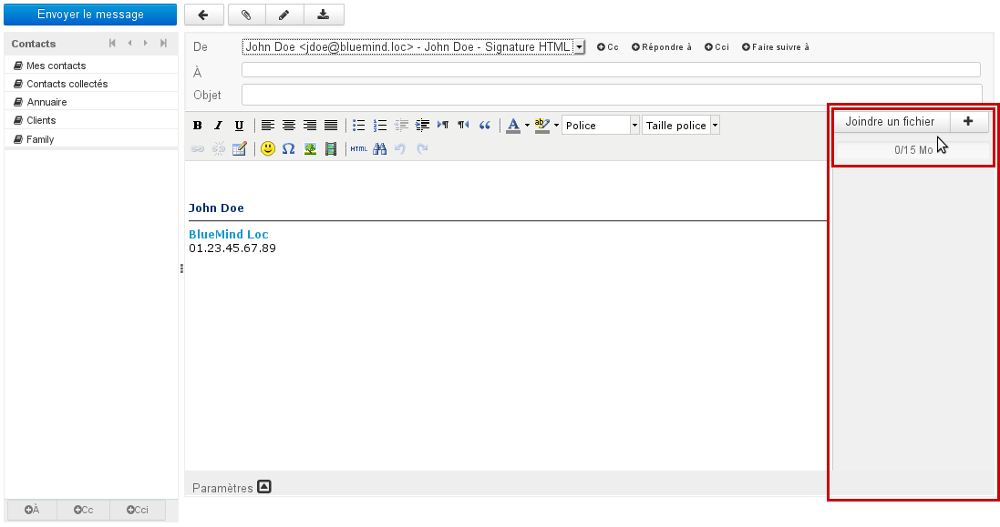

:::tip

Nouveauté

Une jauge en haut de la liste informe de la taille totale des fichiers attachés par rapport au maximum autorisé :

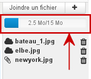

:::

### Ajout par glisser-déposer

Depuis un navigateur de fichiers, effectuer un glisser-déposer d'une ou plusieurs pièces jointes vers la zone droite du composeur.

Les fichiers sont alors joints au message soit en tant que pièce jointe intégrée soit en tant que lien de téléchargement, selon le seuil de détachement automatique paramétré par l'administrateur :

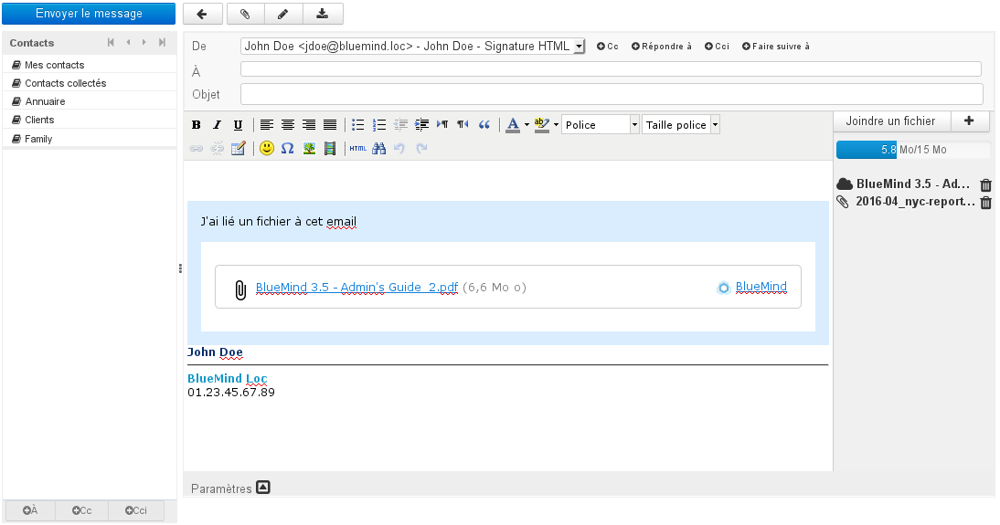

Le pictogramme devant chaque pièce jointe indique si elle est intégrée ou liée :

- **  ** Pièce jointe détachée (celles-ci sont aussi listées dans l'encart bleu dans le corps du message)
-  Pièce jointe intégrée

L'icône 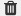 en fin de ligne permet de supprimer une pièce jointe.

### Ajout grâce au bouton «Joindre un fichier»

En cliquant sur les boutons « Joindre un fichier » et  la boite de dialogue d'attachement des pièces jointes apparaît, permettant d'attacher des fichiers depuis l'ordinateur ou depuis le serveur :

- **Depuis votre ordinateur** ouvre le navigateur de fichiers par défaut du système
- **Depuis le serveur BlueMind** ouvre le sélecteur de fichiers de BlueMind :
 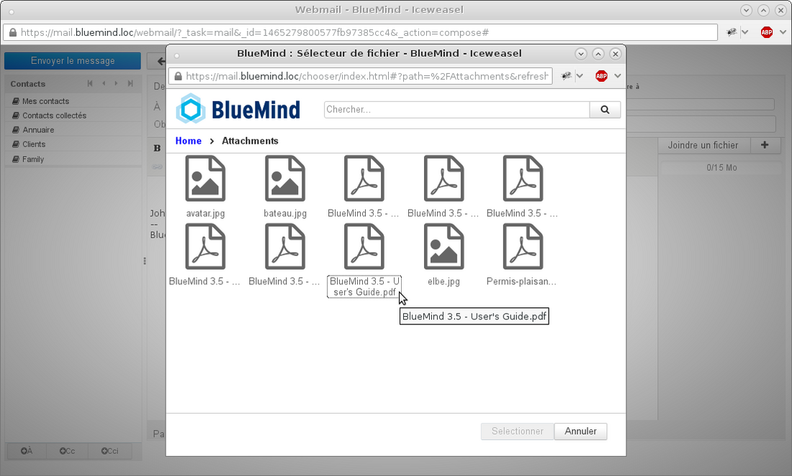 
Ce sélecteur permet de retrouver les fichiers précédemment attachés à des messages et ainsi stockés sur le serveur BlueMind dans un espace propre à l'utilisateur.

:::tip

Pour sélectionner plusieurs fichiers, cliquez dessus en maintenant la touche Ctrl/Command de votre clavier appuyée

:::

Une fois le ou les fichiers sélectionnés, ils sont automatiquement intégrés au message. Un bouton permet de déclencher manuellement le détachement de chacun d'eux :

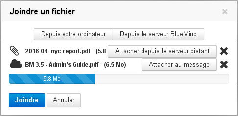

- Lorsqu'un fichier a été détaché, un bouton « Attacher au message » permet de le réintégrer
- La croix  en fin de ligne permet de supprimer une pièce jointe, attachée ou liée
- Les boutons « Depuis votre ordinateur » et « Depuis le serveur BlueMind » permettent de rajouter de nouvelles pièces jointes.

:::info

Lorsque la limite autorisée est bientôt atteinte, la barre de progression est alors orange, lorsqu'elle est dépassée elle devient rouge

:::

Une fois les fichiers choisis, cliquer sur le bouton « Joindre » pour valider. Les fichiers à détacher sont alors envoyés sur le serveur et l'encart de téléchargement est ajouté au message s'il y a lieu. Les pièces jointes sont visibles dans la partie droite du composeur :

## Visualisation des pièces jointes

À réception d'un message, les pièces jointes sont présentées sous forme de liste dans la partie droite du message pour les pièces jointes intégrées au message, et dans un encadré contenant les liens de téléchargement pour les pièces jointes détachées :

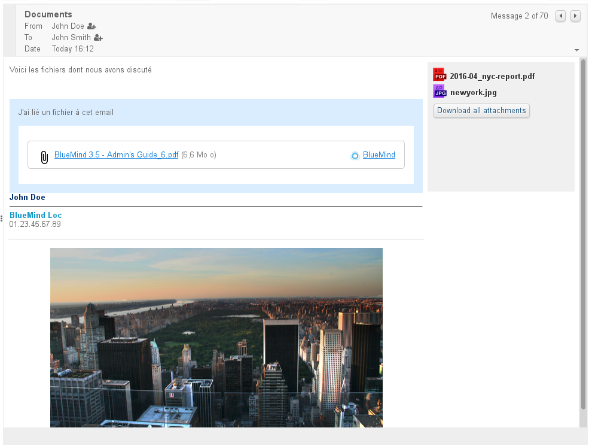

Cliquer sur le nom du fichier pour télécharger la pièce jointe de façon habituelle :

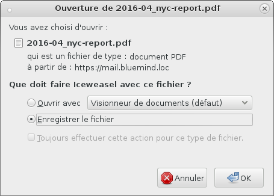

:::info

La présentation des pièces jointes intégrées au message peut varier en cas d'utilisation d'un client lourd, en revanche l'encadré bleu des pièces jointes liées fait partie intégrante du message et sera donc identique sur les divers clients de messagerie, dès lors que la visualisation des messages HTML est active.

:::

## Détachement des pièces jointes depuis les clients lourds

Le connecteur BlueMind permet aux utilisateurs de Thunderbird d'accéder aussi à la fonctionnalité de détachement des pièces jointes.

Pour plus de renseignements sur le fonctionnement, veuillez consulter la page dédiée à votre logiciel client :[ Synchronisation avec Thunderbird](/Guide_de_l_utilisateur/Configuration_des_clients_lourds/Configuration_de_Thunderbird/).

:::info

Outlook et MAPI

La fonctionnalité de détachement des pièces jointes est une fonctionnalité BlueMind, elle ne peut par conséquent fonctionner qu'avec l'utilisation du connecteur BlueMind pour Outlook et ne sera pas disponible dans le cadre d'une utilisation d'[Outlook avec MAPI](/Guide_de_l_administrateur/La_souscription_BlueMind/Mise_en_œuvre_de_MAPI_pour_Outlook/).

:::

## Connecter un compte NextCloud

Il est possible de connecter un compte NextCloud si celui-ci est installé et fonctionnel sur le domaine.

:::tip

Cette fonctionnalité doit au préalable être paramétrée par l'administrateur. Pour plus d'information sur sa mise en œuvre, veuillez vous reporter à la page dédiée du guide de l'administrateur : [Connecter avec Nextcloud](/Guide_de_l_administrateur/Configuration/Détachement_des_pièces_jointes/Connecter_avec_Nextcloud/)

:::

Dans la gestion des préférences de l'utilisateur, se rendre dans Mon compte > onglet « Comptes externes »

- Si aucun compte n'est encore connecté, un bouton « Configurer un compte » est présent, cliquer dessus pour ajouter un nouveau compte : 
- Saisir le login et mot de passe du compte NextCloud à connecter : 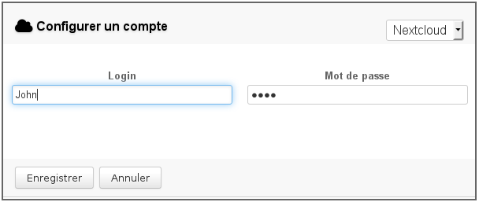
- **Enregistrer**
- Le bouton de configuration disparaît et le compte apparaît : 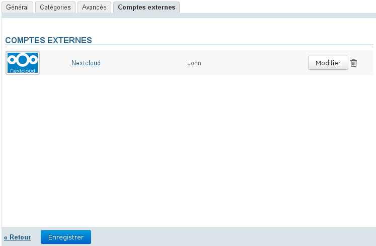 NB : vous pouvez à tout moment supprimer la connexion par l'icône ou modifier les données de connexion en cliquant sur le lien "Nextcloud" ou sur le bouton "Modifier"
-  **Cliquer sur "Enregistrer" pour valider la création du compte** 

Dès lors, le fonctionnement du détachement de pièces jointes reste le même qu'habituellement mais le sélecteur de fichiers BlueMind propose à présent les fichiers du compte NextCloud ainsi que leur arborescence :

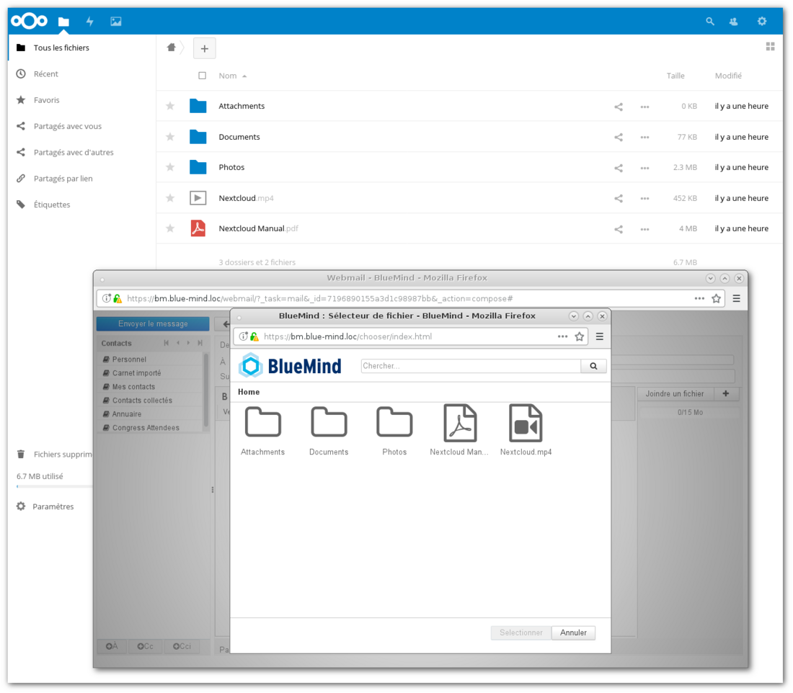

:::tip

Les fichiers ajoutés en tant que fichiers détachés depuis BlueMind sont déposés dans le dossier "Attachments" à la racine du compte NextCloud.

:::

