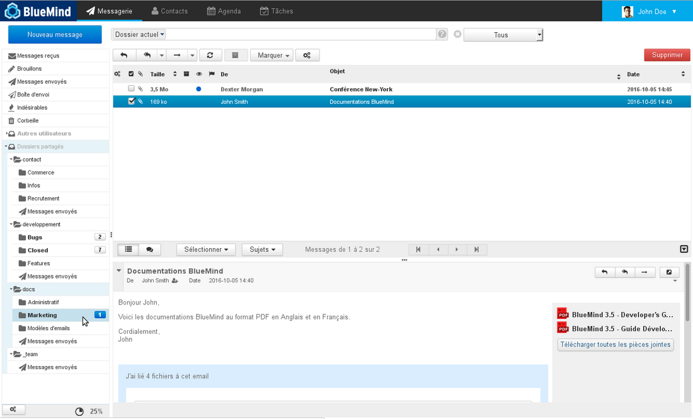
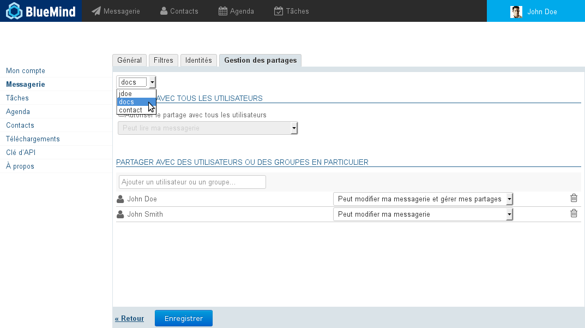
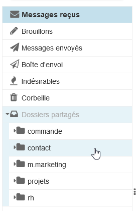
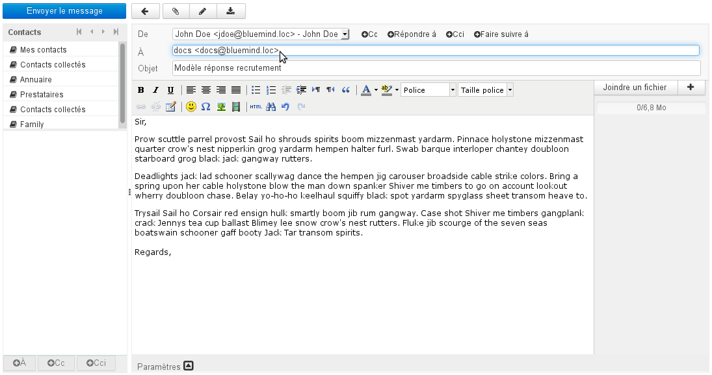
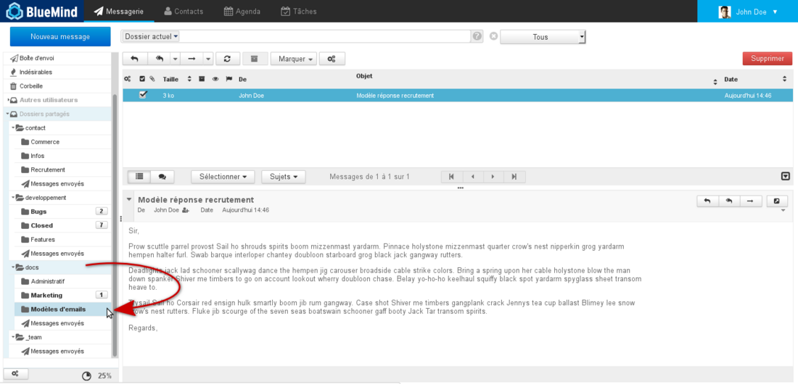
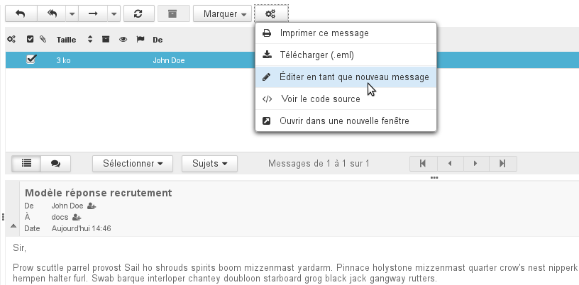
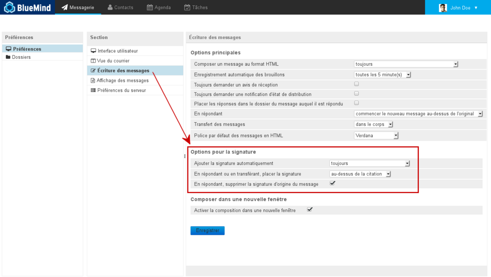
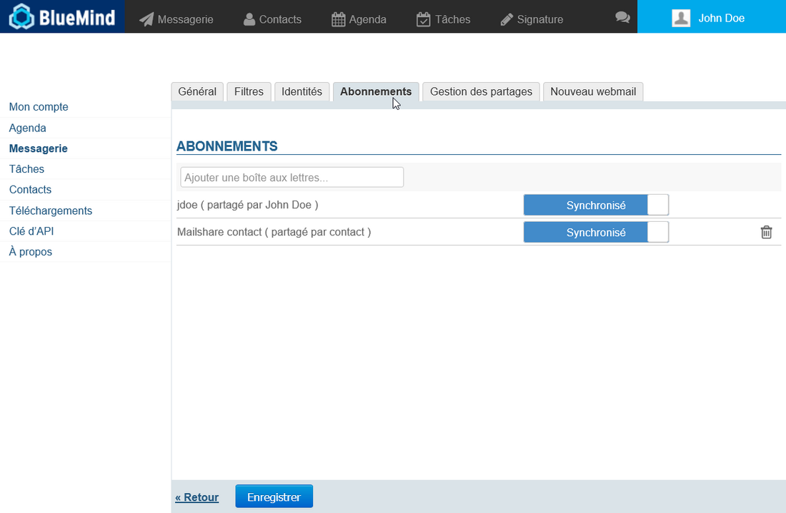
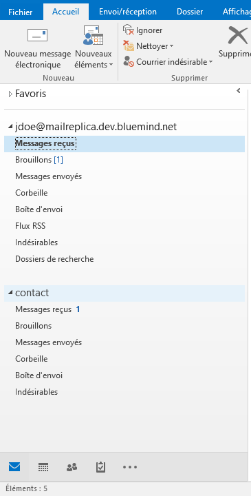

# Les boites aux lettres partagées

## Présentation

Les boites aux lettres partagées sont des boites aux lettres qui, à la différence de celles des utilisateurs, ne sont pas nominatives : un ou plusieurs utilisateurs peuvent y être rattachés.
Les utilisateurs peuvent accéder à la boite et l'utiliser selon les droits qui leur ont été attribués. Ces boites aux lettres sont disponibles pour chaque utilisateur ayant des droits sous l'entrée d'arborescence dédiée du client de messagerie : "Dossiers partagés".

**A partir de la version 4.5 de BlueMind, les utilisateurs partagent le statut de lecture des messages** : lorsqu'un des ayant droit consulte un message, celui-ci passe en "lu" pour tous les autres utilisateurs. Ainsi si un message est toujours indiqué "non lu", cela indique que personne n'en a encore pris connaissance, ou qu'un utilisateur l'a lu puis volontairement repassé en "non lu" afin qu'il soit traité ou consulté.

## Principes

La boite partagée est adaptée à un travail d'équipe : tous les utilisateurs ayant un droit sur la boite partagée peuvent consulter (et plus selon les droits) les mails stockés dans celle-ci.

Le fonctionnement d'une boite partagée est tel que les informations de lecture (mail lu / non lu) des e-mails sont propres à chaque utilisateur : chaque utilisateur possède sa propre information de lecture, que l'e-mail ait été lu ou non par d'autres utilisateurs.

En revanche, les informations de réponse et transfert sont partagées : si un des utilisateurs a répondu à un e-mail, tous les utilisateurs verront le drapeau "Réponse envoyée".

Ce fonctionnement répond bien à un travail collaboratif pour gérer une boite partagée entrante (telle qu'une boite contact), qui intègre par exemple des sous-dossiers "traité", "messages envoyés", voire "modèle de réponse".

## Gestion des partages

Les partages d'une boîte peuvent être gérés soit par l'administrateur du domaine, soit par les utilisateurs à qui celui-ci a délégué la gestion.

L'accès à la gestion des partages de la boîte est différent pour chacun :

- En tant qu'administrateur, se rendre dans la console d'administration > Entrées d'Annuaires > choisir la boîte souhaitée > onglet "Gestion des partages"
- En tant qu'utilisateur se rendre dans la gestion des paramètres utilisateurs > rubrique Messagerie > onglet "Gestion des partages"

Dans cet onglet :

1. choisir dans la première liste déroulante la boite dont on veut gérer les partages :

1. Affecter ensuite les droits souhaités soit à l'ensemble des utilisateurs du domaine, soit à des utilisateurs ou groupes désignés :
    - **lecture** : les utilisateurs peuvent consulter les messages
    - **modification** : les utilisateurs peuvent, en plus du droit de lecture, modifier les messages (ajouter, supprimer, déplacer...) ainsi qu'écrire et répondre au nom de la boite.
    - **gestion** : les utilisateurs peuvent, en plus des droits de lecture et modification, gérer les partages de la boite
2. Ajouter ainsi autant d'utilisateurs et groupes que désirés
3. **Cliquer sur Enregistrer pour prendre en compte les modifications**

 Les utilisateurs désignés reçoivent alors un email d'information leur indiquant que la boîte leur a été partagée. Au prochain rafraichissement de leur interface (une déconnexion/reconnexion peut être nécessaire) la boîte apparait alors dans le client de Messagerie sous l'arborescence "Dossiers partagés" :

Pour des informations détaillées sur le fonctionnement du formulaire de partage, consulter la page [Gestion des partages](/Guide_de_l_utilisateur/Gestion_des_partages/).

## Utilisations d'une boite partagée

### Écrire au nom d'une boîte

Afin de pouvoir écrire "au nom" d'une boîte partagée, i.e. en utilisant l'adresse de la boîte comme expéditeur, il faut :

- que l'administrateur, ou un gestionnaire de la boîte, donne le droit minimum "peut modifier les messages" à l'utilisateur
- que l'utilisateur [se crée une identité](/Guide_de_l_utilisateur/La_messagerie/Les_identités/#Lesidentites-mailshare) en choisissant cette boîte comme adresse d'expéditeur

:::tip

Si l'on souhaite que les autres ayant droit de la boîte puissent consulter les messages envoyés, ne pas oublier de cocher la case prévue à cet effet dans la fenêtre de gestion de l'identité

:::

### Cas d'usages

Les boites aux lettres pratagées peuvent avoir diverses utilisations :

- ** **Projets** ** : une boite par projet ou par service sera partagée entre les différents intervenants, elle permettra ainsi de centraliser les demandes et informations de manière plus complète qu'une simple liste de diffusion ou qu'un groupe
- ** **Contact** ** : une boite permettant de partager les messages de contacts entre direction et commerciaux, pourront aussi y être partagés des modèles de mails de réponses pour des demandes d'information ou devis
- ** **Support** ** : permet de centraliser les demandes de support, la boite pourra être partagée entre les techniciens pour intervention et les commerciaux pour la veille.
- ** **Gestion des demandes entrantes** ** : La boîte pourra être organisée de façon à trier les demandes en fonction des gestionnaires et des statuts de traitement. On pourra organiser la boîte comme suit : la boîte de réception reçoit les messages venant de l'extérieur, un sous-dossier par personne permet de déplacer les messages afin d'attribuer le traitement du message, une fois traité par la personne concernée le message est ensuite déplacé dans dossier "Traité".On pourra aussi envisager un sous-dossier par état. Par exemple pour les demandes de support : bug, information, amélioration. Ou encore pour les boîte commerciales : devis, facture, prospect...
- ** **Modèles de mails** ** : une boite aux lettres peut être dédiée aux modèles de mails de l'entreprise, elle sera partagée entre les différents intervenant et comprendra, triés dans des sous-dossiers, les modèles techniques, les modèles commerciaux, les modèles simples, etc.

### Modèle de mail

Une boite aux lettres partagée peut être utilisée pour partager des mails qui serviront de modèles communs à tous les utilisateurs de la boite.

Dans un premier temps :

- Créer le mail et l'envoyer à la boite si elle possède une adresse mail ou le copier (ou déplacer) dans la boite directement depuis le webmail ou client de messagerie (Outlook, Thunderbird, etc.) :
- Le mail apparaît dans la boite partagée pour tous les utilisateurs de la boite, il pourra être placé par un simple glisser/déposer dans un répertoire spécifique afin d'être retrouvé plus facilement :

- Dans un second temps, lorsqu'un utilisateur souhaite utiliser le message ainsi stocké, il lui suffit depuis le webmail de sélectionner le message et enfin de cliquer sur "Plus d'actions..." > Éditer en tant que nouveau message :

:::info

Dans Thunderbird cette option est disponible depuis le menu "Messages" ou par un clic droit directement > "Modifier comme nouveau message".

:::
La fenêtre de rédaction de message s'ouvre alors avec le message pré-rempli : l'adresse du destinataire et le contenu sont ceux d'origine du message et la signature de l'utilisateur est ajoutée s'il y a lieu.

:::tip

La position de la signature dépend des paramètres de l'utilisateur et du client de messagerie utilisé, il se peut qu'elle ne soit pas positionnée en fin de message.

Dans le webmail BlueMind, pour vérifier/modifier l'emplacement de la signature, se rendre dans les paramètres utilisateur en cliquant sur l'icône en haut à droite de l'écran :

Puis dans Messagerie > Paramètres avancés du client de messagerie > Écriture des messages :

Les paramètres doivent être :

- Ajouter la signature automatiquement : toujours
- En répondant ou en transférant les messages, placer la signature en-dessous de la citation
- En répondant, supprimer la signature d'origine du message

Dans Thunderbird, pour modifier ces options, se rendre dans le menu Édition (Outils, sous Windows) > Paramètres des comptes > section "Rédaction et adressage"

**Attention : Le changement de cette option affectera le comportement sur l'ensemble de ses messages.** Si l'utilisateur souhaite conserver sa signature au dessus des citations pour les autres messages, alors il lui faudra couper/déplacer la signature qui sera insérée automatiquement au dessus lors de l'utilisation des modèles.

:::

## Abonnements et logiciels tiers

A partir de la version 4.3 de BlueMind, il est possible de gérer les abonnements aux boites aux lettres partagées afin de faire apparaitre les boites de son choix dans Outlook [connecté en mapi](/Guide_de_l_utilisateur/Configuration_des_clients_lourds/Synchronisation_avec_Outlook/) ou sur les appareils mobiles [connectés en EAS](/Guide_de_l_utilisateur/Configuration_des_périphériques_mobiles/).

:::info

Les abonnements ne concernent que les outils tiers, ils n'ont pas d'incidence sur l'affichage de la boîte dans le webmail propre à BlueMind ou sur les logiciels tiers synchronisés via IMAP/POP.

:::

Une fois qu'une boite a été partagée et que l'utilisateur a reçu le mail d'information (voir plus haut) :

- se rendre dans la gestion des paramètres : Mon Compte > Messagerie > onglet Abonnements :
- commencer à taper le nom de la boîte souhaitée dans le champ de saisie en haut de l'onglet, l'autocomplétion propose les boîtes correspondantes à la frappe et sur lesquelles l'utilisateur a un droit de partage  :
- sélectionner la boîte voulue pour l'ajouter à la liste, la boîte est ajoutée avec la synchronisation active par défaut :

:::info

- **Synchronisation active** : la boîte sera visible dans Outlook (mapi) et les appareils mobiles (EAS)
- **Synchronisation inactive** : la boîte sera visible dans Outlook (mapi) seulement

:::

- **Cliquer sur Enregistrer pour prendre en compte les abonnements**

:::info

Un abonnement peut être modifié (activation/désactivation de synchronisation) ou supprimé (clic sur l'icône ) à tout moment par l'utilisateur.

:::

:::tip

Trouver les boîtes partagées dans Outlook

Jusqu'à la version 4.4.x de BlueMind, les boîtes apparaissent dans la section "Dossiers publics". **A partir de la version 4.5 de BlueMind**, les boîtes aux lettres partagées se trouvent dans l'arborescence principale :

:::

